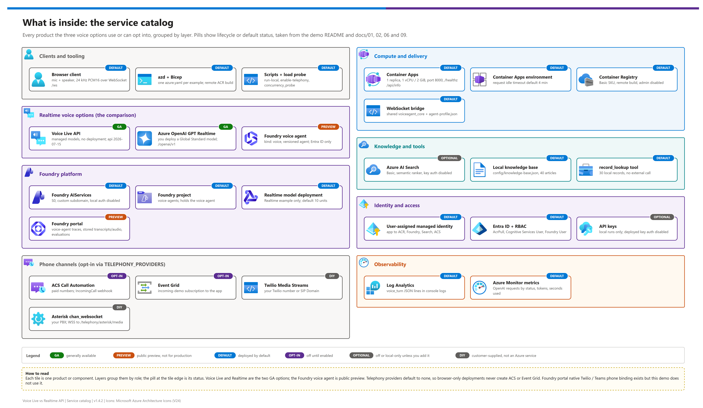
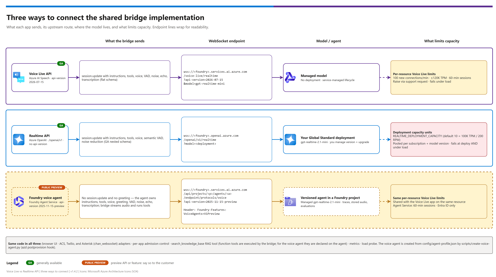

# Voice Live API vs. GPT Realtime API vs. Foundry voice agents

<p align="center">
  &nbsp;&nbsp;
  &nbsp;&nbsp;
  &nbsp;&nbsp;
  &nbsp;&nbsp;
  &nbsp;&nbsp;
  
</p>

<p align="center">
  
  
  
  
  
</p>

> [!NOTE]
> **Start here.** This is the front door: it explains the three options, what gets deployed, and the fastest path to a running demo. Building it end to end? Go to [00 — Reproduce this demo](./docs/00-reproduce-this-demo.md). Browser, Search, and voice-agent paths were live-tested on 2026-09-29; ACS and Twilio live calls have not been exercised (see [`CHANGELOG.md`](./CHANGELOG.md)).

## At a glance

| | |
|---|---|
|  **Voice Live API** | Managed speech-to-speech models, no model deployment.  |
|  **Realtime API** | You deploy and size a Global Standard realtime model.  |
|  **Foundry voice agent** | Versioned Foundry agent served by Voice Live in agent mode.  |
|  **Shape** | Three separate Container Apps, one shared Foundry resource, one shared bridge core. |
|  **Deploy** | `scripts\demo.ps1 -Action Up` (PowerShell 7, Azure CLI, `azd`, Python 3.12+). |

Reusable, generic Microsoft demo repo for comparing **three ways to build a contact-center voice agent** on Azure, with three minimal, reproducible, `azd`-deployable examples:

1. **Azure AI Voice Live API** — managed speech-to-speech models, no model deployment.
2. **Azure OpenAI GPT Realtime API (GA)** — you deploy and size a realtime model.
3. **Foundry voice agent (public preview)** — a Foundry Agent Service agent served by Voice Live in agent mode.

All three reuse the same browser client, WebSocket bridge core, agent profile, RAG tool, phone adapters (ACS, Twilio, and Asterisk), and load probe; the only intentional difference is the upstream. They run as **three separate app instances**, not one shared bridge service. Defaults: `gpt-realtime-mini` (Voice Live), `gpt-realtime-2.1-mini` (Realtime), `gpt-realtime-2.1-mini` (voice agent).

> **Generic on purpose.** The shipped sample domain is the fictional **Contoso service desk**. Retargeting the demo is a config change in `config\agent-profile.json` and `config\sample-data.json`, not a code fork. See [Adapting this pattern to another domain](./docs/01-architecture.md#adapting-this-pattern-to-another-domain).

---

## What's inside

[](./docs/assets/service-catalog.png)

<sub>Editable source: [`docs/assets/service-catalog.drawio`](./docs/assets/service-catalog.drawio) - regenerate with `python scripts/export_diagrams.py docs/assets`.</sub>

<table align="center">
  <tr>
    <td align="center" width="140"><br><sub><b>Voice Live</b><br>managed models</sub></td>
    <td align="center" width="140"><br><sub><b>Realtime</b><br>your deployment</sub></td>
    <td align="center" width="140"><br><sub><b>Voice agent</b><br>versioned, preview</sub></td>
    <td align="center" width="140"><br><sub><b>Foundry</b><br>shared resource</sub></td>
  </tr>
  <tr>
    <td align="center" width="140"><br><sub><b>Container Apps</b><br>3 bridge apps</sub></td>
    <td align="center" width="140"><br><sub><b>AI Search</b><br>40 articles</sub></td>
    <td align="center" width="140"><br><sub><b>ACS</b><br>optional phone</sub></td>
    <td align="center" width="140"><br><sub><b>Managed identity</b><br>keyless auth</sub></td>
  </tr>
</table>

---

## Comparing the three options


<sub>Editable source: [`docs/assets/diagrams/01-solution-architecture.drawio`](./docs/assets/diagrams/01-solution-architecture.drawio) - regenerate with `python scripts/export_diagrams.py docs/assets`.</sub>



<sub>Editable source: [`docs/assets/diagrams/02-three-ways-to-connect.drawio`](./docs/assets/diagrams/02-three-ways-to-connect.drawio) - regenerate with `python scripts/export_diagrams.py docs/assets`.</sub>

*More diagrams: [phone call flow](./docs/assets/diagrams/03-phone-call-flow.png) ([source](./docs/assets/diagrams/03-phone-call-flow.drawio)) · [deployment and regions](./docs/assets/diagrams/04-deployment-and-regions.png) ([source](./docs/assets/diagrams/04-deployment-and-regions.drawio)).*

| | Voice Live API | Realtime API | Foundry voice agent (preview) |
|---|---|---|---|
| **Example** | `examples\voice-live-api\` | `examples\realtime-api\` | `examples\foundry-voice-agent\` |
| **Status** |  |  |  — not for production |
| **Where the agent is defined** | In the app (bridge sends instructions + tools each session) | In the app | A **versioned agent** in a Foundry project (instructions, tools, voice, greeting, audio pipeline); app sends **no session config** |
| **Model** | Managed (`gpt-realtime-mini`, `gpt-realtime-2.1-mini`, …) | Your Global Standard deployment (`gpt-realtime-2.1-mini`, `gpt-realtime-mini`) | Managed (`gpt-realtime-2.1-mini`, `gpt-realtime-mini`, `gpt-realtime`) |
| **Model deployment?** | **No** | **Yes** | **No** |
| **What limits capacity** | Per-resource Voice Live limits: 100 new connections/min, ≤120K TPM, ≤60-min sessions | Deployment quota in **capacity units** (gpt-realtime-2.1-mini: 1 unit = 10K TPM + 20 RPM; often 10 units = 100K TPM by default), pooled per subscription + model version | Same per-resource Voice Live limits, plus Agent Service limits (60-min sessions) |
| **Fails early or under load?** | Under load (throttling) | At deploy time (`InsufficientQuota`) and under load | Under load (throttling) |
| **How to get more** | Azure support request (raise new connections/min; confirm effective TPM because the documented formula and defaults disagree — see [quota caveat](./docs/06-comparison-one-pager.md#side-by-side-comparison)) | Azure OpenAI quota request; can be refused for versions near retirement | Same as Voice Live |
| **Model lifecycle** | Service-managed | You manage versions, upgrade policy, and retirement dates | Service-managed; pin behaviour with agent versions |
| **Wire protocol** | `wss://…/voice-live/realtime?api-version=2026-07-15&model=…` | `wss://…/openai/v1/realtime?model=<deployment>` | `wss://…/api/projects/<project>/agents/<agent>/endpoint/protocols/voice?api-version=2025-11-15-preview` + `Foundry-Features: VoiceAgents=V1Preview` |
| **Auth** | Entra ID (key locally) | Entra ID (key locally) | **Entra ID only** |
| **Audio pipeline** | Azure semantic VAD, deep noise suppression, echo cancellation, built-in transcription | Semantic/server VAD, near/far-field noise reduction, transcription needs its own deployment | Same as Voice Live |
| **Tools / RAG in this demo** | Shared `search_knowledge_base` + record lookup, run by the bridge | Same | Same functions declared on the agent, run by the bridge |
| **Phone calls in this demo** | ACS number / Direct Routing, Twilio number or SIP Domain, or Asterisk over WSS (`chan_websocket`) via the shared bridge | Same | Same (Foundry's native Twilio/Teams phone binding exists but is not used, so all three stay aligned) |
| **Platform extras** | Avatar, BYOM, interim responses | WebRTC client secrets, direct SIP (eastus2/swedencentral), GA schema | Foundry portal, stored transcripts + audio, voice traces, rubric evaluations, agent versioning, native Twilio/Teams Phone, transfer to human |
| **Choose it when** | You want managed capacity and Azure audio features now, in production | You need direct control of the deployed model and already have quota | You want the agent to be a governed Foundry asset (versions, evaluation, observability) and can accept preview |

**Knowledge base:** all three use the same **40 synthetic service-desk articles** through `search_knowledge_base`, backed by Azure AI Search or local `config\knowledge-base.json`. The **30 request records** remain in local `config\sample-data.json`, read by the separate `record_lookup` handler — they are not in the Search index. See [10 — Knowledge base](./docs/10-knowledge-base.md).

Deeper material: [06 — Voice Live vs Realtime one-pager](./docs/06-comparison-one-pager.md) · [07 — Telephony, RAG, shared endpoint, and quota](./docs/07-telephony-and-shared-endpoint.md) · [09 — Environment variables](./docs/09-environment-variables.md).

### What you provision

**Recommended: one shared Foundry resource, three ways to connect.** `scripts\demo.ps1` deploys the platform plus all three app tiers, loads Search, and optionally configures phone channels. The example rows below describe the **standalone alternative**; shared apps reuse the platform's AI resources instead of creating their own.

| Example folder | What you provision | Auth role(s) assigned by Bicep |
|---|---|---|
| `examples\voice-live-api\` | Container Apps, ACR Basic, Log Analytics, user-assigned managed identity, Foundry resource (`AIServices`, S0, `disableLocalAuth`, project management) + a `voice-agents` **project** (no model deployment) | Cognitive Services User, Foundry User, AcrPull |
| `examples\realtime-api\` | Same app stack; Foundry resource with project management + a `voice-agents` **project**, and the Global Standard realtime model deployment used from that project | Cognitive Services OpenAI User, AcrPull; deploying user also gets Foundry User |
| `examples\foundry-voice-agent\` | Same app stack; Foundry resource with project management + a Foundry **project**; the agent is created by the `postprovision` hook | Cognitive Services User, Foundry User, AcrPull |
| `platform\` (recommended shared path) | One Foundry resource + realtime deployment + voice-agent project, separate Azure AI Search, ACS only when selected — shared by all three | Developer: Foundry/OpenAI/Search roles |

In **standalone mode**, every example creates its own Foundry resource with a `voice-agents` project (the Realtime deployment appears under its project; Voice Live and the voice agent use managed models). In **shared mode**, all three reuse the platform's Foundry resource and project instead. Each example still deploys its own Azure Container App, ACR, Log Analytics workspace, and user-assigned managed identity. Each app runs one replica with its own `SessionHub` admission counter, exposes `/healthz`, `/api/info`, and `/ws`, and builds in ACR through `docker.remoteBuild: true`.

**Shared RAG, optional phone calls.** The wrapper always provisions Azure AI Search in `platform\` and loads the 40 articles; **do not deploy `knowledge\` separately for this path**. ACS is created only when `acs` is selected. Shared mode means one Foundry resource in one subscription, **not one literal WebSocket URL or one quota pool**: the APIs use distinct hosts/routes and limits. Each app can accept phone calls over WebSocket through ACS, Twilio (including a PBX via Twilio SIP Domain), or Asterisk directly via `chan_websocket`, and run `search_knowledge_base` on every channel. Browser and phone sessions share admission **within that app**, not globally across the three apps. See [docs\07-telephony-and-shared-endpoint.md](./docs/07-telephony-and-shared-endpoint.md).

### Key environment variables for reproducing

| Variable | Why it matters |
|---|---|
| `AZURE_LOCATION` | AI region (Foundry, models, voice agent, search). `centralus`, `eastus2`, or `swedencentral`. |
| **`AZURE_APP_LOCATION`** | App region (Container Apps, ACR, Log Analytics). Set it when **Container Apps capacity is constrained** in the AI region; use the same value for all three examples. |
| `REALTIME_DEPLOYMENT_CAPACITY` | Realtime deployment size in capacity units (default `10` = 100K TPM / 200 RPM for `gpt-realtime-2.1-mini`); checked before provisioning. |
| `SHARED_RESOURCE_GROUP` / `SHARED_FOUNDRY_NAME` / `SHARED_FOUNDRY_PROJECT` | Reuse one shared Foundry resource/project through distinct API hosts/routes. |
| `TELEPHONY_PROVIDERS` | Any of `acs`, `twilio`, `asterisk`. |
| `AZURE_SEARCH_SERVICE_NAME` (+ `SHARED_RESOURCE_GROUP`) | Point an example at the synthetic knowledge base; set by `scripts\use-knowledge-base.ps1`. |

Full list with defaults and scope: [docs\09-environment-variables.md](./docs/09-environment-variables.md).

---

## 60-second quickstart

> [!WARNING]
> **Never rely on ambient `az` / `azd` login.** This tenant-explicit flow can target the wrong tenant or subscription if you skip it: always pass the tenant and subscription (`-TenantId` / `-SubscriptionId` below, or `az login --tenant` + `azd auth login --tenant-id` in the standalone path), and confirm with `az account show`. `Up` and the cloud resources it creates cost money; there is **no automatic rollback**.

| Step | | Action | Gate |
|---|---|---|---|
| 1 |  | Install [prerequisites](./docs/02-prerequisites.md) and create the venv | ☐ `python --version` is 3.12+; `.venv` has `requirements-agent.txt` |
| 2 |  | Set `DemoName`, `TenantId`, `SubscriptionId` | ☐ `az account show` matches the intended tenant and subscription |
| 3 |  | Run `demo.ps1 -Action Up ... -WhatIf` (offline dry run) | ☐ Order and targets look right; nothing was changed |
| 4 |  | Run `demo.ps1 -Action Up` | ☐ Three browser URLs printed; `/healthz` and `/api/info` pass |
| 5 |  | Run `demo.ps1 -Action Down` when finished | ☐ Four owned resource groups deleted |

### Recommended: shared deploy-all, including phone setup

Commands take a minute to prepare, not to finish deploying. Install [prerequisites](./docs/02-prerequisites.md) first (PowerShell 7, Azure CLI, `azd`, Bicep, **Python 3.12+**, deployment/RBAC permissions, and realtime quota). From the repo root:

```powershell
python -m venv .venv
.\.venv\Scripts\python.exe -m pip install -r scripts\requirements-agent.txt

$Demo = @{
	DemoName = "voice-demo"
	TenantId = "<tenant-guid>"
	SubscriptionId = "<subscription-guid>"
}

# Offline order/target preview: no CLI calls, cloud access, or file changes.
./scripts/demo.ps1 -Action Up @Demo -AppLocation eastus2 -Telephony 'acs,twilio,asterisk' -WhatIf

# Deploy platform, then Voice Live, Realtime, and Foundry voice agent.
./scripts/demo.ps1 -Action Up @Demo -AppLocation eastus2 -Telephony 'acs,twilio,asterisk'
```

The wrapper uses `.venv/Scripts/python.exe` or `.venv/bin/python`, then falls back to `python`. On non-Windows hosts install with `.venv/bin/python -m pip install -r scripts/requirements-agent.txt`. These dependencies include `azure-identity` for Search loading and `azure-ai-projects` for agent creation.

- Defaults: `-Location centralus` (allowed: `centralus`, `eastus2`, `swedencentral`), `-RealtimeCapacity 10`, and app region = AI region unless `-AppLocation` is set. The example places apps in `eastus2`. Keep existing model defaults for this first-time path.
- Phone providers default to **none**; select only those you need. With `twilio`, a missing auth token is **securely prompted**, never supplied on the command line; existing secrets are retained. `-OverflowNumber +E164` optionally supplies an ACS/Twilio fallback.
- `Up` signs in `az` and `azd` tenant-explicitly, provisions shared Search and selected ACS, loads 40 articles, wires each app, runs an ARM preview before each app's sequential `azd up`, creates the agent version through postprovision, checks `/healthz` and `/api/info` backend/provider configuration, and prints **three browser URLs**. `-WhatIf` above is an offline preview, **not** ARM what-if. `-SkipLogin` skips sign-in, not the Azure context check.
- `asterisk` writes local configs for all three apps (extensions **7001/7002/7003**); copying them to the PBX is manual. Twilio prints all three **HTTP POST** voice webhooks; configure a number/SIP Domain in Twilio Console with **one target per number**.
- ACS number acquisition is a **separate paid step after provisioning**. No incoming route is created without `-AcsPhoneNumber`. Once you have a number, configure the default target (or choose `voice-live-api` / `realtime-api`):

```powershell
./scripts/demo.ps1 -Action Phones @Demo -PhoneTarget foundry-voice-agent -AcsPhoneNumber '+<E164-number>'

# Preview the four owned resource groups, then confirm their deletion.
./scripts/demo.ps1 -Action Down @Demo -WhatIf
./scripts/demo.ps1 -Action Down @Demo
```

`Phones` inherits providers from the manifest and reruns routing/config generation **without `azd up`**. ACS uses the stable `incoming-demo` Event Grid subscription on this demo's ACS resource; check for duplicate number filters on older manual routes, which are not removed. `Down` needs no regions/providers, deletes **agent → Realtime → Voice Live → platform**, and never targets `knowledge\` or unrelated environments. `-Force` opts into unattended confirmation; separate `-Purge` opts into irreversible `azd --purge` behavior, not a guarantee of Cognitive Services purging. External Twilio/PBX configuration, phone numbers, and billing still need operator cleanup.

**Ownership and resume:** `DemoName` is 3–20 lowercase letters/digits/hyphens, starting with a letter and ending alphanumeric. The gitignored, nonsecret `.azure/demos/<DemoName>.json` records ownership alongside each project's `.azure/<env>/.env`: `<DemoName>-platform`, `-vl`, `-rt`, `-agent`. The wrapper refuses adoption of pre-existing environments/resource groups and tenant/location/provider drift. Resume with the **same Up arguments**; existing env values are retained, but naming settings are immutable. There is **no automatic rollback**: successful stages persist and cost money. Teardown keeps local state for retries/audit; use a **new DemoName** after full teardown. Health/info checks do not prove upstream audio or real calls work.

Full checkpoints and phone handoff: [00 — Reproduce this demo](./docs/00-reproduce-this-demo.md) · [03 — Deployment contract](./docs/03-deployment.md#recommended-shared-deploy-all) · [07 — Phone setup](./docs/07-telephony-and-shared-endpoint.md#recommended-wrapper-phone-setup).

### Alternative: standalone examples

Use the following **instead of** shared deploy-all when you want separate Foundry resources. Never run a bare `az login` or rely on ambient `azd up`; set the tenant and subscription explicitly for each example. Install the local dependencies above before creating a voice agent.

#### Voice Live API example

```powershell
$TenantId = "<tenant-id>"
$SubscriptionId = "<subscription-id>"
$Location = "centralus"

az login --tenant $TenantId
az account set --subscription $SubscriptionId
az account show --query "{tenant:tenantId, subscription:id, name:name, user:user.name}" -o table
azd auth login --tenant-id $TenantId

cd <repo-root>\examples\voice-live-api
azd env new <environment-name>
azd env set AZURE_TENANT_ID $TenantId
azd env set AZURE_SUBSCRIPTION_ID $SubscriptionId
azd env set AZURE_LOCATION $Location
azd up
```

#### Realtime API example

Run the quota pre-flight in [02-prerequisites.md](./docs/02-prerequisites.md) first, then:

```powershell
$TenantId = "<tenant-id>"
$SubscriptionId = "<subscription-id>"
$Location = "centralus"

az login --tenant $TenantId
az account set --subscription $SubscriptionId
az account show --query "{tenant:tenantId, subscription:id, name:name, user:user.name}" -o table
azd auth login --tenant-id $TenantId

cd <repo-root>\examples\realtime-api
azd env new <environment-name>
azd env set AZURE_TENANT_ID $TenantId
azd env set AZURE_SUBSCRIPTION_ID $SubscriptionId
azd env set AZURE_LOCATION $Location
azd up
```

After deployment, open `SERVICE_WEB_URI` from `azd env get-values` in a browser with microphone access.

#### Foundry voice agent example (preview)

Same steps in `examples\foundry-voice-agent`. `azd up` also creates the agent from `config\agent-profile.json` through the `postprovision` hook. See [its README](./examples/foundry-voice-agent/README.md).

> **Container Apps constrained in the AI region?** Before `azd up` in any example: `azd env set AZURE_APP_LOCATION eastus2` (same value for all three).

---

## Locked decisions

These are the v1 baseline. Deviate only with an updated decision record and docs.

| # | Decision | Choice | Rationale |
|---|---|---|---|
| 1 | Browser architecture | **Server-side WebSocket bridge for all three examples** | Keeps credentials, tools, instructions, and Entra tokens off the browser while preserving one comparison surface. |
| 2 | Shared implementation | **Common `shared\static\` and `shared\voiceagent_core\`** | The client, metrics, tool execution, admission control, telephony adapters, and history trimming are identical across all three options. |
| 3 | Identity | **Managed identity plus `disableLocalAuth: true`** | Demonstrates keyless production posture; API keys are local-only escape hatches when a separate key-enabled resource is used. |
| 4 | Scale shape | **One replica per app plus app-level admission control** | `MAX_CONCURRENT_SESSIONS` covers all channels on that app only. Browser overflow gets `busy` + `1013`; ACS/Twilio use configured overflow or reject/end the call; Asterisk sends `HANGUP` for dialplan fallback. No built-in human queue. |
| 5 | Model defaults | **Voice Live `gpt-realtime-mini`; Realtime `gpt-realtime-2.1-mini`; voice agent `gpt-realtime-2.1-mini`** | Voice Live uses its GA Basic mini model by default; Realtime uses the GA mini with published pricing; the voice agent uses the managed 2.1-mini preview path to show agent-mode governance. |
| 9 | Preview third option  | **Foundry voice agent stores instructions/tools/voice; bridge owns audio and tool execution** | Keeps RAG, telephony, metrics, and the browser harness aligned while showing Foundry portal traces, stored artifacts, agent versions, and evaluations. |
| 6 | API client | **Raw WebSockets instead of SDKs** | Makes the bridge hooks line-comparable. Use the Voice Live SDK or Realtime WebRTC path for production where appropriate. |
| 7 | Hosting | **Azure Container Apps with `azd` remote build** | Browser demo deploys with one command, no local Docker daemon required, and ACR remote build keeps the path reproducible. |
| 8 | Bicep versions | **Pinned to API versions that local Bicep 0.43 builds cleanly** | Current templates use `Microsoft.CognitiveServices/accounts@2025-06-01`, `Microsoft.App/*@2025-07-01`, Log Analytics `2025-02-01`, ACR `2025-11-01`, Managed Identity `2024-11-30`, and role assignments `2022-04-01`. |

---

## When to use this demo

> [!TIP]
> Pick this demo when the goal is a like-for-like comparison: same client, same tools, same load probe, only the upstream changes.

- You need a side-by-side browser voice-agent comparison where app code, UI, tools, and load probe are the same.
- You want to show the operational difference between a managed Voice Live model, a Realtime API model deployment, and a governed Foundry voice-agent asset.
- You need a reusable pattern for server-side tools, managed identity, app-side latency metrics, quota-aware admission control, and a preview agent-mode path.
- You want an `azd` path that can be checked into ADO or GitHub and rebuilt in a clean tenant.

## When not to use this demo

> [!CAUTION]
> This is a comparison harness, not a production voice stack or a contact-center product.

- You are building a production browser voice app and only need one API: evaluate WebRTC first for the Realtime API and the Voice Live SDK or accelerator patterns for Voice Live.
- You need a full contact-center stack (IVR design, queues, agent desktops, CRM screen-pops): start from the appropriate voice accelerator. This repo's ACS/Twilio/Asterisk adapters are a minimal phone harness for comparing the three options on real calls, not a contact-center product.
- You need multi-region production resiliency, private networking, human handoff orchestration, or multi-replica load balancing out of the box: those are hardening items, not the v1 demo baseline.

---

## File index

All narrative documentation lives under `docs\`. The repo root holds only this README, `CHANGELOG.md`, and scaffolding/config files.

| File | Purpose |
|---|---|
| `README.md` | This entry point, quickstart, locked decisions, distribution rules, and provenance. |
| `CHANGELOG.md` | v1 shipped scope, verification record, research corrections, and known gaps. |
| [`docs\00-reproduce-this-demo.md`](./docs/00-reproduce-this-demo.md) | Single-page build orchestrator with checkpoints from tenant auth through teardown. |
| [`docs\01-architecture.md`](./docs/01-architecture.md) | Reference architecture, diagrams, trust boundaries, data flow, protocol, decisions, and retargeting guidance. |
| [`docs\02-prerequisites.md`](./docs/02-prerequisites.md) | Tools, permissions, RBAC, providers, region alignment, quotas, naming, and cost model. |
| [`docs\03-deployment.md`](./docs/03-deployment.md) | IaC deployment guide owned by the deployment-docs pass. |
| [`docs\03b-manual-deployment.md`](./docs/03b-manual-deployment.md) | Portal and imperative CLI alternative to the IaC path. |
| [`docs\04-testing.md`](./docs/04-testing.md) | Functional, load, same-model bake-off, and regression test plan. |
| [`docs\05-troubleshooting.md`](./docs/05-troubleshooting.md) | Symptom-first troubleshooting guide. |
| [`docs\06-comparison-one-pager.md`](./docs/06-comparison-one-pager.md) | Detailed Voice Live vs. Realtime comparison and positioning one-pager. |
| [`docs\07-telephony-and-shared-endpoint.md`](./docs/07-telephony-and-shared-endpoint.md) | Shared Foundry platform, ACS/Twilio/Asterisk/PBX phone channels, RAG, quota comparison, and the phone test plan. |
| [`docs\10-knowledge-base.md`](./docs/10-knowledge-base.md) | Synthetic knowledge base (40 articles, 30 request records), `knowledge\` azd project for Azure AI Search, and wiring the examples to it. |
| `knowledge\` | Infra-only azd project: Azure AI Search + synthetic `knowledge` index (postprovision loads it). |
| [`docs\09-environment-variables.md`](./docs/09-environment-variables.md) | Every deploy-time and runtime variable, with defaults, scope, and capacity-constraint guidance (`AZURE_APP_LOCATION`). |
| `examples\foundry-voice-agent\` | Foundry voice agent (preview) example; agent created by `scripts\create-voice-agent.py`.  |
| `platform\` | Infra-only azd project: one Foundry resource + realtime deployment + project, separate AI Search, optional ACS. |
| `shared\voiceagent_core\telephony\` | ACS Call Automation, Twilio Media Streams, and Asterisk `chan_websocket` adapters, audio conversion, channel security. |
| `shared\voiceagent_core\rag.py` | `knowledge_search` tool handler (Azure AI Search or local JSON). |
| `config\knowledge-base.json` | Sample knowledge documents for the RAG tool and index loader. |
| `scripts\demo.ps1` | Shared deploy-all (`Up`), phone routing/config handoff (`Phones`), and owned four-resource-group teardown (`Down`); offline `-WhatIf`. |
| `scripts\enable-telephony.ps1` | Turn on phone channels (Asterisk, Twilio, ACS) for an example, generate their secrets, and write ready-to-copy Asterisk config after deploy. |
| `scripts\probe-asterisk.py`, `scripts\probe-voice-agent.py` | Verify the Asterisk endpoint and the voice agent connection without a phone or browser. |
| `scripts\use-shared-platform.ps1`, `scripts\configure-telephony.ps1`, `scripts\load-knowledge-index.py` | Wire an example to the platform, route phone numbers, load the index. |
| `docs\assets\diagrams\0N-*.drawio` + `.png` | The four core diagrams (solution architecture, three ways to connect, phone call flow, deployment and regions): editable draw.io sources and the PNGs embedded in the README and docs. |
| `docs\assets\*.drawio` + `.png` | Service catalog, prerequisites map, manual deployment steps, testing matrix, troubleshooting tree, comparison, configuration flow, knowledge-base flow. Regenerate any PNG with `python scripts\export_diagrams.py docs\assets` (and `docs\assets\diagrams`); draw.io Desktop required. |
| [`docs\assets\comparison-one-pager.html`](./docs/assets/comparison-one-pager.html) | Browser-renderable comparison asset. |
| [`docs\assets\comparison-one-pager.pdf`](./docs/assets/comparison-one-pager.pdf) | One-page HTML export. Regenerate with `pwsh scripts\export-comparison.ps1` (Microsoft Edge); print-copy links are disabled to avoid embedding local paths. |
| `config\agent-profile.json` | Domain retargeting surface: assistant name, instructions, greeting, tools, handlers, and conversation settings. |
| `config\sample-data.json` | Example-domain data for the shipped record-lookup tool. |
| `demo-ids.template.json` | Committed deployment-ID reference template; copy to `demo-ids.local.json` for populated local notes. |
| `loadtest\concurrency_probe.py` | Text-turn WebSocket concurrency probe used for 1, 4, 10, and 20 session sweeps. |

---

## Prerequisites snapshot

Full detail is in [02-prerequisites.md](./docs/02-prerequisites.md). At minimum you need:

<p>
  &nbsp;
  &nbsp;
  &nbsp;
  
</p>

- Azure CLI, `azd` 1.30+ (latest verified in the facts brief: 1.34.2), Bicep 0.43+, Python 3.12+, PowerShell 7, and a modern browser with microphone access.
- Azure subscription permissions to create resources and assign RBAC: Contributor plus User Access Administrator, or Owner.
- Resource providers registered for Container Apps, Cognitive Services, Container Registry, Log Analytics, and Managed Identity.
- A region that supports the chosen API and model. For a clean same-region bake-off, use `centralus`, `eastus2`, or `swedencentral`.
- Realtime API quota checked before deployment. The Realtime example creates a Global Standard model deployment, sized in capacity units (`REALTIME_DEPLOYMENT_CAPACITY`, default `10`); a `preprovision` hook checks it against available quota.

---

## Distribution

> [!IMPORTANT]
> Never commit populated tenant IDs, subscription IDs, deployment IDs, `.env.local`, API keys, private keys, or secrets. `demo-ids.template.json` is the only committed ID file; populated values live in the gitignored `demo-ids.local.json`.

This repo is intended to be checked into ADO or GitHub as a standalone reusable demo. `.gitignore` and `.dockerignore` exclude deployment state, local env files, Python caches, secrets, populated ID snapshots, and build outputs. `demo-ids.template.json` is safe to commit because it contains placeholders only; the populated copy is `demo-ids.local.json`, which is gitignored.

`azd` keeps runtime values in `.azure\<environment>\.env`, which is also gitignored. Never commit populated tenant IDs, subscription IDs, deployment IDs, `.env.local`, API keys, private keys, or secrets. Pipeline/runtime credentials should come from the CI system secret store or Key Vault, not from files in the repo.

---

## Reusing this demo for another domain

> [!TIP]
> The retargeting surface is two files: `config\agent-profile.json` and `config\sample-data.json`. No code fork needed.

The reusable surface is intentionally small: edit `config\agent-profile.json` and `config\sample-data.json`; then re-run `azd hooks run postprovision` for `examples\foundry-voice-agent` so the Foundry agent version is refreshed. Keep `shared\`, `examples\`, `infra\`, `loadtest\`, and `tests\` unchanged. The one legitimate code extension is registering a new handler in `voiceagent_core.tools.HANDLERS` when the new domain needs a tool behavior beyond `record_lookup` or `current_time`.

See [Adapting this pattern to another domain](./docs/01-architecture.md#adapting-this-pattern-to-another-domain) for the field-by-field retargeting contract.

---

## Related accelerators

| Accelerator | What this repo borrows | What is intentionally not copied |
|---|---|---|
| `Azure-Samples/call-center-voice-agent-accelerator` | Managed identity with `disableLocalAuth`, Azure semantic VAD, deep noise suppression, echo cancellation, 24 kHz browser audio, `azd` Container Apps remote build, and the production recommendation to evaluate the Voice Live SDK. | Telephony connectors, contact-center provider setup, avatar and custom-voice breadth, and its default cascaded model path. This repo keeps the comparison minimal and uses raw WebSockets for parity. |
| `Azure-Samples/realtime-call-center-accelerator` | Server-side proxy pattern that keeps instructions and tools off the browser. | Deprecated preview endpoint  `/openai/realtime?api-version=2024-10-01-preview&deployment=`, beta flat session schema, beta event names, ACS telephony complexity, manual app deploy script, stale Bicep shape, and the commented barge-in truncation task. |

Verification URLs for those findings are recorded in `CHANGELOG.md` from the provided research files.

---

## Decision provenance

| Date | Decision | Reference |
|---|---|---|
| 2026-09-25 | Packaged the Voice Live API vs. GPT Realtime API comparison as a reusable, generic demo pattern. | [CHANGELOG](CHANGELOG.md) `1.0.0` entry |

The release history for this and later changes is in [CHANGELOG.md](CHANGELOG.md).

---

*Last updated: 2026-10-02*
