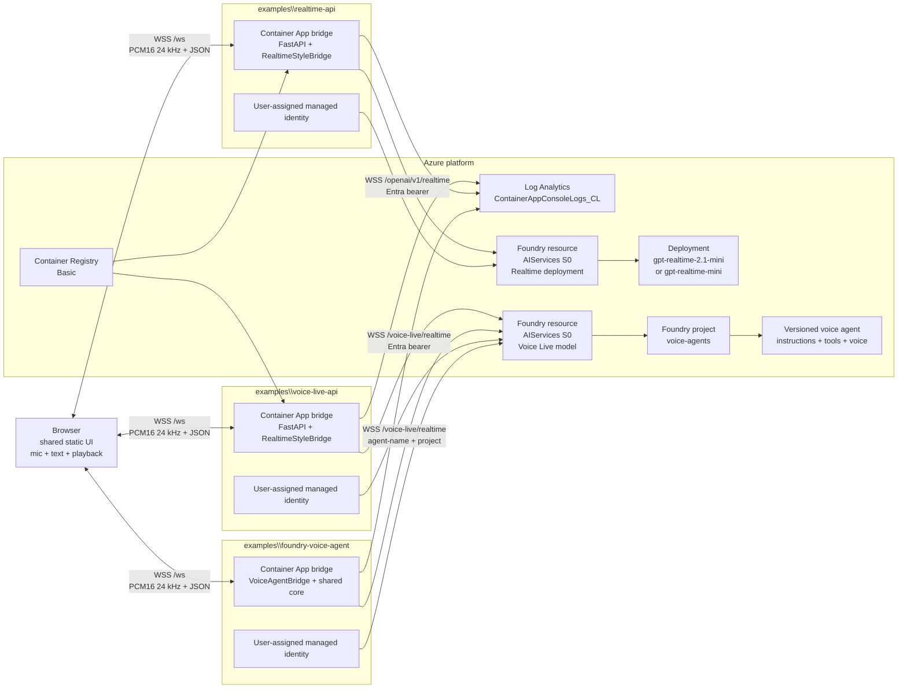

# 01 — Architecture

Reference architecture for the Voice Live API vs. GPT Realtime API vs. Foundry voice agent demo. Read this first, then [02-prerequisites.md](./02-prerequisites.md).

---

## Goals

- Compare Voice Live API, GPT Realtime API, and a Foundry voice agent through the same browser UI, app bridge, tools, metrics, and load probe.
- Keep credentials, prompts, and tool handlers server-side.
- Use managed identity and `disableLocalAuth` in deployed resources.
- Make retargeting structural: change config and data, not shared code.
- Preserve enough app-side metrics to reason about latency, token growth, quota pressure, and admission control.

## Non-goals

- Not a contact-center implementation. The optional ACS/Twilio adapters ([07](07-telephony-and-shared-endpoint.md)) put real phone calls on the same bridge for testing; they are not IVR, queueing, or agent-desktop software.
- Not a multi-region, private-network, autoscaled production landing zone.
- Not a benchmark that controls every variable automatically; the docs show how to create a fair same-model run, but the operator records quota, region, and model context.

---

## Architecture diagram

> **Presentation-ready diagram**: [`assets\voice-live-vs-realtime-api-architecture.drawio`](./assets/voice-live-vs-realtime-api-architecture.drawio). The Mermaid view below is the text companion for review and diffs.



---

## Logical layers

| Layer | Components | Responsibility |
|---|---|---|
| User interaction | `shared\static\index.html`, `app.js`, `audio-worklet.js`, `styles.css` | Browser UI, microphone capture, 24 kHz PCM16 chunks, gapless playback, barge-in playback flush, text turns, transcript, tool and metrics panes. |
| App bridge | `shared\voiceagent_core\server.py`, `bridge.py`, `metrics.py`, `tools.py`, API-specific bridge files | Terminates browser WebSocket, opens upstream WebSocket, applies session config, executes tools server-side, logs metrics, gates concurrency. |
| Platform | Container Apps, ACR Basic, Log Analytics, user-assigned managed identity, Foundry `AIServices` resource | Hosts the bridge, stores logs, pulls images, and provides managed identity to call the upstream API. |
| Model/API | Voice Live managed model, Realtime model deployment, or Foundry voice agent | Performs realtime speech/text generation, turn detection, function calling, and token usage reporting. |

---

## Component table

| Component | Voice Live example | Realtime example | Foundry voice agent example |
|---|---|---|---|
| Example root | `examples\voice-live-api\` | `examples\realtime-api\` | `examples\foundry-voice-agent\` |
| Bridge file | `examples\voice-live-api\src\voice_live_bridge.py` | `examples\realtime-api\src\realtime_api_bridge.py` | `examples\foundry-voice-agent\src\voice_agent_bridge.py` |
| Endpoint | `wss://<resource>.services.ai.azure.com/voice-live/realtime?api-version=2026-07-15&model=<model>` | `wss://<resource>.openai.azure.com/openai/v1/realtime?model=<deployment>` | `wss://<resource>.services.ai.azure.com/voice-live/realtime?api-version=2026-07-15&agent-name=<agent>&agent-project-name=<project>` |
| Session schema | Flat Voice Live schema | GA nested Realtime schema | Agent mode: only audio pipeline fields in `session.update`; instructions/tools/voice are stored on the agent |
| Default model | `gpt-realtime-mini` | `gpt-realtime-2.1-mini` | `gpt-realtime-2.1-mini` |
| Default voice | `en-US-Ava:DragonHDLatestNeural` | `marin` | `en-US-Ava:DragonHDLatestNeural` stored on the agent |
| Model provisioning | Managed by Voice Live; no deployment in Bicep | `Microsoft.CognitiveServices/accounts/deployments` with Global Standard SKU | Managed by Voice Live through Agent Service; no Azure OpenAI deployment |
| Required API roles | Cognitive Services User + Foundry User | Cognitive Services OpenAI User | Cognitive Services User + Foundry User for app identity; Foundry User for the deployer |
| Shared app roles | AcrPull on ACR | AcrPull on ACR | AcrPull on ACR |
| Local key env var | `VOICE_LIVE_API_KEY` | `AZURE_OPENAI_API_KEY` | None; agent mode is Entra ID only |

---

## End-to-end data flow

1. The browser loads `/api/info`, then opens `WSS /ws` to the Container App.
2. The FastAPI app admits the session if `active_sessions < MAX_CONCURRENT_SESSIONS`; otherwise it sends `{"type":"busy"}` and closes with code `1013`.
3. The bridge gets an Entra token through `DefaultAzureCredential`; in Azure it uses the user-assigned managed identity client ID from `AZURE_CLIENT_ID`.
4. The example-specific bridge opens the upstream WebSocket:
   - Voice Live: `/voice-live/realtime` with `api-version=2026-07-15` and `model=<managed-model>`.
   - Realtime: `/openai/v1/realtime` with `model=<deployment-name>` and no `api-version`.
   - Foundry voice agent: `/voice-live/realtime` with `agent-name=<agent>`, `agent-project-name=<project>`, and optional `agent-version`.
5. Voice Live and Realtime send `session.update` built from `config\agent-profile.json` plus API-specific audio, voice, VAD, transcription, tool, and token settings. In Foundry agent mode, `scripts\create-voice-agent.py` has already stored instructions, function tools, voice, and `store: true` on a versioned agent, so the bridge sends only the per-session audio pipeline.
6. The browser captures microphone audio with `AudioWorklet`, resamples to 24 kHz PCM16, base64-encodes each chunk, and sends `{"type":"audio","audio":"..."}`.
7. The bridge forwards audio chunks upstream as `input_audio_buffer.append`.
8. Server VAD or semantic VAD emits `input_audio_buffer.speech_stopped`; the bridge marks turn start for TTFA.
9. The upstream API streams audio deltas; the bridge emits `{"type":"audio","audio":"..."}` and the browser schedules gapless playback.
10. If a user starts speaking while audio is playing, upstream `input_audio_buffer.speech_started` maps to browser `speech_started`, and the client clears scheduled playback immediately.
11. If the model calls a tool, upstream `response.function_call_arguments.done` is handled server-side. `ToolRegistry` executes the configured handler, emits a `tool_call` UI message, and sends `conversation.item.create` with `function_call_output`.
12. The bridge waits for the function-call response's `response.done` before sending the follow-up `response.create`; sending it earlier is rejected by the API as an active-response conflict. The same rule covers a turn typed while a response is still playing (for example the greeting): the bridge sends `response.cancel`, emits `interrupted` so the browser flushes playback, drops the cancelled response's remaining audio, and creates the new response on the cancelled `response.done`. The bridge only ever has one `response.create` in flight.
13. On the final `response.done`, the bridge records usage, emits `metrics`, logs one structured `voice_turn` JSON line, and trims old upstream conversation items if `conversation.max_history_items` is set.

---

## Browser-server WebSocket protocol

The protocol is shared across all three examples and comes from the `server.py` and `bridge.py` docstrings.

### Browser to server

| Message | Shape | Purpose |
|---|---|---|
| Audio chunk | `{"type":"audio","audio":"<base64 PCM16 mono 24 kHz>"}` | Stream microphone audio to the bridge. |
| Text turn | `{"type":"text","text":"..."}` | Send a text-only turn through the same session. |
| Interrupt | `{"type":"interrupt"}` | Cancel an active upstream response when supported by the current state. |

### Server to browser

| Message | Shape | Purpose |
|---|---|---|
| Ready | `{"type":"ready","api","model","voice","assistant_name"}` | Session is connected and configured. |
| Audio | `{"type":"audio","audio":"<base64 PCM16 mono 24 kHz>"}` | Assistant audio playback chunk. |
| Speech started | `{"type":"speech_started"}` | Voice barge-in signal; browser clears queued playback. |
| Interrupted | `{"type":"interrupted"}` | Typed barge-in: the bridge cancelled the active response; browser clears queued playback. |
| Transcript | `{"type":"transcript","role":"user" \| "assistant","text","final"}` | Streaming or final transcript update. |
| Tool call | `{"type":"tool_call","name","arguments","result"}` | Server-side tool execution surfaced to the UI. |
| Metrics | `{"type":"metrics","turn","session"}` | Last-turn and session metrics. |
| Busy | `{"type":"busy","message"}` | Admission control refused the session. |
| Error | `{"type":"error","message"}` | Client-visible setup, upstream, or protocol error. |

---

## Trust boundaries

| Boundary | Control |
|---|---|
| Browser to server | Browser sees only `/ws`, `/api/info`, static assets, transcripts, audio, and tool results. No upstream credentials or raw tool definitions are needed client-side. |
| Server to upstream API | For Voice Live and Realtime, the bridge holds instructions, tool schemas, tool handlers, and Entra/API-key credentials. For agent mode, the Foundry project holds the versioned agent definition; the bridge still holds tool handlers and Entra credentials. |
| Deployed identity | User-assigned managed identity is granted only the required API role(s) and AcrPull. |
| Local auth | Bicep sets `disableLocalAuth: true` on the Foundry resource. API-key env vars are documented for local experiments against a separate key-enabled resource only. |
| Voice Live RBAC | Cognitive Services User `a97b65f3-24c7-4388-baec-2e87135dc908` and Foundry User `53ca6127-db72-4b80-b1b0-d745d6d5456d`. |
| Realtime RBAC | Cognitive Services OpenAI User `5e0bd9bd-7b93-4f28-af87-19fc36ad61bd`. |
| Tool execution | Tools run inside the server process through `ToolRegistry`; the browser never executes or supplies handlers. The Foundry voice agent declares the same function tools, but the shared bridge still executes them so RAG is identical. |

---

## What differs between the examples

The root README has the three-way comparison, while [`06-comparison-one-pager.md`](./06-comparison-one-pager.md) remains the two-GA-API deep dive. The implementation differences are intentionally limited to these files:

| File | Voice Live hook | Realtime hook | Foundry voice agent hook |
|---|---|---|---|
| `examples\voice-live-api\src\voice_live_bridge.py` | Builds `/voice-live/realtime` URL with `api-version=2026-07-15`; flat session schema; Azure or OpenAI voice object; Azure semantic VAD; managed model string; sends instructions and tools each session. | Not used. | Not used. |
| `examples\realtime-api\src\realtime_api_bridge.py` | Not used. | Builds `/openai/v1/realtime` URL with no `api-version`; GA nested session schema; deployment name in `model=`; optional transcription deployment; sends instructions and tools each session. | Not used. |
| `examples\foundry-voice-agent\src\voice_agent_bridge.py` | Not used. | Not used. | Builds `/voice-live/realtime` URL with `agent-name` and `agent-project-name`; sends only audio pipeline settings because the agent owns instructions, tools, and voice. |
| `scripts\create-voice-agent.py` | Not used. | Not used. | Creates a Foundry Agent Service voice agent version from `config\agent-profile.json` through `azure-ai-projects` 2.7.0 with `allow_preview=True`. |
| `examples\*\infra\modules\resources.bicep` | Creates Foundry resource and role assignments only; no model deployment. | Creates Foundry resource plus `accounts/deployments` for the realtime model. | Creates Foundry resource with `allowProjectManagement: true`, system identity, and a `Microsoft.CognitiveServices/accounts/projects@2025-06-01` project in standalone mode; shared mode uses the platform project. |
| `examples\*\infra\main.parameters.json` | Uses `VOICE_LIVE_MODEL`, `VOICE_LIVE_VOICE`, and `MAX_CONCURRENT_SESSIONS`. | Uses `AZURE_OPENAI_REALTIME_MODEL`, `AZURE_OPENAI_REALTIME_MODEL_VERSION`, `AZURE_OPENAI_REALTIME_DEPLOYMENT`, `REALTIME_DEPLOYMENT_CAPACITY`, `REALTIME_VERSION_UPGRADE_OPTION`, `REALTIME_VOICE`, and `MAX_CONCURRENT_SESSIONS`. | Uses `VOICE_AGENT_MODEL`, `VOICE_AGENT_VOICE`, `VOICE_AGENT_NAME`, `VOICE_AGENT_PROJECT_NAME`, shared-project values, and `MAX_CONCURRENT_SESSIONS`. |

Everything else should remain shared unless a future decision record says otherwise.

---

## Metrics and observability

Each completed turn emits one app log line shaped like:

```json
{"event":"voice_turn","api":"Realtime API","session_id":"...","turn_index":1,"ttfa_ms":123.45,"response_ms":678.9,"input_tokens":0,"output_tokens":0,"total_tokens":0,"cached_tokens":0,"session":{"tokens_per_minute":0}}
```

Query it in Log Analytics:

```kusto
ContainerAppConsoleLogs_CL
| where Log_s has '"event":"voice_turn"'
| extend t = parse_json(Log_s)
| summarize
    p90_ttfa = percentile(todouble(t.ttfa_ms), 90),
    avg_tokens = avg(toint(t.total_tokens)),
    avg_tpm = avg(todouble(t.session.tokens_per_minute))
  by api = tostring(t.api)
```

Primary measurements:

| Metric | Source | Why it matters |
|---|---|---|
| TTFA | App timestamp from `speech_stopped` or text send to first audio delta | Best user-perceived latency signal in this demo. |
| Response ms | Turn start to final `response.done` | Captures long tool and model turns. |
| Token counts | `response.done.response.usage` | Shows context growth and quota pressure. |
| Tokens per minute | Session summary | Helps size concurrent sessions against TPM. |
| Busy count | Admission-control messages from load probe | Shows app cap reached before users experience dead air. |

---

## Decisions with rationale

### Server-side WebSocket bridge

Learn guidance recommends WebRTC for low-latency browser audio on the Realtime API, and Voice Live has SDK and telephony accelerator paths. This demo deliberately uses a server-side WebSocket bridge so all three options share one client, one tool execution boundary, one admission-control mechanism, and one metrics path.

### Shared client and core

`shared\static\` and `shared\voiceagent_core\` are the comparison harness. If behavior belongs to all three options, it stays shared. If it is an upstream contract difference, it belongs in the example-specific bridge, agent-creation hook, or Bicep.

### Foundry voice agent as preview third option

The Foundry voice agent example is included as a public-preview third option, not a production recommendation. Its design decision is that the agent owns instructions, function-tool declarations, voice, storage, and versioning in a Foundry project, while the bridge owns the live audio pipeline and executes tools through the shared `ToolRegistry`. That keeps RAG and phone/browser behavior identical across all three examples while showing the governance and observability benefits of a Foundry-hosted agent.

### Managed identity and disabled local auth

The deployed path uses Entra tokens and user-assigned managed identities. `disableLocalAuth: true` is configured in Bicep for all three examples. API-key env vars remain documented only for local experiments against resources where keys are intentionally enabled.

### One replica plus admission control

`MAX_CONCURRENT_SESSIONS` is per process. Keeping min and max replicas at one makes the cap global and easy to reason about during demos. Production scale-out must pair multi-replica routing with shared or distributed admission control.

### Model defaults

Voice Live defaults to `gpt-realtime-mini` because it is GA in Voice Live and confirmed in the recommended common regions. Realtime defaults to `gpt-realtime-2.1-mini` version `2026-07-07` because it is GA, has a confirmed retirement date in the brief, and has published retail pricing. The Foundry voice agent defaults to managed `gpt-realtime-2.1-mini` to show the newest agent-mode path without creating an Azure OpenAI deployment.

### Raw WebSockets

Raw WebSockets expose the exact upstream contract differences: Voice Live flat schema and beta-style audio event names versus Realtime GA nested schema and GA event names. Production apps can adopt SDK/WebRTC after the comparison is understood.

### Container Apps and `azd`

Container Apps supports WebSocket ingress, managed identity, ACR image pulls, and Log Analytics. `azd` remote build avoids requiring Docker locally and lets each example deploy independently.

### Pinned Bicep API versions

Newer stable resource-provider versions exist, but the repo pins versions that compile cleanly with local Bicep 0.43. The changelog records this as a deliberate compatibility decision, not an assumption that newer versions are invalid.

---

## Adapting this pattern to another domain

The app is domain-neutral by design. The fictional **Contoso service desk** files demonstrate the mechanism; they are not an architectural constraint.

### Change only these config files for normal retargeting

| File and field | What it controls | Change guidance |
|---|---|---|
| `config\agent-profile.json` `assistant_name` | Name shown by `/api/info` and the browser subtitle. | Set a generic user-facing assistant name for the new demo domain. |
| `config\agent-profile.json` `instructions` | System instructions sent in `session.update` for Voice Live/Realtime and stored on a Foundry voice agent version at agent-creation time. | Keep speech concise, tool-grounded, and domain appropriate. Do not include secrets or customer-specific facts. |
| `config\agent-profile.json` `greeting` | Optional first spoken response after session setup. | Make it short enough for a voice demo. |
| `config\agent-profile.json` `tools[]` | Tool identity and schemas advertised to the model; for the voice agent, re-run `azd hooks run postprovision` after edits to publish a new agent version. | Tool `name`, `description`, and `parameters` are the highest-impact domain settings. The model decides whether to call a tool from these fields. |
| `config\agent-profile.json` `tools[].handler` | Which registered Python handler executes the tool. | Use `record_lookup` or `current_time` unless the domain genuinely needs a new behavior. |
| `config\agent-profile.json` `tools[].handler_config` | Handler-specific mapping such as data file, collection, key field, and argument name. | Point at the new sample data and key fields. |
| `config\agent-profile.json` `conversation.max_history_items` | Optional history cap; when set, the bridge deletes oldest upstream items. | Use when longer calls grow TPM too quickly. Leave `null` for default off. |
| `config\sample-data.json` | Example records used by `record_lookup`. | Replace with fictional or approved demo data only. Keep structure aligned with `handler_config`. |

### What stays fixed

- Browser protocol and UI.
- 24 kHz PCM16 audio path.
- Server-side bridge, admission control, metrics, and logging.
- For the Foundry voice agent, edit the profile first and then publish a new agent version with `azd hooks run postprovision`; otherwise the deployed app still connects to the previous agent definition.
- Managed identity and keyless Azure deployment posture.
- `azd` deployment shape.
- Load-probe method.
- Reusability guard tests.

### Legitimate code extension: add a custom tool handler

If the new domain needs a behavior that cannot be modeled as a JSON record lookup or current-time response, add a handler to `HANDLERS` in `shared\voiceagent_core\tools.py` and reference that handler by name in `config\agent-profile.json`.

Keep the extension generic:

- Handler receives `(arguments, tool, profile)`.
- Handler returns a JSON-serializable object.
- Handler reads domain settings from `handler_config`, not hardcoded constants.
- Add or update tests so a different domain can retarget without changing shared code again.

### Guard tests

`tests\test_reusability_guards.py` and `tests\test_retarget_domain.py` enforce the pattern contract: domain vocabulary must not leak into shared core/loadtest Python, forbidden customer-identifying terms must not appear, and a different domain can retarget through profile/data only.

---

## Production hardening

- Replace browser WebSocket audio with WebRTC for Realtime browser apps where low latency is the priority.
- Harden the telephony adapters for production: Entra ID–protected Event Grid delivery instead of a query-string secret, and a production-grade resampler (or native G.711 upstream sessions) for the Twilio path.
- Implement `conversation.item.truncate` and Voice Live `auto_truncate` for unheard audio during barge-in.
- Add private networking, private endpoints, ingress restrictions, and managed egress as needed.
- Redesign admission control for multiple replicas; `MAX_CONCURRENT_SESSIONS` is per replica today.
- Add second-region failover and a model-capacity runbook before production cutover.
- Route `busy` overflow to a human handoff queue.
- Budget prompt, tool schema, and history tokens; trim instructions and tool definitions aggressively.
- Evaluate the Voice Live SDK and Realtime SDK/WebRTC helpers after the raw protocol comparison is complete.

---

*Last updated: 2026-09-29*
