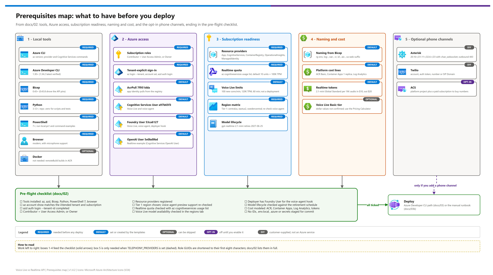

[README](../README.md) › [docs index](./00-reproduce-this-demo.md) › 02 Prerequisites

# 02 — Prerequisites

<p>
  &nbsp;
  &nbsp;
  &nbsp;
  &nbsp;
  
</p>

<p>
  
  
  
  
</p>

Everything required before deploying any of the three examples. Work through this list before [00-reproduce-this-demo.md](./00-reproduce-this-demo.md) or the deployment guides.

## At a glance

| | Area | What you need |
|---|---|---|
|  | Tools | Azure CLI, `azd` 1.30+, Bicep 0.43+, Python 3.12+, PowerShell 7+, browser |
|  | Permissions | Contributor + User Access Administrator, or Owner |
|  | Quota | Realtime Global Standard capacity units in the chosen region |
|  | Region | `centralus`, `eastus2`, or `swedencentral` for a same-region comparison |

[](./assets/prerequisites-map.png)

<sub>Editable source: [`assets/prerequisites-map.drawio`](./assets/prerequisites-map.drawio) - regenerate with `python scripts/export_diagrams.py docs/assets`.</sub>

> [!WARNING]
> **Plan ahead.** The Realtime example creates a model deployment and can fail on quota. Check quota before starting deployment.

> [!IMPORTANT]
> Authenticate tenant-explicitly every time (`az login --tenant`, `azd auth login --tenant-id`) and confirm with `az account show`; ambient login state can point at the wrong tenant or subscription.

> [!TIP]
> Work top to bottom, then tick the [pre-flight checklist](#pre-flight-checklist) at the end.

---

## 1 — Tools

| Tool | Required version or check | Notes |
|---|---|---|
|  Azure CLI | Installed `az`; capture exact version with `az version` | Needs Cognitive Services, Container Apps, Container Registry, and provider-registration commands used below. |
|  Azure Developer CLI (`azd`) | 1.30+; latest verified in the facts brief is 1.34.2 | Each example has its own `azure.yaml`. Use `azd auth login --tenant-id`. |
|  Bicep | 0.43+ | Local Bicep 0.43.8 drove the current API-version pins. |
|  Python | 3.12+ | Containers use `python:3.12-slim`; local scripts and tests use the repo `.venv`. The voice-agent postprovision hook installs `azure-ai-projects` from `scripts\requirements-agent.txt` when it creates the Foundry agent. |
|  PowerShell | 7+ | Required for `scripts\run-local.ps1` and the Windows-first command examples. |
|  Browser | Modern browser with microphone support | Needed for the shared browser UI and AudioWorklet capture. |
|  Docker | Optional | `docker.remoteBuild: true` builds in ACR, so local Docker is not required for the `azd` path. |

---

## 2 — Subscription and permissions

You need an Azure subscription where you can create resources and assign RBAC:

- **Contributor** on the subscription or target resource group.
- **User Access Administrator** on the subscription or target resource group, or **Owner**, because the Bicep templates create role assignments.

Use tenant-explicit auth every time:

```powershell
$TenantId = "<tenant-id>"
$SubscriptionId = "<subscription-id>"

az login --tenant $TenantId
az account set --subscription $SubscriptionId
az account show --query "{tenant:tenantId, subscription:id, name:name, user:user.name}" -o table
azd auth login --tenant-id $TenantId
```

---

## 3 — RBAC assigned by Bicep

| Example | Scope | Principal | Role | GUID |
|---|---|---|---|---|
| All examples | Container Registry | User-assigned managed identity | AcrPull | `7f951dda-4ed3-4680-a7ca-43fe172d538d` |
| Voice Live | Foundry `AIServices` resource | User-assigned managed identity | Cognitive Services User | `a97b65f3-24c7-4388-baec-2e87135dc908` |
| Voice Live | Foundry `AIServices` resource | User-assigned managed identity | Foundry User | `53ca6127-db72-4b80-b1b0-d745d6d5456d` |
| Voice Live | Foundry `AIServices` resource | Deploying principal when `AZURE_PRINCIPAL_ID` is set | Cognitive Services User | `a97b65f3-24c7-4388-baec-2e87135dc908` |
| Voice Live | Foundry `AIServices` resource | Deploying principal when `AZURE_PRINCIPAL_ID` is set | Foundry User | `53ca6127-db72-4b80-b1b0-d745d6d5456d` |
| Realtime | Foundry `AIServices` resource | User-assigned managed identity | Cognitive Services OpenAI User | `5e0bd9bd-7b93-4f28-af87-19fc36ad61bd` |
| Realtime | Foundry `AIServices` resource | Deploying principal when `AZURE_PRINCIPAL_ID` is set | Cognitive Services OpenAI User | `5e0bd9bd-7b93-4f28-af87-19fc36ad61bd` |
| Foundry voice agent | Foundry `AIServices` resource | User-assigned managed identity | Cognitive Services User | `a97b65f3-24c7-4388-baec-2e87135dc908` |
| Foundry voice agent | Foundry `AIServices` resource | User-assigned managed identity | Foundry User | `53ca6127-db72-4b80-b1b0-d745d6d5456d` |
| Foundry voice agent | Foundry `AIServices` resource | Deploying principal when `AZURE_PRINCIPAL_ID` is set | Foundry User | `53ca6127-db72-4b80-b1b0-d745d6d5456d` |

Role source: https://learn.microsoft.com/en-us/azure/role-based-access-control/built-in-roles/ai-machine-learning and https://learn.microsoft.com/en-us/azure/role-based-access-control/built-in-roles/containers

---

## 4 — Resource providers

Register these providers before deployment:

```powershell
az provider register --namespace Microsoft.App
az provider register --namespace Microsoft.CognitiveServices
az provider register --namespace Microsoft.ContainerRegistry
az provider register --namespace Microsoft.OperationalInsights
az provider register --namespace Microsoft.ManagedIdentity
```

Check registration state:

```powershell
az provider show -n Microsoft.App --query registrationState -o tsv
az provider show -n Microsoft.CognitiveServices --query registrationState -o tsv
az provider show -n Microsoft.ContainerRegistry --query registrationState -o tsv
az provider show -n Microsoft.OperationalInsights --query registrationState -o tsv
az provider show -n Microsoft.ManagedIdentity --query registrationState -o tsv
```

---

## 5 — Regional alignment

Deploy all examples to the same AI region when comparing latency. If you split regions, the latency comparison is confounded by geography and capacity differences.

### Tier 1 — strongly recommended for the three-way comparison

- `centralus`
- `eastus2`
- `swedencentral`

### Tier 2 — one example only or not ideal for side-by-side

- Voice Live: `westus2`
- Realtime API: `canadacentral`, `francecentral`, `southindia`

### Tier 3 — workarounds

- Deploy examples in different regions only when regional availability forces it; label the results as functionally comparable but latency-confounded.
- Use BYOM or a different Voice Live model only when the target Voice Live model is not available in the required region.

### Component availability matrix

Snapshot as of **2026-09-25**. Verify at deployment time.

| Region | Voice Live `gpt-realtime-mini`  | Realtime Global Standard family  | Foundry voice agent  | Container Apps managed environment | Recommended use |
|---|---|---|---|---|---|
| `centralus` | Confirmed | Confirmed | Re-check Agent Service + Voice Live support | Verify | Tier 1 same-region bake-off |
| `eastus2` | Confirmed | Confirmed | Re-check Agent Service + Voice Live support | Verify | Tier 1 same-region bake-off |
| `swedencentral` | Confirmed | Confirmed | Re-check Agent Service + Voice Live support | Verify | Tier 1 same-region bake-off |
| `westus2` | Confirmed | Not in the verified Realtime region list | Re-check before use | Verify | Voice Live only or split-region workaround |
| `canadacentral` | Not in the requested Tier 2 common set | Confirmed | Not verified | Verify | Realtime only or split-region workaround |
| `francecentral` | Not in the requested Tier 2 common set | Confirmed | Not verified | Verify | Realtime only or split-region workaround |
| `southindia` | Not in the requested Tier 2 common set | Confirmed | Not verified | Verify | Realtime only or split-region workaround |

### Verify at deployment time

```powershell
# Realtime quota and regional usage.
az cognitiveservices usage list -l <region> -o table

# Azure location list.
az account list-locations -o table

# Container Apps managed environment locations.
az provider show -n Microsoft.App --query "resourceTypes[?resourceType=='managedEnvironments'].locations"

# After a Foundry account exists, inspect available account models.
az cognitiveservices account list-models -n <account-name> -g <resource-group> -o table
```

Voice Live has no verified CLI command for per-model availability. Check the regions tab directly: https://learn.microsoft.com/en-us/azure/ai-services/speech-service/regions?tabs=voice-live

---

## 6 — Quota

### Realtime API quota

Before deploying `examples\realtime-api`, run:

```powershell
az cognitiveservices usage list -l <region> -o table
```

The verified brief confirms a default `gpt-realtime` Global Standard quota row of 100,000 TPM and 200 RPM. Realtime deployment capacity (`sku.capacity`) is set in **capacity units**, and each unit grants both a TPM and an RPM limit that depend on the model version (from `az cognitiveservices model list` and a live deployment, 2026-09-29):

| Model (Global Standard) | Per capacity unit | 10 units | 20 units |
|---|---|---|---|
| `gpt-realtime-2.1-mini` 2026-07-07 | 10,000 TPM + 20 RPM | 100K TPM / 200 RPM | 200K TPM / 400 RPM |
| `gpt-realtime-mini` 2025-12-15 | 10,000 TPM + 3 RPM | 100K TPM / 30 RPM | 200K TPM / 60 RPM |
| `gpt-realtime` 2025-08-28 | 10,000 TPM + 20 RPM | 100K TPM / 200 RPM | 200K TPM / 400 RPM |

The Foundry portal shows the deployment as **TPM** (units × 10,000). `az cognitiveservices usage list` labels the quota row `Requests Per Minute - <model> - GlobalStandard`, but its limit and usage are counted in these **units**, not requests. Observed on 2026-09-29: a subscription with a default limit of **10 units** for `gpt-realtime-2.1-mini` (100K TPM) and 20 for `gpt-realtime-mini` in `centralus`. `REALTIME_DEPLOYMENT_CAPACITY` therefore defaults to `10`, and the `preprovision` hook (`scripts\check-realtime-quota.ps1`) stops `azd provision` with the value to set if the request exceeds what is available. Re-check per-unit rates with `az cognitiveservices model list -l <region>` because they vary by model version.

Request more quota at https://aka.ms/oai/stuquotarequest. The verified brief also notes that realtime quota is moving to a subscription-level pool; moving regions can fix availability, but it does not create new subscription quota.

### Voice Live and Foundry voice-agent quota

For S0 Voice Live resources, the verified limits are:

| Limit | Value |
|---|---|
| New connections per minute | 100 |
| Maximum connection length | 60 minutes per session |
| Tokens per minute | 120,000 |

Only new connections per minute (NCPM) is directly adjustable; the TPM limit increases automatically with it using **TPM = NCPM × 4,000**. Request increases through the Azure portal support-request path (not the Azure OpenAI quota form). Note that Learn is internally inconsistent here: the table lists 100 NCPM and ≤ 120,000 TPM, while the formula example uses 30 NCPM → 120,000 TPM; plan with 120,000 TPM until support confirms the resource's effective limit.

Voice Live's natively supported models and Foundry voice-agent managed models are **not a deployment**, so they do not draw from Azure OpenAI deployment quota and need no per-version quota request. Voice Live removes model deployment management, but high-concurrency workloads still need capacity planning against these per-resource limits. The full side-by-side quota comparison is in [07 — Telephony and the shared AI endpoint](07-telephony-and-shared-endpoint.md#quota-and-limits-voice-live-vs-realtime-api).

---

## 7 — Model lifecycle

Realtime model retirement source: https://learn.microsoft.com/en-us/azure/foundry/openai/concepts/model-retirement-schedule

Known lifecycle points from the verified brief:

| Model | Version | Status in brief | Retirement note |
|---|---|---|---|
| `gpt-realtime-2.1-mini` | `2026-07-07` |  | 2027-06-25 |
| `gpt-realtime-mini` | `2025-12-15` |  | Conflicting duplicate rows: 2026-12-15 vs. 2027-06-15 |
| `gpt-realtime-mini` | `2025-10-06` |  | Conflicting duplicate rows: 2026-09-21 vs. 2027-04-06 |

> [!CAUTION]
> Plan against the earlier conflicting retirement date until Microsoft corrects the page.

Voice Live `gpt-realtime-2.1-mini` is preview in the verified Voice Live model table; verify regional support before relying on it for the same-model bake-off.

---

## 8 — Naming conventions from Bicep

All three examples (and `platform\`) deploy at subscription scope and create a resource group named from the azd environment:

| Resource | Pattern |
|---|---|
|  Resource group | `rg-<environmentName>` |
|  Name suffix | `uniqueString(subscription().id, environmentName, location)` |
|  Log Analytics workspace | `log-<suffix>` |
|  Container Apps environment | `cae-<suffix>` |
|  Container Registry | `cr<suffix>` |
|  User-assigned identity | `id-<suffix>` |
|  Foundry `AIServices` account | `ais-<suffix>` |
|  Container App | `ca-web-<suffix>` |
|  Realtime deployment name | `realtimeDeploymentName` when set, otherwise the model name |

Outputs include the resource group, location, ACR endpoint/name, Container App name/URI, API endpoint, model/deployment values, voice value, and Foundry resource name.

---

## 9 — Cost estimate

Use the Azure Pricing Calculator before quoting a cost: https://azure.microsoft.com/en-us/pricing/calculator/

### Platform line items

| Line item | What to estimate | Notes |
|---|---|---|
| ACR Basic | One Basic registry per example unless you consolidate manually. | Estimate as a small standing monthly registry cost plus image storage. |
| Container Apps consumption | One always-on replica per example at 1 vCPU and 2 GiB. | This demo sets min replicas and max replicas to one, so include idle baseline plus active CPU/memory. |
| Log Analytics | Container App console logs and retention. | Estimate ingestion from `voice_turn`, session logs, platform logs, and any debug level changes. |

### Realtime model tokens

Published `gpt-realtime-2.1-mini` Global Standard rates from the verified Retail Prices API:

| Meter | Rate per 1M tokens |
|---|---:|
| Text input | $0.60 |
| Cached text input | $0.06 |
| Text output | $2.40 |
| Audio input | $10.00 |
| Cached audio input | $0.30 |
| Audio output | $20.00 |

Worked formula for a 3-minute call:

```text
realtime_call_cost =
  (input_text_tokens / 1,000,000 * 0.60)
+ (cached_text_tokens / 1,000,000 * 0.06)
+ (output_text_tokens / 1,000,000 * 2.40)
+ (input_audio_tokens / 1,000,000 * 10.00)
+ (cached_audio_tokens / 1,000,000 * 0.30)
+ (output_audio_tokens / 1,000,000 * 20.00)
```

Do not invent audio tokens per second. Get the actual token counts from `response.done.response.usage`, the app metrics UI, Log Analytics, or `loadtest\concurrency_probe.py` output.

### Voice Live Basic tier and voice-agent preview

The Foundry voice-agent example uses a managed Voice Live model and does not create an Azure OpenAI deployment, but it can store transcripts/audio and traces in Foundry (`store: true`). Account for Foundry Agent Service preview usage and review pricing before quoting.

### Voice Live Basic tier

Voice Live `gpt-realtime-mini` and `gpt-realtime-2.1-mini` are Basic tier in the verified model table, but exact dollar values were not confirmed in the static research pass. Link only: https://azure.microsoft.com/en-us/pricing/details/cognitive-services/speech-services/

---

## 10 — Optional phone channels

| Channel | You need | Notes |
|---|---|---|
| Asterisk (`chan_websocket`) | Asterisk 20.16+, 21.11+, 22.6+ or 23 with `chan_websocket` and `res_websocket_client` loaded (`asterisk -rx "module show like websocket"`); outbound TCP 443 to `*.azurecontainerapps.io`; public CA trust | No SIP trunk, no Twilio, no ACS. JSON control messages need 20.18+/22.8+/23.2+. Secrets are generated by `scripts\enable-telephony.ps1`. |
| Twilio | Twilio account, auth token, and a number or SIP Domain | Your auth token becomes `TWILIO_AUTH_TOKEN`. |
| ACS | The shared `platform\` (provides ACS), a **paid** subscription to buy numbers | Numbers are bought in the portal. |

## Pre-flight checklist

> [!TIP]
> Treat this as the gate for the whole page: do not start deployment until every box is ticked.

Confirm all of these before moving to deployment:

- [ ] Azure CLI, `azd`, Bicep, Python, PowerShell 7, and browser are installed.
- [ ] `az account show` matches the intended tenant and subscription.
- [ ] `azd auth login --tenant-id <tenant-id>` completed.
- [ ] Subscription permission includes Contributor plus User Access Administrator, or Owner.
- [ ] Resource providers are registered.
- [ ] Region chosen from Tier 1 when doing a same-region comparison, and voice-agent preview support re-checked if using `examples\foundry-voice-agent`.
- [ ] Realtime quota checked with `az cognitiveservices usage list -l <region> -o table`.
- [ ] Voice Live model availability checked in the regions tab.
- [ ] Deployer has Foundry User for the voice-agent postprovision hook.
- [ ] Model lifecycle checked against the retirement schedule.
- [ ] Cost expectations modeled for ACR, Container Apps, Log Analytics, and model tokens.
- [ ] No populated IDs, `.env.local`, `.azure\`, or secrets are staged for commit.

**Next:** [03 — Deployment](./03-deployment.md).

---

*Last updated: 2026-10-02*
