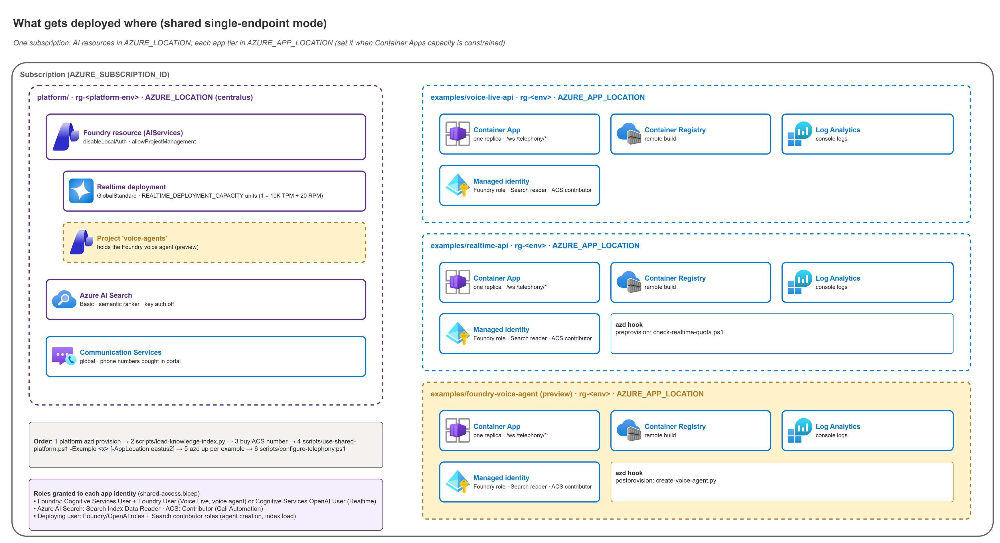

# 03 — Deployment

Step-by-step `azd` deployment for the reusable browser voice-agent comparison repo. The three examples deploy side by side to Azure Container Apps and differ only in the upstream API they call:

- `examples\voice-live-api\` → Azure AI Voice Live API.
- `examples\realtime-api\` → Azure OpenAI GPT Realtime API GA.
- `examples\foundry-voice-agent\` → Foundry voice agent public preview (served by Voice Live agent mode).

> **No-IaC alternative.** If the environment cannot run `azd` or Bicep, use [03b-manual-deployment.md](./03b-manual-deployment.md). It creates the same resource shape with Azure Portal and imperative Azure CLI commands.

> **Windows paths.** Commands below assume PowerShell on Windows. Keep backslash paths.

---

## Phase overview



| Phase | What you do | Typical time | Validation at end |
|---|---|---:|---|
| 0 | Authenticate `az` and `azd` to the intended tenant and subscription | 2-5 min | `az account show` matches the target |
| 1 | Pick a shared region and check provider registration, quota, and capacity | 5-10 min | Region is viable before provisioning |
| 2 | Deploy `examples\voice-live-api` with `azd up` | 10-15 min | App URL, Foundry resource, and Voice Live endpoint exist |
| 3 | Deploy `examples\realtime-api` with `azd up` | 10-15 min | App URL, Foundry resource, and model deployment exist |
| 4 | Deploy `examples\foundry-voice-agent` with `azd up` | 10-15 min | App URL, Foundry project, and voice agent version exist |
| 5 | Smoke test all three deployed apps | 10 min | Browser, tool call, health, info, and metrics work |
| 6 | Run any example locally against deployed resources | 5-10 min | Local `uvicorn` app connects with your Azure identity |
| 7 | Change model, voice, capacity, agent profile, or concurrency and redeploy | 5-15 min | New values appear in `/api/info`, deployment list, or a new agent version |
| 8 | Tear down cleanly | 5-10 min | Resource group is removed and soft-deleted AI account is purged |

---

## What azd reads and writes

`azd` reads each example's `infra\main.parameters.json`, maps environment values to Bicep parameters, then writes deployment outputs to `.azure\<env>\.env`. Use `azd env get-values` to inspect or export those values.

### Voice Live API IaC contract

| azd env value | Bicep parameter | Default from `main.parameters.json` | Used for |
|---|---|---|---|
| `AZURE_ENV_NAME` | `environmentName` | azd environment name | Resource group `rg-<env>` and resource-name suffix |
| `AZURE_LOCATION` | `location` | set by operator | Azure region |
| `AZURE_APP_LOCATION` | `appLocation` | empty (= `AZURE_LOCATION`) | Optional region for Container Apps, ACR, Log Analytics, and the app identity when Container Apps is constrained in the AI region; see [07](07-telephony-and-shared-endpoint.md#container-apps-in-a-different-region-than-the-ai-endpoint) |
| `AZURE_PRINCIPAL_ID` | `principalId` | set by azd when available | Optional deployer RBAC for local runs |
| `AZURE_PRINCIPAL_TYPE` | `principalType` | `User` | Principal type for deployer RBAC |
| `VOICE_LIVE_MODEL` | `voiceLiveModel` | `gpt-realtime-mini` | Managed Voice Live model |
| `VOICE_LIVE_VOICE` | `voiceLiveVoice` | `en-US-Ava:DragonHDLatestNeural` | Voice Live voice |
| `MAX_CONCURRENT_SESSIONS` | `maxConcurrentSessions` | `20` | Per-replica admission cap |
| `SERVICE_WEB_RESOURCE_EXISTS` | `webExists` | `false` | Preserve current image on re-provision |

| Voice Live output | Source | Notes |
|---|---|---|
| `AZURE_LOCATION` | `main.bicep` | Deployment region |
| `AZURE_TENANT_ID` | `main.bicep` | Tenant used by the deployment |
| `AZURE_RESOURCE_GROUP` | `main.bicep` | `rg-<env>` |
| `AZURE_CONTAINER_REGISTRY_ENDPOINT` | `resources.bicep` | ACR login server |
| `AZURE_CONTAINER_REGISTRY_NAME` | `resources.bicep` | ACR name |
| `SERVICE_WEB_NAME` | `resources.bicep` | Container App name |
| `SERVICE_WEB_URI` | `resources.bicep` | Public HTTPS URL |
| `VOICE_LIVE_ENDPOINT` | `resources.bicep` | `https://<foundry>.services.ai.azure.com` |
| `VOICE_LIVE_MODEL` | `main.bicep` | Active Voice Live model |
| `VOICE_LIVE_VOICE` | `main.bicep` | Active Voice Live voice |
| `VOICE_LIVE_API_VERSION` | `main.bicep` | `2026-07-15` |
| `FOUNDRY_RESOURCE_NAME` | `resources.bicep` | AIServices account name |

Container App environment variables set by Bicep are exactly: `VOICE_LIVE_ENDPOINT`, `VOICE_LIVE_API_VERSION`, `VOICE_LIVE_MODEL`, `VOICE_LIVE_VOICE`, `AZURE_CLIENT_ID`, `MAX_CONCURRENT_SESSIONS`, and `LOG_LEVEL`.

### Realtime API IaC contract

| azd env value | Bicep parameter | Default from `main.parameters.json` | Used for |
|---|---|---|---|
| `AZURE_ENV_NAME` | `environmentName` | azd environment name | Resource group `rg-<env>` and resource-name suffix |
| `AZURE_LOCATION` | `location` | set by operator | Azure region |
| `AZURE_APP_LOCATION` | `appLocation` | empty (= `AZURE_LOCATION`) | Optional region for Container Apps, ACR, Log Analytics, and the app identity when Container Apps is constrained in the AI region; see [07](07-telephony-and-shared-endpoint.md#container-apps-in-a-different-region-than-the-ai-endpoint) |
| `AZURE_PRINCIPAL_ID` | `principalId` | set by azd when available | Optional deployer RBAC for local runs |
| `AZURE_PRINCIPAL_TYPE` | `principalType` | `User` | Principal type for deployer RBAC |
| `AZURE_OPENAI_REALTIME_MODEL` | `realtimeModel` | `gpt-realtime-2.1-mini` | Model name deployed to Azure OpenAI |
| `AZURE_OPENAI_REALTIME_MODEL_VERSION` | `realtimeModelVersion` | empty | Optional override; Bicep defaults per model |
| `AZURE_OPENAI_REALTIME_DEPLOYMENT` | `realtimeDeploymentName` | empty | Optional deployment name; defaults to model name |
| `REALTIME_DEPLOYMENT_CAPACITY` | `realtimeDeploymentCapacity` | `10` | GlobalStandard capacity units; `gpt-realtime-2.1-mini` = 10K TPM + 20 RPM per unit (10 = 100K TPM). Checked by the `preprovision` hook |
| `REALTIME_VERSION_UPGRADE_OPTION` | `versionUpgradeOption` | `OnceCurrentVersionExpired` | Deployment version-upgrade policy |
| `REALTIME_VOICE` | `realtimeVoice` | `marin` | Realtime output voice |
| `MAX_CONCURRENT_SESSIONS` | `maxConcurrentSessions` | `20` | Per-replica admission cap |
| `SERVICE_WEB_RESOURCE_EXISTS` | `webExists` | `false` | Preserve current image on re-provision |

| Realtime output | Source | Notes |
|---|---|---|
| `AZURE_LOCATION` | `main.bicep` | Deployment region |
| `AZURE_TENANT_ID` | `main.bicep` | Tenant used by the deployment |
| `AZURE_RESOURCE_GROUP` | `main.bicep` | `rg-<env>` |
| `AZURE_CONTAINER_REGISTRY_ENDPOINT` | `resources.bicep` | ACR login server |
| `AZURE_CONTAINER_REGISTRY_NAME` | `resources.bicep` | ACR name |
| `SERVICE_WEB_NAME` | `resources.bicep` | Container App name |
| `SERVICE_WEB_URI` | `resources.bicep` | Public HTTPS URL |
| `AZURE_OPENAI_ENDPOINT` | `resources.bicep` | `https://<foundry>.openai.azure.com` |
| `AZURE_OPENAI_REALTIME_DEPLOYMENT` | `resources.bicep` | Deployment name used in the GA `model=` query |
| `AZURE_OPENAI_REALTIME_MODEL` | `main.bicep` | Active model label |
| `AZURE_OPENAI_REALTIME_MODEL_VERSION` | `resources.bicep` | Resolved model version |
| `REALTIME_VOICE` | `main.bicep` | Active Realtime voice |
| `FOUNDRY_RESOURCE_NAME` | `resources.bicep` | AIServices account name |

Container App environment variables set by Bicep are exactly: `AZURE_OPENAI_ENDPOINT`, `AZURE_OPENAI_REALTIME_DEPLOYMENT`, `AZURE_OPENAI_REALTIME_MODEL`, `REALTIME_VOICE`, `AZURE_CLIENT_ID`, `MAX_CONCURRENT_SESSIONS`, and `LOG_LEVEL`.

### Foundry voice agent IaC contract

| azd env value | Bicep parameter | Default from `main.parameters.json` | Used for |
|---|---|---|---|
| `AZURE_ENV_NAME` | `environmentName` | azd environment name | Resource group `rg-<env>` and resource-name suffix |
| `AZURE_LOCATION` | `location` | set by operator | AI region for Foundry, Voice Live, and the Foundry project |
| `AZURE_APP_LOCATION` | `appLocation` | empty (= `AZURE_LOCATION`) | Optional app tier region for Container Apps, ACR, Log Analytics, and identity |
| `VOICE_AGENT_MODEL` | `voiceAgentModel` | `gpt-realtime-2.1-mini` | Managed model stored on the voice agent; no Azure OpenAI deployment |
| `VOICE_AGENT_VOICE` | `voiceAgentVoice` | `en-US-Ava:DragonHDLatestNeural` | Voice stored on the agent |
| `VOICE_AGENT_NAME` | `voiceAgentName` | `voice-agent-demo` | Agent name used in the Voice Live agent-mode URL |
| `VOICE_AGENT_PROJECT_NAME` | `voiceAgentProjectName` | `voice-agents` | Standalone Foundry project name |
| `SHARED_FOUNDRY_PROJECT` | `sharedFoundryProjectName` | empty | Shared platform project that holds the agent |
| `MAX_CONCURRENT_SESSIONS` | `maxConcurrentSessions` | `20` | Per-replica admission cap |
| `SERVICE_WEB_RESOURCE_EXISTS` | `webExists` | `false` | Preserve current image on re-provision |

| Voice-agent output | Source | Notes |
|---|---|---|
| `VOICE_AGENT_ENDPOINT` | `resources.bicep` | `https://<foundry>.services.ai.azure.com` |
| `VOICE_AGENT_PROJECT` | `resources.bicep` | Project name used as `agent-project-name` |
| `VOICE_AGENT_PROJECT_ENDPOINT` | `resources.bicep` | Used by `scripts\create-voice-agent.py` |
| `VOICE_AGENT_NAME` | `main.bicep` | Agent name |
| `VOICE_AGENT_MODEL` | `main.bicep` | Active managed model stored on the agent |
| `VOICE_AGENT_VOICE` | `main.bicep` | Active voice stored on the agent |
| `VOICE_AGENT_API_VERSION` | `main.bicep` | `2026-07-15` |

Container App environment variables set by Bicep are exactly: `VOICE_AGENT_ENDPOINT`, `VOICE_AGENT_PROJECT`, `VOICE_AGENT_NAME`, `VOICE_AGENT_API_VERSION`, `VOICE_AGENT_MODEL`, `VOICE_AGENT_VOICE`, `AZURE_CLIENT_ID`, `MAX_CONCURRENT_SESSIONS`, and `LOG_LEVEL`, plus shared search/telephony values when enabled. The `postprovision` hook creates or versions the agent from `config\agent-profile.json`; re-run `azd hooks run postprovision` after profile edits.

---

## Phase 0 — Authenticate to the right tenant

> **Do this first every time.** This repo is intended for multi-tenant work. Never run a bare `az login` or trust ambient `azd` state before token acquisition or resource writes.

Set target values:

```powershell
$TenantId = "<TENANT_ID>"
$SubscriptionId = "<SUBSCRIPTION_ID>"
```

Sign in and pin the subscription:

```powershell
az login --tenant $TenantId
# If no browser is available:
# az login --tenant $TenantId --use-device-code

az account set --subscription $SubscriptionId
az account show --query "{tenant:tenantId, subscription:id, subName:name, user:user.name}" -o table

azd auth login --tenant-id $TenantId
```

### Phase 0 validation

- [ ] `az account show` returns the intended tenant ID.
- [ ] `az account show` returns the intended subscription ID.
- [ ] `azd auth login --tenant-id <TENANT_ID>` completed for the same tenant.
- [ ] No deployment command has run before this validation passed.

---

## Phase 1 — Pick a region and check quota/availability

Use one region for all examples when you want a fair side-by-side. The Tier-1 side-by-side regions are:

| Tier | Regions | Why |
|---|---|---|
| Tier 1 | `centralus`, `eastus2`, `swedencentral` | Confirmed for Voice Live `gpt-realtime-mini` and Realtime API Global Standard realtime models |
| Also viable for Voice Live-only | `westus2` | Confirmed for Voice Live but not the strongest default for a side-by-side |

Set a shared region:

```powershell
$Location = "centralus"
```

Register providers if this subscription is new to these services:

```powershell
az provider register --namespace Microsoft.App
az provider register --namespace Microsoft.ContainerRegistry
az provider register --namespace Microsoft.CognitiveServices
az provider register --namespace Microsoft.ManagedIdentity
az provider register --namespace Microsoft.OperationalInsights

az provider show --namespace Microsoft.App --query registrationState -o tsv
az provider show --namespace Microsoft.CognitiveServices --query registrationState -o tsv
```

Check Cognitive Services usage and quota in the target region:

```powershell
az cognitiveservices usage list -l $Location -o table
```

What to look for:

- For **Realtime API**, confirm the subscription has available Global Standard realtime quota before deploying the model. Realtime quota is tracked at subscription level for the relevant pool; moving regions can fix capacity placement, but it does not create more subscription quota.
- For **Voice Live**, remember the service is managed model mode with no customer model deployment, but the resource still has service limits: 100 new connections per minute, 120,000 TPM, and 60-minute sessions at the default S0 limit.
- For any option, if the target model is not available or capacity is exhausted in the region, switch to another Tier-1 region before provisioning.

### Phase 1 validation

- [ ] `Microsoft.App`, `Microsoft.ContainerRegistry`, `Microsoft.CognitiveServices`, `Microsoft.ManagedIdentity`, and `Microsoft.OperationalInsights` are registered or registering.
- [ ] `$Location` is one of `centralus`, `eastus2`, or `swedencentral` for side-by-side deployment.
- [ ] `az cognitiveservices usage list -l $Location -o table` has been reviewed for quota and capacity risk.
- [ ] Any required quota request is filed before a customer-facing build.

---

## Phase 2 — Deploy the Voice Live example

Voice Live creates no model deployment. The app connects to the managed Voice Live model through an AIServices account.

```powershell
cd <repo-root>\examples\voice-live-api

azd env new vl-<name>
azd env set AZURE_TENANT_ID $TenantId
azd env set AZURE_SUBSCRIPTION_ID $SubscriptionId
azd env set AZURE_LOCATION $Location

# Optional preview model. Default is gpt-realtime-mini.
azd env set VOICE_LIVE_MODEL gpt-realtime-2.1-mini

azd env get-values
azd up
```

What gets created:

- Resource group `rg-<azd-env-name>`.
- Log Analytics workspace.
- Azure Container Apps environment.
- Azure Container Registry Basic with admin user disabled.
- User-assigned managed identity.
- `AcrPull` assignment from the identity to ACR.
- AIServices Foundry account with custom subdomain and local auth disabled.
- Cognitive Services User and Foundry User assignments for the Container App identity, plus the deploying principal when `AZURE_PRINCIPAL_ID` is present.
- Azure Container App with external ingress on port 8000, one replica, `/healthz` probes, and the Voice Live environment variables listed above.

Expected duration: about 10-15 minutes, dominated by provider readiness and ACR remote build. A local Docker daemon is not required because `azure.yaml` uses `docker.remoteBuild: true`.

Capture the outputs:

```powershell
azd env get-values
```

### Phase 2 validation

- [ ] `azd up` completed without an infrastructure or deployment error.
- [ ] `azd env get-values` includes `SERVICE_WEB_URI`.
- [ ] `azd env get-values` includes `VOICE_LIVE_ENDPOINT`.
- [ ] `azd env get-values` includes `FOUNDRY_RESOURCE_NAME`.
- [ ] `azd env get-values` reports `VOICE_LIVE_MODEL` as the intended value.

---

## Phase 3 — Deploy the Realtime API example

The Realtime API example creates and sizes an Azure OpenAI realtime model deployment. The default is `gpt-realtime-2.1-mini` version `2026-07-07`; `gpt-realtime-mini` uses version `2025-12-15` unless you override `AZURE_OPENAI_REALTIME_MODEL_VERSION`.

```powershell
cd <repo-root>\examples\realtime-api

azd env new rt-<name>
azd env set AZURE_TENANT_ID $TenantId
azd env set AZURE_SUBSCRIPTION_ID $SubscriptionId
azd env set AZURE_LOCATION $Location
azd env set AZURE_OPENAI_REALTIME_MODEL gpt-realtime-2.1-mini
azd env set REALTIME_DEPLOYMENT_CAPACITY 10

azd env get-values
azd up
```

Optional overrides:

```powershell
azd env set AZURE_OPENAI_REALTIME_DEPLOYMENT <deployment-name>
azd env set AZURE_OPENAI_REALTIME_MODEL_VERSION <model-version>
azd env set REALTIME_VOICE marin
azd env set MAX_CONCURRENT_SESSIONS 20
```

What gets created:

- Same base resources as the Voice Live example: resource group, Log Analytics, Container Apps environment, ACR Basic with admin disabled, user-assigned managed identity, `AcrPull`, AIServices account, and one Container App.
- Azure OpenAI realtime model deployment under the AIServices account:
  - `sku.name`: `GlobalStandard`.
  - `sku.capacity`: `REALTIME_DEPLOYMENT_CAPACITY`.
  - `model.format`: `OpenAI`.
  - `model.name`: `AZURE_OPENAI_REALTIME_MODEL`.
  - `model.version`: resolved from Bicep defaults or `AZURE_OPENAI_REALTIME_MODEL_VERSION`.
  - `raiPolicyName`: `Microsoft.DefaultV2`.
  - `versionUpgradeOption`: `REALTIME_VERSION_UPGRADE_OPTION`.
- Cognitive Services OpenAI User assignments for the Container App identity, plus the deploying principal when `AZURE_PRINCIPAL_ID` is present.

Check the deployment afterwards:

```powershell
$Rg = azd env get-value AZURE_RESOURCE_GROUP
$Foundry = azd env get-value FOUNDRY_RESOURCE_NAME

az cognitiveservices account deployment list -n $Foundry -g $Rg -o table
```

Expected duration: about 10-15 minutes when quota and regional capacity are already available. `InsufficientQuota` or capacity errors happen during the model deployment step, not during image build.

### Phase 3 validation

- [ ] `azd up` completed without `InsufficientQuota` or model availability errors.
- [ ] `azd env get-values` includes `SERVICE_WEB_URI`.
- [ ] `azd env get-values` includes `AZURE_OPENAI_ENDPOINT`.
- [ ] `azd env get-values` includes `AZURE_OPENAI_REALTIME_DEPLOYMENT`.
- [ ] `az cognitiveservices account deployment list -n $Foundry -g $Rg -o table` shows the intended model deployment.

---

## Phase 4 — Deploy the Foundry voice agent example (preview)

```powershell
cd <repo-root>\examples\foundry-voice-agent

azd env new va-<name>
azd env set AZURE_TENANT_ID $TenantId
azd env set AZURE_SUBSCRIPTION_ID $SubscriptionId
azd env set AZURE_LOCATION $Location
azd up
```

What gets created:

- Same base resources as the other examples: resource group, Log Analytics, Container Apps environment, ACR Basic, user-assigned managed identity, `AcrPull`, and one Container App.
- AIServices Foundry account with `disableLocalAuth: true`, `allowProjectManagement: true`, and a system-assigned identity.
- Foundry project `voice-agents` in standalone mode.
- Cognitive Services User and Foundry User assignments for the app identity, plus Foundry User for the deploying principal when `AZURE_PRINCIPAL_ID` is present.
- A voice agent version created by `examples\foundry-voice-agent\hooks\postprovision.ps1`, which runs `scripts\create-voice-agent.py --project-endpoint ...`.

Validation:

```powershell
azd env get-values
$ServiceWebUri = azd env get-value SERVICE_WEB_URI
curl.exe "$ServiceWebUri/healthz"
curl.exe "$ServiceWebUri/api/info"
```

### Phase 4 validation

- [ ] `azd up` completed and the postprovision hook did not fail.
- [ ] `VOICE_AGENT_ENDPOINT`, `VOICE_AGENT_PROJECT`, and `VOICE_AGENT_NAME` are present.
- [ ] `/api/info` reports the Foundry voice agent example.
- [ ] Re-running `azd hooks run postprovision` after profile edits creates a new agent version.

---

## Phase 5 — Smoke test

Run these checks for each example from that example's folder.

```powershell
$ServiceWebUri = azd env get-value SERVICE_WEB_URI

curl.exe "$ServiceWebUri/healthz"
curl.exe "$ServiceWebUri/api/info"
```

Expected results:

- `/healthz` returns `{"status":"ok"}`.
- `/api/info` returns the API name, model, voice, active sessions, and max sessions.

Open the browser:

```powershell
Start-Process $ServiceWebUri
```

In the browser:

1. Select **Start**.
2. Allow microphone access.
3. Speak a short request and confirm audio returns.
4. Type `What's the status of request SR-1001?` and send it.
5. Confirm the **Tools** panel shows `lookup_request_status` and the result contains the fictional Contoso service desk record.
6. Confirm the **Metrics** panel updates Last TTFA, Last response, token counts, session turns, total tokens, tokens per minute, and p50/p90 TTFA.

### Phase 4 validation

- [ ] `/healthz` returns `status: ok` for Voice Live.
- [ ] `/api/info` reports `Voice Live API` for Voice Live.
- [ ] `/healthz` returns `status: ok` for Realtime API.
- [ ] `/api/info` reports `Realtime API` for Realtime.
- [ ] `/healthz` returns `status: ok` for the Foundry voice agent.
- [ ] `/api/info` reports the Foundry voice agent example.
- [ ] Browser microphone prompt appears and is accepted.
- [ ] Spoken turn returns audio.
- [ ] Typed SR-1001 turn exercises `lookup_request_status`.
- [ ] Metrics panel updates after at least one complete turn.

---

## Phase 6 — Local run against deployed resources

Local runs use the Azure identity from your local `az` login. The Bicep grants the deploying principal the required roles only when `AZURE_PRINCIPAL_ID` is populated, and RBAC can take a few minutes to propagate.

Voice Live:

```powershell
cd <repo-root>\examples\voice-live-api
azd env get-values > .env.local
..\..\scripts\run-local.ps1 -Example voice-live-api
```

Realtime API:

```powershell
cd <repo-root>\examples\realtime-api
azd env get-values > .env.local
..\..\scripts\run-local.ps1 -Example realtime-api
```

Foundry voice agent:

```powershell
cd <repo-root>\examples\foundry-voice-agent
azd env get-values > .env.local
..\..\scripts\run-local.ps1 -Example foundry-voice-agent
```

Open `http://127.0.0.1:8000` after `uvicorn` starts.

If local upstream calls return 401 or 403 immediately after provisioning, wait 5-10 minutes and retry. If they still fail, confirm your deploying principal was assigned roles on the Foundry account.

### Phase 5 validation

- [ ] `.env.local` exists in the selected example folder and came from `azd env get-values`.
- [ ] `..\..\scripts\run-local.ps1 -Example voice-live-api` starts `uvicorn` for Voice Live.
- [ ] `..\..\scripts\run-local.ps1 -Example realtime-api` starts `uvicorn` for Realtime API.
- [ ] `http://127.0.0.1:8000/healthz` returns `status: ok`.
- [ ] Browser smoke test works locally after RBAC propagation.

---

## Phase 7 — Change model, voice, capacity, or concurrency and redeploy

Use `azd provision` when you change a Bicep parameter or Container App environment value. Use `azd deploy` when only application code, static assets, or Python files changed. Use `azd up` when you want both in sequence.

Voice Live examples:

```powershell
cd <repo-root>\examples\voice-live-api

azd env set VOICE_LIVE_MODEL gpt-realtime-mini
azd env set VOICE_LIVE_VOICE en-US-Ava:DragonHDLatestNeural
azd env set MAX_CONCURRENT_SESSIONS 20

azd provision
```

Realtime API examples:

```powershell
cd <repo-root>\examples\realtime-api

azd env set AZURE_OPENAI_REALTIME_MODEL gpt-realtime-2.1-mini
azd env set REALTIME_DEPLOYMENT_CAPACITY 10
azd env set REALTIME_VOICE marin
azd env set MAX_CONCURRENT_SESSIONS 20

azd provision
```

Foundry voice agent examples:

```powershell
cd <repo-root>\examples\foundry-voice-agent

azd env set VOICE_AGENT_MODEL gpt-realtime-2.1-mini
azd env set VOICE_AGENT_VOICE en-US-Ava:DragonHDLatestNeural
azd env set MAX_CONCURRENT_SESSIONS 20

azd provision
azd hooks run postprovision   # publish profile/model/voice changes as a new agent version
```

After a code-only change:

```powershell
azd deploy
```

After both infra settings and code changed:

```powershell
azd provision
azd deploy
```

Validation commands:

```powershell
$ServiceWebUri = azd env get-value SERVICE_WEB_URI
curl.exe "$ServiceWebUri/api/info"

$Rg = azd env get-value AZURE_RESOURCE_GROUP
$Foundry = azd env get-value FOUNDRY_RESOURCE_NAME
az cognitiveservices account deployment list -n $Foundry -g $Rg -o table
```

### Phase 6 validation

- [ ] Model and voice changes appear in `/api/info`.
- [ ] Realtime model deployment changes appear in `az cognitiveservices account deployment list`.
- [ ] `MAX_CONCURRENT_SESSIONS` changes are reflected in `/api/info`.
- [ ] `azd deploy` was run after any application code or static asset change.

---

## Phase 8 — Tear down

Run teardown from each example folder you deployed:

```powershell
cd <repo-root>\examples\voice-live-api
azd down --purge

cd <repo-root>\examples\realtime-api
azd down --purge

cd <repo-root>\examples\foundry-voice-agent
azd down --purge
```

Use `--purge` because soft-deleted Foundry and Cognitive Services accounts can retain the account name and quota association. Without purge, a later rebuild can fail with a name conflict even after the resource group appears deleted.

If you need to inspect or purge a leftover account manually:

```powershell
az cognitiveservices account list-deleted -o table
az cognitiveservices account purge --name <account-name> --resource-group <deleted-resource-group> --location <region>
```

### Phase 7 validation

- [ ] `azd down --purge` completed for every environment you created.
- [ ] The resource group no longer appears in the portal or `az group list`.
- [ ] `az cognitiveservices account list-deleted -o table` does not show a leftover account name you plan to reuse.

---

## Post-deployment checklist

- [ ] Voice Live, Realtime API, and Foundry voice agent were deployed to the same Tier-1 region for side-by-side testing.
- [ ] Browser smoke test passed for all deployed examples.
- [ ] Local run passed for at least one example.
- [ ] Load test plan in [04-testing.md](./04-testing.md) is ready before any customer walkthrough.
- [ ] Troubleshooting runbook in [05-troubleshooting.md](./05-troubleshooting.md) is available during the demo.
- [ ] Teardown command and purge behavior are understood before creating throwaway environments.

---

*Last updated: 2026-09-29*
