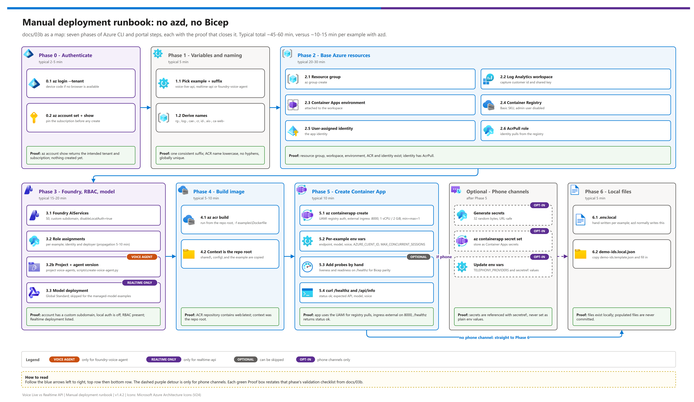

[README](../README.md) › [docs index](./00-reproduce-this-demo.md) › 03b Manual deployment

# 03b — Manual Deployment (No azd or Bicep)

<p>
  &nbsp;
  &nbsp;
  &nbsp;
  &nbsp;
  
</p>

<p>
  
  
  
  
</p>

Manual deployment path for customers who cannot run `azd`, ARM, or Bicep. It produces the same **resource kinds, role assignments, container image shape, ingress, identity model, and application environment variables** as [03-deployment.md](./03-deployment.md), using Azure Portal and imperative Azure CLI commands.

> [!TIP]
> **Use the IaC path when you can.** Manual deployment usually takes ~45-60 minutes. The `azd` path usually takes ~10-15 minutes per example and is less error-prone.

> [!IMPORTANT]
> **After manual provisioning.** Anything `azd` normally writes to `.azure\<env>\.env` must be populated by hand into `examples\<ex>\.env.local` for local runs and into `demo-ids.local.json` for human reference.

This document only replaces the provisioning phases. For smoke testing, local runs, and load testing, use:

- [03-deployment.md](./03-deployment.md)
- [04-testing.md](./04-testing.md)

---

## Phase overview

[](./assets/manual-deployment-steps.png)

<sub>Editable source: [`assets/manual-deployment-steps.drawio`](./assets/manual-deployment-steps.drawio) - regenerate with `python scripts/export_diagrams.py docs/assets`.</sub>

| Step | | What you build manually | Typical time | Gate |
|---|---|---|---:|---|
| **Phase 0** |  | Authenticate to the intended tenant and subscription | 2-5 min | ☐ `az account show` matches target |
| **Phase 1** |  | Shared variables and naming | 5 min | ☐ One consistent suffix is set |
| **Phase 2** |  | Base Azure resources | 20-30 min | ☐ RG, Log Analytics, ACA environment, ACR, and identity exist |
| **Phase 3** |  | API-specific Foundry account, RBAC, and optional Realtime model deployment | 15-20 min | ☐ Roles and deployment exist |
| **Phase 4** |  | Remote image build from repo root | 5-10 min | ☐ ACR contains the app image |
| **Phase 5** |  | Container App create | 10 min | ☐ HTTPS endpoint responds |
| **Phase 6** |  | Hand-populate local deployment files | 5 min | ☐ `.env.local` and `demo-ids.local.json` are usable |

---

## Phase 0 — Authenticate to the right tenant

> [!WARNING]
> **Tenant-explicit `az` authentication is mandatory.** The active `az` account silently drifts across tenants and subscriptions; a bare `az login` can create resources in the wrong place. Sign in with `az login --tenant`, pin the subscription with `az account set`, and confirm with `az account show` **before any create command**. If you also use `azd` elsewhere in the repo, run `azd auth login --tenant-id <TENANT_ID>` for the same tenant.

Run the same tenant-explicit auth gate as the IaC path:

```powershell
$TenantId = "<TENANT_ID>"
$SubscriptionId = "<SUBSCRIPTION_ID>"

az login --tenant $TenantId
# If no browser is available:
# az login --tenant $TenantId --use-device-code

az account set --subscription $SubscriptionId
az account show --query "{tenant:tenantId, subscription:id, subName:name, user:user.name}" -o table
```

### Phase 0 validation

- [ ] `az account show` returns the intended tenant ID.
- [ ] `az account show` returns the intended subscription ID.
- [ ] No create command has run before tenant and subscription were verified.

---

## Phase 1 — Shared variables and naming

The Bicep path uses a deterministic `uniqueString()` suffix. Manual CLI cannot evaluate that ARM function without a deployment, so choose one short suffix and use it consistently. If you are recreating a prior `azd` environment manually, copy the existing suffix from the deployed resource names.

```powershell
$Repo = "<repo-root>"   # the folder you cloned this repo into
$Example = "voice-live-api"   # or "realtime-api" or "foundry-voice-agent"
$EnvName = "manual-voice"
$Location = "centralus"
$Suffix = "<short-unique-suffix>"

$Rg = "rg-$EnvName"
$LogName = "log-$Suffix"
$CaeName = "cae-$Suffix"
$AcrName = "cr$Suffix"
$IdentityName = "id-$Suffix"
$FoundryName = "ais-$Suffix"
$WebName = "ca-web-$Suffix"
$ImageTag = "web:latest"
$AcrLoginServer = "$AcrName.azurecr.io"
$Image = "$AcrLoginServer/$ImageTag"
$MaxConcurrentSessions = 20
$VoiceAgentProjectName = "voice-agents"
$VoiceAgentName = "voice-agent-demo"

$SubId = az account show --query id -o tsv
$PrincipalId = az ad signed-in-user show --query id -o tsv
```

### Phase 1 validation

- [ ] `$Example` is `voice-live-api`, `realtime-api`, or `foundry-voice-agent`.
- [ ] `$Location` is a Tier-1 side-by-side region from [03-deployment.md](./03-deployment.md).
- [ ] `$AcrName` is globally unique, lowercase, and has no hyphens.
- [ ] `$PrincipalId` is populated if the deployer should run locally against the same Foundry account.

---

## Phase 2 — Base Azure resources

| Step | | Resource | Gate |
|---|---|---|---|
| **2.1** |  | Resource group | ☐ `$Rg` exists |
| **2.2** |  | Log Analytics workspace | ☐ Workspace ID and key captured |
| **2.3** |  | Container Apps environment | ☐ Environment attached to the workspace |
| **2.4** |  | Azure Container Registry | ☐ Basic SKU, admin user disabled |
| **2.5** |  | User-assigned managed identity | ☐ Client and principal IDs captured |
| **2.6** |  | `AcrPull` role assignment | ☐ Identity can pull from ACR |

### 2.1 Resource group

```powershell
az group create --name $Rg --location $Location
```

**Portal equivalent:** Azure Portal → Resource groups → **Create** → Resource group `$Rg` → Region `$Location`.

### 2.2 Log Analytics workspace

```powershell
az monitor log-analytics workspace create --resource-group $Rg --workspace-name $LogName --location $Location

$LogAnalyticsId = az monitor log-analytics workspace show --resource-group $Rg --workspace-name $LogName --query customerId -o tsv
$LogAnalyticsKey = az monitor log-analytics workspace get-shared-keys --resource-group $Rg --workspace-name $LogName --query primarySharedKey -o tsv
```

**Portal equivalent:** Log Analytics workspaces → **Create** → name `$LogName` → Resource group `$Rg` → Region `$Location` → Pricing tier **Pay-as-you-go**.

### 2.3 Container Apps environment

```powershell
az containerapp env create --name $CaeName --resource-group $Rg --location $Location --logs-workspace-id $LogAnalyticsId --logs-workspace-key $LogAnalyticsKey
```

**Portal equivalent:** Container Apps environments → **Create** → Environment name `$CaeName` → Region `$Location` → attach the Log Analytics workspace `$LogName`.

### 2.4 Azure Container Registry

```powershell
az acr create --name $AcrName --resource-group $Rg --location $Location --sku Basic --admin-enabled false
```

**Portal equivalent:** Container registries → **Create** → Registry name `$AcrName` → SKU **Basic** → Admin user **Disabled**.

### 2.5 User-assigned managed identity

```powershell
az identity create --name $IdentityName --resource-group $Rg --location $Location

$IdentityId = az identity show --name $IdentityName --resource-group $Rg --query id -o tsv
$IdentityClientId = az identity show --name $IdentityName --resource-group $Rg --query clientId -o tsv
$IdentityPrincipalId = az identity show --name $IdentityName --resource-group $Rg --query principalId -o tsv
```

**Portal equivalent:** Managed identities → **Create** → User-assigned → name `$IdentityName` → Resource group `$Rg` → Region `$Location`.

### 2.6 AcrPull role assignment

```powershell
$AcrId = "/subscriptions/$SubId/resourceGroups/$Rg/providers/Microsoft.ContainerRegistry/registries/$AcrName"

az role assignment create --assignee-object-id $IdentityPrincipalId --assignee-principal-type ServicePrincipal --role "7f951dda-4ed3-4680-a7ca-43fe172d538d" --scope $AcrId
```

**Portal equivalent:** Container registry `$AcrName` → Access control (IAM) → Add role assignment → Role **AcrPull** → Managed identity `$IdentityName`.

### Phase 2 validation

- [ ] Resource group exists.
- [ ] Log Analytics workspace exists and keys were captured.
- [ ] Container Apps environment exists.
- [ ] ACR exists with admin user disabled.
- [ ] User-assigned managed identity exists.
- [ ] Managed identity has `AcrPull` on ACR.

---

## Phase 3 — API-specific Foundry account, RBAC, and model deployment

| Step | | Resource | Gate |
|---|---|---|---|
| **3.1** |  | Foundry `AIServices` account | ☐ Custom subdomain set, local auth disabled |
| **3.2** |  | Role assignments (and voice-agent project/version) | ☐ Roles for the chosen example are present |
| **3.3** |  | Realtime model deployment (`realtime-api` only) | ☐ Deployment listed by `az cognitiveservices account deployment list` |

### 3.1 Foundry AIServices account

```powershell
az cognitiveservices account create --name $FoundryName --resource-group $Rg --location $Location --kind AIServices --sku S0 --custom-domain $FoundryName --yes

$FoundryId = az cognitiveservices account show --name $FoundryName --resource-group $Rg --query id -o tsv

# Reliable way to enforce local-auth-disabled if the create flag surface differs by CLI version.
az resource update --ids $FoundryId --set properties.disableLocalAuth=true
```

**Portal equivalent:** Azure AI services or Azure AI Foundry resource creation → kind **Azure AI services** or **AIServices** → Pricing tier **S0** → Custom subdomain `$FoundryName` → after creation, disable local authentication if the portal exposes the control.

### 3.2 Role assignments

Role IDs used by this repo:

| Role | GUID | Used by |
|---|---|---|
| AcrPull | `7f951dda-4ed3-4680-a7ca-43fe172d538d` | Container App identity pulls from ACR |
| Cognitive Services User | `a97b65f3-24c7-4388-baec-2e87135dc908` | Voice Live API access |
| Foundry User | `53ca6127-db72-4b80-b1b0-d745d6d5456d` | Voice Live API access |
| Cognitive Services OpenAI User | `5e0bd9bd-7b93-4f28-af87-19fc36ad61bd` | Realtime API access |

For `voice-live-api`:

```powershell
az role assignment create --assignee-object-id $IdentityPrincipalId --assignee-principal-type ServicePrincipal --role "a97b65f3-24c7-4388-baec-2e87135dc908" --scope $FoundryId
az role assignment create --assignee-object-id $IdentityPrincipalId --assignee-principal-type ServicePrincipal --role "53ca6127-db72-4b80-b1b0-d745d6d5456d" --scope $FoundryId

az role assignment create --assignee-object-id $PrincipalId --assignee-principal-type User --role "a97b65f3-24c7-4388-baec-2e87135dc908" --scope $FoundryId
az role assignment create --assignee-object-id $PrincipalId --assignee-principal-type User --role "53ca6127-db72-4b80-b1b0-d745d6d5456d" --scope $FoundryId
```

For `realtime-api`:

```powershell
az role assignment create --assignee-object-id $IdentityPrincipalId --assignee-principal-type ServicePrincipal --role "5e0bd9bd-7b93-4f28-af87-19fc36ad61bd" --scope $FoundryId
az role assignment create --assignee-object-id $PrincipalId --assignee-principal-type User --role "5e0bd9bd-7b93-4f28-af87-19fc36ad61bd" --scope $FoundryId
```

For `foundry-voice-agent`:

```powershell
az role assignment create --assignee-object-id $IdentityPrincipalId --assignee-principal-type ServicePrincipal --role "a97b65f3-24c7-4388-baec-2e87135dc908" --scope $FoundryId
az role assignment create --assignee-object-id $IdentityPrincipalId --assignee-principal-type ServicePrincipal --role "53ca6127-db72-4b80-b1b0-d745d6d5456d" --scope $FoundryId
az role assignment create --assignee-object-id $PrincipalId --assignee-principal-type User --role "53ca6127-db72-4b80-b1b0-d745d6d5456d" --scope $FoundryId
```

Create a Foundry project for the voice agent. The exact `az cognitiveservices account project create` command surface can vary by CLI version; if your CLI does not expose it, use the portal path instead: Foundry portal → your Foundry resource → Projects → **Create project** → name `voice-agents`.

After the project exists, create the agent version from the repo root:

```powershell
$ProjectEndpoint = "https://$FoundryName.services.ai.azure.com/api/projects/$VoiceAgentProjectName"
cd $Repo
python -m pip install -r scripts\requirements-agent.txt
python scripts\create-voice-agent.py --project-endpoint $ProjectEndpoint --agent-name $VoiceAgentName --profile config\agent-profile.json
```

**Portal equivalent:** Foundry or Azure AI Services account → Access control (IAM) → Add role assignment → select the role by name → assign to managed identity `$IdentityName` and to the deployer user.

> [!NOTE]
> RBAC propagation can take 5-10 minutes. If the app or local run returns 401/403 immediately after role assignment, wait and retry before changing configuration.

### 3.3 Realtime only: model deployment

Skip this section for `voice-live-api` and `foundry-voice-agent`. Voice Live and voice-agent model modes use managed models and no customer deployment.

```powershell
$RealtimeModel = "gpt-realtime-2.1-mini"
$RealtimeModelVersion = "2026-07-07"
$RealtimeDeployment = "gpt-realtime-2.1-mini"
$RealtimeCapacity = 100

az cognitiveservices account deployment create --name $FoundryName --resource-group $Rg --deployment-name $RealtimeDeployment --model-format OpenAI --model-name $RealtimeModel --model-version $RealtimeModelVersion --sku-name GlobalStandard --sku-capacity $RealtimeCapacity

az cognitiveservices account deployment list --name $FoundryName --resource-group $Rg -o table
```

**Portal equivalent:** Foundry resource → Model deployments → Deploy model → choose the realtime model and version → Deployment type **Global Standard** → Deployment name `$RealtimeDeployment` → Capacity `$RealtimeCapacity`.

The Bicep path also sets `versionUpgradeOption` and `raiPolicyName`. The installed Azure CLI help for `az cognitiveservices account deployment create` exposes the model and SKU flags above, but not those two Bicep properties. If exact policy parity is required, verify the deployment in the portal after create or use the IaC path.

### Phase 3 validation

- [ ] AIServices account exists with custom subdomain `$FoundryName`.
- [ ] Local auth is disabled.
- [ ] API-specific RBAC assignments are present.
- [ ] For `realtime-api`, `az cognitiveservices account deployment list` shows the realtime deployment.

---

## Phase 4 — Build the image in ACR

Run `az acr build` from the repo root so Docker can copy `shared\`, `config\`, and the selected example:

```powershell
cd $Repo
az acr build --registry $AcrName --image $ImageTag -f "examples\$Example\Dockerfile" .
```

**Portal equivalent:** ACR Tasks or Quick task → Source context is the repo root → Dockerfile path `examples\<ex>\Dockerfile` → image tag `web:latest`.

### Phase 4 validation

- [ ] `az acr build` completed successfully.
- [ ] ACR repository contains `web:latest`.
- [ ] Build context was the repo root, not the example folder.

---

## Phase 5 — Create the Container App

| Step | | Variant (pick the one matching `$Example`) | Gate |
|---|---|---|---|
| **5.1** |  | `voice-live-api` container app | ☐ `/healthz` returns `status: ok` |
| **5.2** |  | `realtime-api` container app | ☐ `/api/info` reports Realtime API |
| **5.3** |  | `foundry-voice-agent` container app | ☐ `/api/info` reports the Foundry voice agent |

### 5.1 Voice Live container app

Use this command when `$Example = "voice-live-api"`:

```powershell
$VoiceLiveModel = "gpt-realtime-mini"
$VoiceLiveVoice = "en-US-Ava:DragonHDLatestNeural"

az containerapp create --name $WebName --resource-group $Rg --environment $CaeName --image $Image --registry-server $AcrLoginServer --registry-identity $IdentityId --user-assigned $IdentityId --ingress external --target-port 8000 --transport auto --cpu 1.0 --memory 2.0Gi --min-replicas 1 --max-replicas 1 --env-vars "VOICE_LIVE_ENDPOINT=https://$FoundryName.services.ai.azure.com" "VOICE_LIVE_API_VERSION=2026-07-15" "VOICE_LIVE_MODEL=$VoiceLiveModel" "VOICE_LIVE_VOICE=$VoiceLiveVoice" "AZURE_CLIENT_ID=$IdentityClientId" "MAX_CONCURRENT_SESSIONS=$MaxConcurrentSessions" "LOG_LEVEL=INFO"
```

### 5.2 Realtime API container app

Use this command when `$Example = "realtime-api"`:

```powershell
$RealtimeDeployment = "gpt-realtime-2.1-mini"
$RealtimeModel = "gpt-realtime-2.1-mini"
$RealtimeVoice = "marin"

az containerapp create --name $WebName --resource-group $Rg --environment $CaeName --image $Image --registry-server $AcrLoginServer --registry-identity $IdentityId --user-assigned $IdentityId --ingress external --target-port 8000 --transport auto --cpu 1.0 --memory 2.0Gi --min-replicas 1 --max-replicas 1 --env-vars "AZURE_OPENAI_ENDPOINT=https://$FoundryName.openai.azure.com" "AZURE_OPENAI_REALTIME_DEPLOYMENT=$RealtimeDeployment" "AZURE_OPENAI_REALTIME_MODEL=$RealtimeModel" "REALTIME_VOICE=$RealtimeVoice" "AZURE_CLIENT_ID=$IdentityClientId" "MAX_CONCURRENT_SESSIONS=$MaxConcurrentSessions" "LOG_LEVEL=INFO"
```


### 5.3 Foundry voice-agent container app

Use this command when `$Example = "foundry-voice-agent"`:

```powershell
$VoiceAgentModel = "gpt-realtime-2.1-mini"
$VoiceAgentVoice = "en-US-Ava:DragonHDLatestNeural"

az containerapp create --name $WebName --resource-group $Rg --environment $CaeName --image $Image --registry-server $AcrLoginServer --registry-identity $IdentityId --user-assigned $IdentityId --ingress external --target-port 8000 --transport auto --cpu 1.0 --memory 2.0Gi --min-replicas 1 --max-replicas 1 --env-vars "VOICE_AGENT_ENDPOINT=https://$FoundryName.services.ai.azure.com" "VOICE_AGENT_PROJECT=$VoiceAgentProjectName" "VOICE_AGENT_NAME=$VoiceAgentName" "VOICE_AGENT_API_VERSION=2026-07-15" "VOICE_AGENT_MODEL=$VoiceAgentModel" "VOICE_AGENT_VOICE=$VoiceAgentVoice" "AZURE_CLIENT_ID=$IdentityClientId" "MAX_CONCURRENT_SESSIONS=$MaxConcurrentSessions" "LOG_LEVEL=INFO"
```

Agent mode rejects key authentication; do not set an API key. If `config\agent-profile.json` changes, re-run `scripts\create-voice-agent.py` to publish a new agent version.

**Portal equivalent:** Container Apps → Create → Container App name `$WebName` → Environment `$CaeName` → Image `$AcrLoginServer/web:latest` → Registry auth with managed identity `$IdentityName` → Ingress **Enabled**, external, target port `8000` → identity **User assigned** `$IdentityName` → env vars exactly as listed above → CPU `1.0`, memory `2.0Gi`, min replicas `1`, max replicas `1`.

The Bicep path also defines HTTP liveness and readiness probes against `/healthz`. If you need exact probe parity in the manual path, add those probes in the Container App portal after create.

Capture the app URL:

```powershell
$ServiceWebUri = "https://$(az containerapp show --name $WebName --resource-group $Rg --query properties.configuration.ingress.fqdn -o tsv)"
curl.exe "$ServiceWebUri/healthz"
curl.exe "$ServiceWebUri/api/info"
```

### Phase 5 validation

- [ ] Container App exists and uses the user-assigned managed identity.
- [ ] Registry identity is the same user-assigned managed identity.
- [ ] Ingress is external on target port `8000`.
- [ ] `curl.exe "$ServiceWebUri/healthz"` returns `status: ok`.
- [ ] `curl.exe "$ServiceWebUri/api/info"` reports the expected API, model, and voice.

---

## Optional — Enable phone channels by hand

 

> [!CAUTION]
> Secrets must be stored as Container Apps secrets and referenced with `secretref:`; never put them in plain env values, Bicep outputs, or committed files.

Equivalent of `scripts\enable-telephony.ps1` for a Container App created manually. Generate each secret
(32 random bytes, URL-safe):

```powershell
function New-Secret { [Convert]::ToBase64String([Security.Cryptography.RandomNumberGenerator]::GetBytes(32)).TrimEnd('=').Replace('+','-').Replace('/','_') }
$webhookSecret  = New-Secret
$asteriskSecret = New-Secret
```

Store them as Container Apps secrets and reference them from env vars (never as plain env values):

```powershell
az containerapp secret set -n $AppName -g $ResourceGroup --subscription $SubscriptionId `
  --secrets telephony-webhook-secret=$webhookSecret asterisk-websocket-secret=$asteriskSecret
az containerapp update -n $AppName -g $ResourceGroup --subscription $SubscriptionId `
  --set-env-vars TELEPHONY_PROVIDERS=asterisk `
    TELEPHONY_WEBHOOK_SECRET=secretref:telephony-webhook-secret `
    ASTERISK_WEBSOCKET_SECRET=secretref:asterisk-websocket-secret `
    PUBLIC_BASE_URL=https://$(az containerapp show -n $AppName -g $ResourceGroup --subscription $SubscriptionId --query properties.configuration.ingress.fqdn -o tsv)
```

Put `$asteriskSecret` in Asterisk's `websocket_client.conf` as `password` (see
[07 §7](07-telephony-and-shared-endpoint.md#7-connect-asterisk-directly-over-wss-no-twilio)).
For Twilio add `twilio-auth-token=<token>` / `TWILIO_AUTH_TOKEN=secretref:twilio-auth-token`; for ACS add
`acs-eventgrid-secret=$(New-Secret)` / `ACS_EVENTGRID_SECRET=secretref:acs-eventgrid-secret` plus `ACS_ENDPOINT`.

---

## Phase 6 — Populate local deployment files by hand

The manual path does not create `.azure\<env>\.env`. Create `examples\<ex>\.env.local` yourself.

For `voice-live-api`:

```powershell
@"
AZURE_LOCATION=$Location
AZURE_TENANT_ID=$TenantId
AZURE_RESOURCE_GROUP=$Rg
AZURE_CONTAINER_REGISTRY_ENDPOINT=$AcrLoginServer
AZURE_CONTAINER_REGISTRY_NAME=$AcrName
SERVICE_WEB_NAME=$WebName
SERVICE_WEB_URI=$ServiceWebUri
VOICE_LIVE_ENDPOINT=https://$FoundryName.services.ai.azure.com
VOICE_LIVE_MODEL=$VoiceLiveModel
VOICE_LIVE_VOICE=$VoiceLiveVoice
VOICE_LIVE_API_VERSION=2026-07-15
FOUNDRY_RESOURCE_NAME=$FoundryName
"@ | Set-Content -LiteralPath "$Repo\examples\voice-live-api\.env.local" -Encoding utf8
```

For `foundry-voice-agent`:

```powershell
@"
AZURE_LOCATION=$Location
AZURE_TENANT_ID=$TenantId
AZURE_RESOURCE_GROUP=$Rg
AZURE_CONTAINER_REGISTRY_ENDPOINT=$AcrLoginServer
AZURE_CONTAINER_REGISTRY_NAME=$AcrName
SERVICE_WEB_NAME=$WebName
SERVICE_WEB_URI=$ServiceWebUri
VOICE_AGENT_ENDPOINT=https://$FoundryName.services.ai.azure.com
VOICE_AGENT_PROJECT=$VoiceAgentProjectName
VOICE_AGENT_PROJECT_ENDPOINT=https://$FoundryName.services.ai.azure.com/api/projects/$VoiceAgentProjectName
VOICE_AGENT_NAME=$VoiceAgentName
VOICE_AGENT_MODEL=$VoiceAgentModel
VOICE_AGENT_VOICE=$VoiceAgentVoice
VOICE_AGENT_API_VERSION=2026-07-15
FOUNDRY_RESOURCE_NAME=$FoundryName
"@ | Set-Content -LiteralPath "$Repo\examples\foundry-voice-agent\.env.local" -Encoding utf8
```

For `realtime-api`:

```powershell
@"
AZURE_LOCATION=$Location
AZURE_TENANT_ID=$TenantId
AZURE_RESOURCE_GROUP=$Rg
AZURE_CONTAINER_REGISTRY_ENDPOINT=$AcrLoginServer
AZURE_CONTAINER_REGISTRY_NAME=$AcrName
SERVICE_WEB_NAME=$WebName
SERVICE_WEB_URI=$ServiceWebUri
AZURE_OPENAI_ENDPOINT=https://$FoundryName.openai.azure.com
AZURE_OPENAI_REALTIME_DEPLOYMENT=$RealtimeDeployment
AZURE_OPENAI_REALTIME_MODEL=$RealtimeModel
AZURE_OPENAI_REALTIME_MODEL_VERSION=$RealtimeModelVersion
REALTIME_VOICE=$RealtimeVoice
FOUNDRY_RESOURCE_NAME=$FoundryName
"@ | Set-Content -LiteralPath "$Repo\examples\realtime-api\.env.local" -Encoding utf8
```

Also copy `demo-ids.template.json` to `demo-ids.local.json` and fill in the corresponding block. This file is a human reference and local dry-run aid only; do not commit populated IDs or secrets.

### Phase 6 validation

- [ ] `examples\<ex>\.env.local` exists and has the endpoint, model, app URL, resource group, and Foundry name.
- [ ] `demo-ids.local.json` exists if you want a local reference snapshot.
- [ ] No populated `.env.local` or `demo-ids.local.json` file is committed.
- [ ] Continue with smoke tests and local-run checks in [03-deployment.md](./03-deployment.md).

**Next:** [04 — Testing](./04-testing.md).

---

*Last updated: 2026-10-02*
