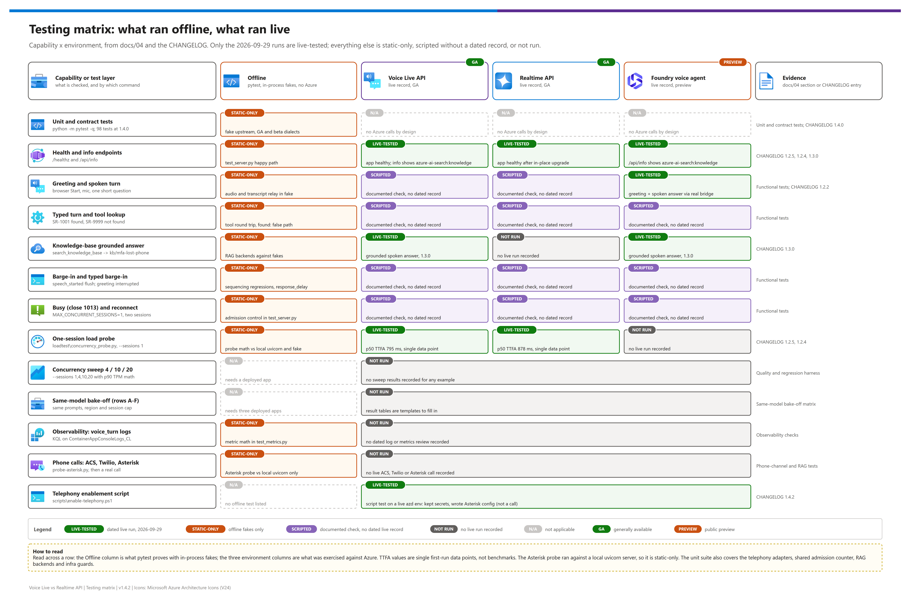

[README](../README.md) › [docs index](./00-reproduce-this-demo.md) › 04 Testing

# 04 — Testing

<p>
&nbsp;
&nbsp;
&nbsp;
&nbsp;
&nbsp;

</p>

  

Test plan for proving the three browser voice agents work, stay reusable, and can be compared fairly. Run unit tests before any deploy, then run functional and quality tests against all three deployed examples. This page is also the honest record of what has and has not been run against Azure: see [Live validation](#live-validation).

## At a glance

| | Topic | One-line answer |
|---|---|---|
|  | **Before any deploy** | `python -m pytest -q` from the repo root: shared bridge, schema dialects, tools, metrics and infra guards, no Azure calls |
|  | **After each deploy** | Health, info, greeting, voice and typed turns, tool found / not found, barge-in, busy and reconnect checks on all three apps |
|  | **Fair comparison** | Same prompts file, same session sweep, same region, same `MAX_CONCURRENT_SESSIONS` for every bake-off row |
|  | **Latency evidence** | App-side `voice_turn` logs and the load probe: `Time to Response` is not available for Standard deployments |

[](./assets/testing-matrix.png)

<sub>Editable source: [`assets/testing-matrix.drawio`](./assets/testing-matrix.drawio) - regenerate with `python scripts/export_diagrams.py docs/assets`.</sub>

> [!IMPORTANT]
> **Read the badges as scope, not as a score.** Only the items listed under [Live validation](#live-validation) were exercised against Azure (2026-09-29). Everything else on this page, including the unit suite, the multi-session load sweep, phone calls and the Asterisk probe against a deployed app, is  until you run it and record the result.

---

## Test categories

| Category | Goal | When to run | Verified |
|---|---|---|---|
| Unit and contract tests | Prove shared bridge, settings, schema dialects, tools, metrics, and infra guards | Every code change |  |
| Functional deployment tests | Prove each deployed app works end to end | Every deployment |  for the items in [Live validation](#live-validation) |
| Quality and regression harness | Measure latency, tokens, throughput, and busy responses under concurrency | Before demos and after model/capacity changes |  1-session probe only; 4/10/20-session sweeps are not recorded |
| Same-model bake-off | Compare Voice Live API, Foundry voice agent, and Realtime API with the same prompts and model family | Before presenting results |  |
| Observability checks | Confirm app logs and Azure metrics show the evidence you need | Every load-test run |  |
| Demo script | Practice the 5-minute walkthrough | Day-of-demo dry run |  |

---

## Live validation

The [CHANGELOG](../CHANGELOG.md) records these runs as **verified live on 2026-09-29**. Nothing on this page is claimed live beyond them.

| Environment | What the CHANGELOG records | Version |
|---|---|---|
| `vldemo` (Voice Live) | Existing Foundry resource upgraded in place, project `voice-agents` created, app healthy, 1-session probe OK on `gpt-realtime-2.1-mini` (p50 TTFA 795 ms) | 1.2.5 |
| `rtdemo` (Realtime) | Existing account upgraded in place (no data loss), project `voice-agents` created, deployment unchanged (10 units = 100K TPM / 200 RPM), deployment listed by the project `/deployments` API, app healthy, 1-session probe OK (p50 TTFA 878 ms) | 1.2.4 |
| Capacity units | `az cognitiveservices model list` and the live deployment's `rateLimits` confirmed units → TPM/RPM for `gpt-realtime-2.1-mini` and `gpt-realtime-mini` | 1.2.3 |
| Foundry voice agent | Reproduced the agent-mode route failure; project route verified through the real `VoiceAgentBridge`: greeting, `search_knowledge_base` tool call answered by the shared RAG tool, spoken answer | 1.2.2 |
| `kbdemo` (knowledge project) | Search service created, 40 documents indexed, semantic query "I lost my phone and cannot sign in" returned `kb/mfa-lost-phone` first | 1.3.0 |
| `vldemo` and `fademo` against `kbdemo` | `/api/info` reports `azure-ai-search:knowledge`; a live question about a lost authenticator phone produced a `search_knowledge_base` call answered from `kb/mfa-lost-phone` and a grounded spoken answer on both | 1.3.0 |
| Telephony script on a live azd env | `scripts\enable-telephony.ps1` kept existing secrets and generated Asterisk config matching the env (script test only, not a call) | 1.4.2 |

**Static-only (not recorded as run live):** the unit and contract suite (98 tests at 1.4.0), ACS and Twilio live calls, a real Asterisk call (the Asterisk probe was verified against a local `uvicorn` server, not a deployed app), the 4/10/20-session load sweeps, and the same-model bake-off rows.

> [!CAUTION]
> Don't quote a latency or capacity number from this page as a benchmark. The two 1-session probe values above are single data points from a first live run; the results-recording tables below are templates for you to fill in.

---

## Unit and contract tests

From the repo root:

```powershell
cd <repo-root>
python -m venv .venv
.\.venv\Scripts\pip install -r requirements-dev.txt
.\.venv\Scripts\python -m pytest -q
```

What the suite covers:

| Test file | Coverage |
|---|---|
| `tests\fake_upstream.py` | In-process fake upstream with GA and beta dialects, per-connection response lifecycle (rejects overlapping `response.create`, honors `response.cancel`), function-call flow, and an optional `response_delay` for deterministic barge-in tests |
| `tests\test_bridge_core.py` | Shared bridge event aliases, audio and transcript relay, tool round trip, `function_call_output` shape, history trimming, interrupt handling, benign-error filtering, and two sequencing regressions: follow-up `response.create` must wait for the function-call `response.done`, and a turn typed during the greeting cancels the greeting before creating the new response |
| `tests\test_metrics.py` | TTFA, response latency, nested usage extraction, missing usage defaults, cached tokens, audio/text token counters, and tokens per minute |
| `tests\test_profile_and_tools.py` | Profile validation, duplicate tool rejection, handler validation, `lookup_request_status`, missing records, and time-zone fallback |
| `tests\test_server.py` | `/healthz`, `/api/info`, WebSocket happy path, and admission control returning `busy` when `MAX_CONCURRENT_SESSIONS` is exceeded |
| `tests\test_voice_live_example.py` | Voice Live endpoint construction, token scope, flat session schema, Azure and OpenAI voice config, transcription defaults, beta-style event compatibility, Dockerfile COPY guards, Bicep RBAC and local-auth guards, and `azure.yaml` remote build guards |
| `tests\test_realtime_example.py` | Realtime GA `/openai/v1/realtime` URL with no `api-version`, no `OpenAI-Beta` header, token-scope override, nested GA session schema, optional transcription deployment, GA fake-upstream tool flow, Dockerfile COPY guards, Bicep model deployment guards, and `azure.yaml` remote build guards |
| `tests\test_foundry_voice_agent_example.py` | Foundry voice-agent URL/auth/session contract, agent-mode audio-only `session.update`, client-executed tool/RAG flow, agent definition creation from `config\agent-profile.json`, and infra/postprovision hook guards |
| `tests\test_loadtest_probe.py` | Concurrency probe summary math (ready, busy, error, p50/p90 TTFA, response ms, tokens per turn, per-session TPM, aggregate TPM), plus an end-to-end run against a real `uvicorn` app and the fake upstream: greeting drained, turns measured, and the session over the cap reported as `busy` |
| `tests\test_reusability_guards.py` | No domain leakage into shared or load-test Python, no secret patterns, no personal profile paths (`C:\Users\<name>`), no internal authoring or sales-process terminology, and no customer-identifying terms. The terms are kept out of the repo on purpose: list them one per line in the gitignored `tests\forbidden-terms.local.txt`, or set `FORBIDDEN_TERMS="a,b"`. The check skips when neither is present. |
| `tests\test_retarget_domain.py` | End-to-end retargeting by profile and data file only, proving the example domain is not hardcoded into shared code |
| **Validation level** |  All files run offline against in-process fakes; none call Azure |

> [!NOTE]
> The suite also covers the telephony adapters (ACS, Twilio, Asterisk), the shared admission counter, the RAG backends, the knowledge project and the platform infra contract. The CHANGELOG counts 98 tests at 1.4.0.

### Unit-test validation

- [ ] `.\.venv\Scripts\python -m pytest -q` passes from the repo root.
- [ ] Reusability guard failures are treated as release blockers.
- [ ] Any bridge change is covered by either the GA or beta fake upstream path.

---

## Functional tests against a deployment

Run each check against `examples\voice-live-api`, `examples\realtime-api`, and `examples\foundry-voice-agent`.

| Check | How to run | Expected result |
|---|---|---|
| Health endpoint | `curl.exe "$ServiceWebUri/healthz"` | JSON contains `status: ok` |
| Info endpoint | `curl.exe "$ServiceWebUri/api/info"` | API name, model, voice, active sessions, and max sessions are returned |
| Greeting | Open browser, click **Start**, allow mic | Assistant greeting plays once if configured in `config\agent-profile.json` |
| Voice turn | Speak one short question | Transcript and audio response appear; metrics panel updates |
| Typed turn | Type a short message into the text box | User bubble, assistant response, and metrics appear |
| Tool lookup found | Type `What's the status of request SR-1001?` | Tools panel shows `lookup_request_status`; response references the fictional Contoso service desk status |
| Tool lookup not found | Type `What's the status of request SR-9999?` | Tool result has `found: false`; assistant does not invent a record |
| Barge-in | Speak while assistant audio is still playing | Browser playback flushes on `speech_started`; new turn proceeds |
| Typed barge-in | Type a question while the greeting is still playing | Greeting stops (`interrupted`), no upstream error appears, and the typed question is answered |
| Busy response | Temporarily set `MAX_CONCURRENT_SESSIONS` to `1`, provision, then open two sessions | Second session receives `busy` and WebSocket close code 1013 rather than dead air |
| Reconnect | Close the browser tab, reopen, click **Start** | New session connects and `/api/info` active session count settles correctly |

For the busy test:

```powershell
azd env set MAX_CONCURRENT_SESSIONS 1
azd provision
```

Restore afterwards:

```powershell
azd env set MAX_CONCURRENT_SESSIONS 20
azd provision
```

### Functional validation

- [ ] All scripted checks pass for Voice Live.
- [ ] All scripted checks pass for Realtime API.
- [ ] All scripted checks pass for the Foundry voice agent.
- [ ] Busy behavior was verified at least once before load testing.
- [ ] Tool-found and tool-not-found paths were both demonstrated.

---

## Quality and regression harness

The load probe opens N concurrent WebSocket sessions and sends scripted text turns. It measures app-side TTFA, response latency, usage tokens, estimated TPM, aggregate TPM, and busy counts.

Exact CLI flags from `loadtest\concurrency_probe.py`:

| Flag | Required | Default | Meaning |
|---|---|---|---|
| `--url` | yes | none | WebSocket URL ending in `/ws` |
| `--sessions` | no | `1,4,10,20` | Comma-separated concurrency levels |
| `--turns-file` | no | `loadtest\prompts.example.json` | JSON list of text turns |
| `--ramp-seconds` | no | `0.0` | Seconds over which to stagger session starts |
| `--timeout` | no | `30.0` | Per-message timeout in seconds |
| `--out` | no | `results.json` | Output JSON path |

Run the standard sweep:

```powershell
cd <repo-root>

.\.venv\Scripts\python .\loadtest\concurrency_probe.py --url wss://<app-host>/ws --sessions 1,4,10,20 --turns-file .\loadtest\prompts.example.json --ramp-seconds 0 --timeout 30 --out .\loadtest\results-<api>-<model>.json
```

Read the printed summary:

| Metric | How to interpret it |
|---|---|
| `ok` | Sessions that connected and completed all turns |
| `busy` | Sessions rejected by admission control before doing work |
| `errors` | Probe, app, or upstream errors |
| `p50_ttfa_ms` | Median time from turn start to first audio |
| `p90_ttfa_ms` | Tail TTFA; compare this across APIs and models |
| `p50_response_ms` | Median time from turn start to response completion |
| `p90_response_ms` | Tail response completion time |
| `avg_tokens_per_turn` | Average total tokens across completed turns |
| `est_tpm_per_session` | Estimated tokens per minute per completed session |
| `aggregate_tpm` | Sum of session TPMs at that concurrency level |

Results-recording table template:

| API | Model | Sessions | OK | Busy | Errors | p50 TTFA ms | p90 TTFA ms | p50 response ms | p90 response ms | Avg tokens per turn | Est TPM per session | Aggregate TPM | Notes |
|---|---|---:|---:|---:|---:|---:|---:|---:|---:|---:|---:|---:|---|
| Voice Live | `gpt-realtime-mini` | 1 | | | | | | | | | | | |
| Voice Live | `gpt-realtime-mini` | 4 | | | | | | | | | | | |
| Voice Live | `gpt-realtime-mini` | 10 | | | | | | | | | | | |
| Voice Live | `gpt-realtime-mini` | 20 | | | | | | | | | | | |
| Realtime API | `gpt-realtime-2.1-mini` | 1 | | | | | | | | | | | |
| Realtime API | `gpt-realtime-2.1-mini` | 4 | | | | | | | | | | | |
| Realtime API | `gpt-realtime-2.1-mini` | 10 | | | | | | | | | | | |
| Realtime API | `gpt-realtime-2.1-mini` | 20 | | | | | | | | | | | |
| Foundry voice agent | `gpt-realtime-2.1-mini` | 1 | | | | | | | | | | | |
| Foundry voice agent | `gpt-realtime-2.1-mini` | 4 | | | | | | | | | | | |
| Foundry voice agent | `gpt-realtime-2.1-mini` | 10 | | | | | | | | | | | |
| Foundry voice agent | `gpt-realtime-2.1-mini` | 20 | | | | | | | | | | | |

### Harness validation

- [ ] Probe ran with the same `loadtest\prompts.example.json` for all three options.
- [ ] JSON output was saved with `--out`.
- [ ] Busy counts are separated from upstream errors.
- [ ] p90 TTFA and aggregate TPM are reviewed before increasing concurrency.

---

## Same-model bake-off matrix

Use the same prompts file and the same session sweep for every row. For apples-to-apples testing, deploy each API with both allowed model settings.

| Row | Example | Model setting commands | Probe output |
|---|---|---|---|
| A | Voice Live with `gpt-realtime-mini` | `cd examples\voice-live-api`; `azd env set VOICE_LIVE_MODEL gpt-realtime-mini`; `azd provision` | `loadtest\results-voice-live-gpt-realtime-mini.json` |
| B | Voice Live with `gpt-realtime-2.1-mini` | `cd examples\voice-live-api`; `azd env set VOICE_LIVE_MODEL gpt-realtime-2.1-mini`; `azd provision` | `loadtest\results-voice-live-gpt-realtime-2-1-mini.json` |
| C | Realtime API with `gpt-realtime-mini` | `cd examples\realtime-api`; `azd env set AZURE_OPENAI_REALTIME_MODEL gpt-realtime-mini`; `azd env set REALTIME_DEPLOYMENT_CAPACITY 10`; `azd provision` | `loadtest\results-realtime-gpt-realtime-mini.json` |
| D | Realtime API with `gpt-realtime-2.1-mini` | `cd examples\realtime-api`; `azd env set AZURE_OPENAI_REALTIME_MODEL gpt-realtime-2.1-mini`; `azd env set REALTIME_DEPLOYMENT_CAPACITY 10`; `azd provision` | `loadtest\results-realtime-gpt-realtime-2-1-mini.json` |
| E | Foundry voice agent with `gpt-realtime-2.1-mini` | `cd examples\foundry-voice-agent`; `azd env set VOICE_AGENT_MODEL gpt-realtime-2.1-mini`; `azd provision`; `azd hooks run postprovision` | `loadtest\results-voice-agent-gpt-realtime-2-1-mini.json` |
| F | Voice Live with `gpt-realtime-2.1-mini` vs voice agent with same managed model | Run rows B and E one at a time in shared mode because they share Voice Live limits | Compare `results-voice-live-*` and `results-voice-agent-*` |

Compare:

- TTFA p50 and p90.
- Response latency p50 and p90.
- Tokens per turn.
- Busy counts.
- Errors and 429s.
- Voice quality notes from the same listener and audio setup.
- Tool-call behavior for SR-1001 and SR-9999.

### Bake-off validation

- [ ] Same prompts file used for all rows.
- [ ] Same region used for all options unless documenting a capacity exception.
- [ ] Same `MAX_CONCURRENT_SESSIONS` value used for all apps.
- [ ] Realtime deployment capacity recorded beside results.
- [ ] Voice quality notes captured immediately after each run.

---

## Capacity math

Realtime APIs re-process session context on each response: instructions, tool schemas, and history all contribute input tokens. Use measured p90 TPM from the probe rather than guessing.

**Realtime capacity units → TPM/RPM.** `REALTIME_DEPLOYMENT_CAPACITY` is in capacity units, not RPM. For `gpt-realtime-2.1-mini`, 1 unit = 10,000 TPM + 20 RPM, so the default 10 units = **100K TPM / 200 RPM** (what the portal shows as TPM). At ~80K TPM per call at p90, 10 units hold about **one** concurrent caller at p90; a 20-caller Realtime test needs ~1.6M TPM (~160 units). The `preprovision` hook prints the conversion for the chosen model version.

Formula:

```text
required TPM = p90 per-call TPM x target concurrent calls
```

Generic sizing examples:

| Scenario | Math | Result |
|---|---|---|
| 20 calls at about 80K TPM per call | `80,000 x 20` | About 1.6M TPM required |
| 200K TPM quota with 80K TPM per call | `200,000 / 80,000` | Only about 2 concurrent calls with clean headroom |
| Voice Live default S0 limit | service limit | 120K TPM, 100 new connections per minute, 60-minute sessions |
| Foundry voice agent default limit | service limit | Same Voice Live resource limits; shared with Voice Live in shared-platform mode |

If the probe shows long pauses before errors appear, treat that as a capacity signal. The cheapest fix is usually fewer tokens per call:

- Shorten instructions.
- Keep spoken answers to one or two sentences.
- Keep tool schemas concise.
- Configure `conversation.max_history_items` in `config\agent-profile.json` if long sessions grow context too much.
- For production hardening, truncate unheard audio during barge-in where the upstream API supports it.

### Capacity validation

- [ ] p90 per-session TPM captured from the probe.
- [ ] Target concurrency multiplied by p90 TPM.
- [ ] Result compared against Voice Live service limits, shared voice-agent limits, or Realtime quota.
- [ ] Region and quota assumptions recorded with the result JSON.

---

## Observability checks

The app logs one structured line per completed turn:

```json
{"event":"voice_turn","api":"..."}
```

Query Container Apps logs:

```kusto
ContainerAppConsoleLogs_CL
| where Log_s has '"event":"voice_turn"'
| extend payload = parse_json(Log_s)
| project
    TimeGenerated,
    api = tostring(payload.api),
    session_id = tostring(payload.session_id),
    turn_index = toint(payload.turn_index),
    ttfa_ms = todouble(payload.ttfa_ms),
    response_ms = todouble(payload.response_ms),
    total_tokens = toint(payload.total_tokens),
    tokens_per_minute = todouble(payload.session.tokens_per_minute)
| order by TimeGenerated desc
```

Azure OpenAI metrics to watch for the Realtime API:

- Requests split by status code, especially 429s.
- Token metrics.
- Realtime API seconds used.
- App-side TTFA and response latency from this repo's `voice_turn` logs.

Voice Live and voice-agent limits to keep visible during test planning:

- 100 new connections per minute.
- 120,000 TPM.
- 60-minute session cap.

Foundry voice-agent observability to check:

- Foundry portal traces for the versioned agent.
- Stored transcripts/audio when `store: true` is enabled on the agent.
- App-side `voice_turn` logs to keep the metric envelope comparable with the other examples.

`Time to Response` is not available for Standard deployments, so the app-side metrics and probe results are the primary latency evidence.

### Observability validation

- [ ] `voice_turn` rows appear in Log Analytics after a browser turn.
- [ ] Probe results and Log Analytics agree on the trend.
- [ ] Realtime status-code metrics were checked after each load run.
- [ ] Voice Live limit math was checked before any high-concurrency run.

---

## Phone-channel and RAG tests

| Step | | Action | Gate |
|---|---|---|---|
| **1** |  | `python scripts\probe-asterisk.py --url wss://<app-fqdn>/telephony/asterisk/media` | ☐ Agent audio returned; wrong secret → HTTP 403 |
| **2** |  | Place a real call to the Asterisk extension | ☐ RAG and barge-in checks repeat on the phone channel |
| **3** |  | Filter logs by the `channel` field (`browser`, `acs`, `twilio`, `asterisk`) | ☐ Browser and narrowband phone results kept separate |

**Asterisk channel:** `python scripts\probe-asterisk.py --url wss://<app-fqdn>/telephony/asterisk/media` (simulates `chan_websocket`: Basic auth, `media` subprotocol, JSON `MEDIA_START`, slin24). Pass criteria: agent audio returned; wrong secret → HTTP 403. Then place a real call to the Asterisk extension and repeat the RAG and barge-in checks.

When the shared platform and telephony are enabled, run the phone test plan in
[07 — Telephony and the shared AI endpoint](07-telephony-and-shared-endpoint.md#test-plan): RAG on
browser and phone, phone barge-in, shared admission control, and a repeat of the concurrency sweep
with real calls. Filter logs by the `channel` field (`browser`, `acs`, `twilio`) to keep browser
and narrowband phone results separate.

> [!WARNING]
> The Asterisk probe and the phone test plan are  in the CHANGELOG record: the probe was verified against a local server, and no live ACS, Twilio or Asterisk call is recorded. Record your own result before demonstrating phone calls to an audience.

## Five-minute walkthrough

| Minute | Action | Presenter notes |
|---|---|---|
| 0:00-0:45 | Open all three deployed apps | "Same browser UI, same tools, same profile, same data. Only the upstream API changes." |
| 0:45-1:30 | Show `/api/info` for all three | "The app reports API, model, voice, and session cap from the deployed config." |
| 1:30-2:15 | Start Voice Live, allow mic, ask a short spoken question | "Voice Live gives managed model mode, Azure voices, semantic VAD, noise suppression, and echo cancellation without creating a model deployment." |
| 2:15-3:00 | Start Realtime API, ask the same spoken question | "Realtime API uses an explicit Azure OpenAI deployment sized against quota." |
| 3:00-3:45 | Type the same configured tool question in all three | "Tools run server-side. Credentials and tool implementation never go to the browser." |
| 3:45-4:30 | Show metrics panels | "The comparison uses app-side TTFA, response latency, tokens, and TPM, not subjective impressions only." |
| 4:15-4:40 | Start the Foundry voice agent and show agent versions and traces | "The agent stores instructions, tools, voice, transcripts, traces, and evaluation hooks in Foundry; the bridge still executes tools so RAG stays shared." |
| 4:40-5:00 | Show load-test result table | "Capacity decisions come from p90 TPM and concurrency math, then quota and service limits." |

### Demo-script validation

- [ ] All apps are pre-warmed before the walkthrough.
- [ ] Browser mic permission already tested.
- [ ] SR-1001 and SR-9999 tool paths tested.
- [ ] Load-test result JSON is available for backup evidence.

---

Next: [05 - Troubleshooting](./05-troubleshooting.md) →

*Last updated: 2026-10-02*
