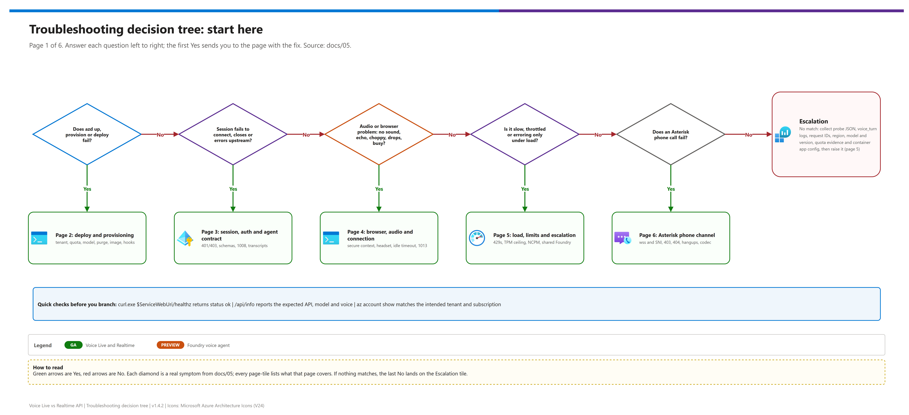
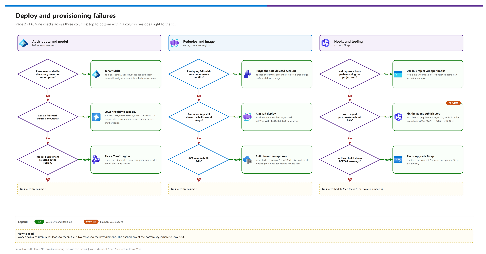
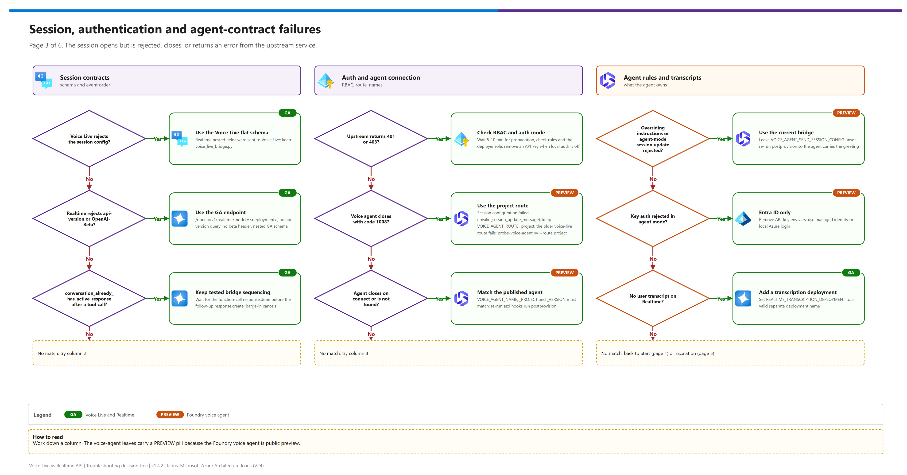
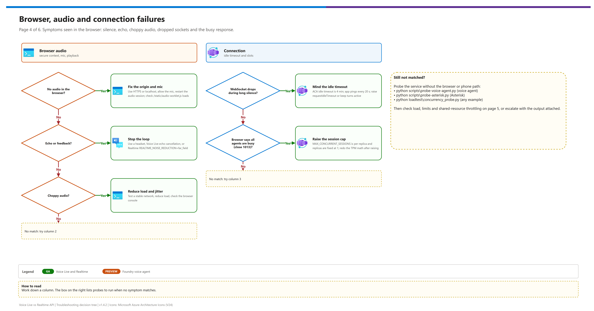
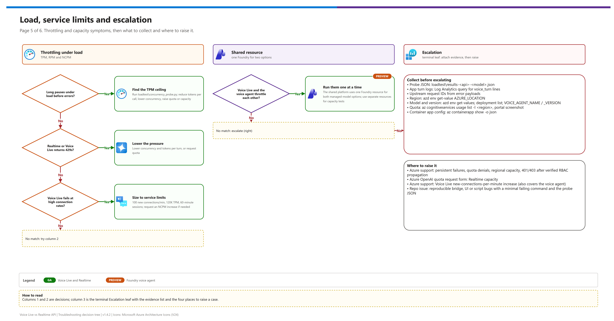
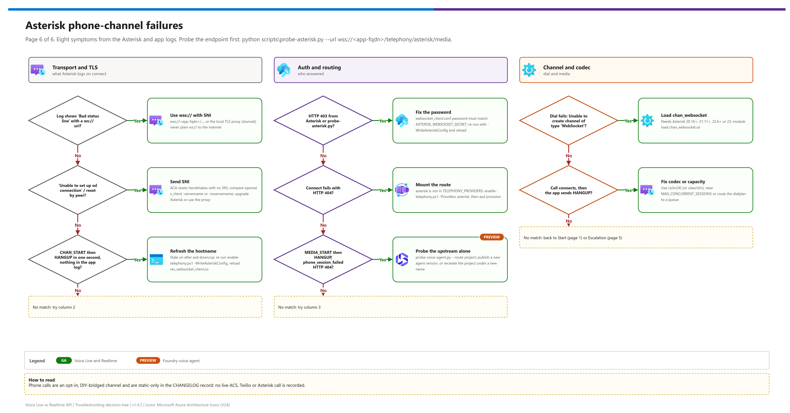

[README](../README.md) › [docs index](./00-reproduce-this-demo.md) › 05 Troubleshooting

# 05 — Troubleshooting

<p>
&nbsp;
&nbsp;
&nbsp;
&nbsp;
&nbsp;
&nbsp;

</p>

   

Common failure modes for the Voice Live vs. Realtime API vs. Foundry voice-agent browser demo, organised by where the symptom appears. Start with the decision tree or the quick triage table, then use the matching symptom section.

## At a glance

| | Topic | One-line answer |
|---|---|---|
|  | **Wrong tenant or subscription** | Ambient `az` / `azd` context drifted: re-run tenant-explicit auth first ([Tenant drift](#tenant-drift)) |
|  | **`InsufficientQuota` on `azd up`** | `REALTIME_DEPLOYMENT_CAPACITY` is in capacity units; lower it to what the `preprovision` hook reports ([Quota and capacity](#quota-and-capacity)) |
|  | **Voice agent closes with `1008`** | Use the default project route, `VOICE_AGENT_ROUTE=project` ([session contract](#foundry-voice-agent-session-contract)) |
|  | **Asterisk call hangs up immediately** | Check `wss://` with SNI, the secret and `TELEPHONY_PROVIDERS` ([Asterisk channel](#asterisk-channel)) |

> [!NOTE]
> The Foundry voice agent is  and Voice Live and Realtime are  per the demo's own status tables, so preview behaviour can differ by region and over time. The fixes here come from the repo's changelog and code; the 2026-09-29 live runs are listed in [04 - Testing](./04-testing.md#live-validation).

## Decision tree

Start at the root question, answer each branch, and follow the leaf to the section that has the fix.

[](./assets/troubleshooting-decision-tree-1.png)

The tree has six pages. Page 1 routes you to the page that matches your symptom:

| Page | Covers |
|---|---|
| 2 | Deploy and provisioning |
| 3 | Session, auth and agent contract |
| 4 | Browser, audio and connection |
| 5 | Load, limits and escalation |
| 6 | Asterisk phone channel |

<details><summary><b>Show pages 2-6</b></summary>

[](./assets/troubleshooting-decision-tree-2.png)

[](./assets/troubleshooting-decision-tree-3.png)

[](./assets/troubleshooting-decision-tree-4.png)

[](./assets/troubleshooting-decision-tree-5.png)

[](./assets/troubleshooting-decision-tree-6.png)

</details>

<sub>Editable source: [`assets/troubleshooting-decision-tree.drawio`](./assets/troubleshooting-decision-tree.drawio) - regenerate with `python scripts/export_diagrams.py docs/assets`.</sub>

---

## Quick triage table

| Where | Symptom | Likely cause | Fast fix | Section |
|---|---|---|---|---|
|  | Asterisk log: `res_http_websocket.c: Unable to retrieve HTTP status line` / `Bad status line` with a `ws://<app-fqdn>/...` uri | Plain `ws://` straight to Container Apps (port 80) sends the password unencrypted over the internet and is often blocked or mangled by proxies and ISPs, so no HTTP response comes back. The app requires `allowInsecure: false` anyway | Use `wss://<app-fqdn>/...` (Asterisk with SNI), or the local TLS proxy (`ws://127.0.0.1:8081/...` to stunnel). Never plain `ws://` to the internet | [Asterisk channel](#asterisk-channel) |
|  | Asterisk log: `Problem setting up ssl connection ... Connection reset by peer` / `Unable to set up ssl connection with peer '<ip>:443'` | Azure Container Apps ingress resets TLS handshakes that carry **no SNI** (verified: same reset without SNI, success with it). The Asterisk build is not sending the hostname in the TLS hello, or a proxy/TLS-inspection device in between strips it | On the Asterisk host compare `openssl s_client -connect <fqdn>:443 -servername <fqdn>` (should work) with `-noservername` (resets). Upgrade to a stock Asterisk release that includes commit 8e119a72 (SNI on client TLS, April 2024), remove `proxy_host` if set, or use the local TLS proxy workaround in [Asterisk channel](#asterisk-channel) | [Asterisk channel](#asterisk-channel) |
|  | Asterisk CEL shows the `WebSocket/<client>` channel `CHAN_START` then `HANGUP` in the same second, no `ANSWER`, and **nothing** in the app log | The connection never reached the app. Most often the `uri` in `websocket_client.conf` still has the **old hostname** after `azd down` + `azd up` (a new Container Apps environment gets a new domain, e.g. `<app>.<random-words>.<region>.azurecontainerapps.io`); otherwise DNS, outbound 443, or TLS trust on the Asterisk host | Re-run `./scripts/enable-telephony.ps1 -Example <x> -WriteAsteriskConfig`, replace the section in `websocket_client.conf`, `module reload res_websocket_client.so`; check `asterisk -rvvv` output during a call for the connect error | [Asterisk channel](#asterisk-channel) |
|  | Asterisk shows `MEDIA_START` then `HANGUP`; app log `phone_session_failed ... HTTP 404` | The app reached Asterisk fine but could not open the **upstream** session. For the voice agent, the voice route answers "Project not found" / `agent_not_found` although the agents API lists the agent (seen after deleting and recreating the Foundry resource and project with the same names) | Probe the upstream alone: `python scripts\probe-voice-agent.py --route project`. If it 404s, publish a new agent version (`azd hooks run postprovision`) and retry; if it still 404s, recreate the project under a new name (`VOICE_AGENT_PROJECT_NAME`) or wait for propagation | [Asterisk channel](#asterisk-channel) |
|  | Asterisk `Dial(WebSocket/...)` fails immediately: `Unable to create channel of type 'WebSocket'` | `chan_websocket` not loaded or Asterisk too old | Asterisk 20.16+/21.11+/22.6+/23; `module load chan_websocket.so` | [Asterisk channel](#asterisk-channel) |
|  | Asterisk log or `probe-asterisk.py` shows HTTP 403 | Password in `websocket_client.conf` doesn't match `ASTERISK_WEBSOCKET_SECRET` | Re-run `enable-telephony.ps1 -WriteAsteriskConfig` and copy the file; reload `res_websocket_client.so` | [Asterisk channel](#asterisk-channel) |
|  | Asterisk connect fails with HTTP 404 | `asterisk` not in `TELEPHONY_PROVIDERS`, so the route isn't mounted | `enable-telephony.ps1 -Providers asterisk`, then `azd provision` | [Asterisk channel](#asterisk-channel) |
|  | Call connects then the app sends `HANGUP` | Unsupported codec, or every admission slot is busy | Use `c(slin24)` (or `ulaw`/`slin`); raise `MAX_CONCURRENT_SESSIONS` or route the dialplan to a queue after `Dial()` | [Asterisk channel](#asterisk-channel) |
|  | Resources deploy into the wrong tenant or subscription | Ambient `az` or `azd` context drifted | Re-run tenant-explicit auth and verify `az account show` | [Tenant drift](#tenant-drift) |
|  | `azd up` fails with `InsufficientQuota` | Realtime deployment capacity exceeds available quota | Lower `REALTIME_DEPLOYMENT_CAPACITY`, request quota, or use another viable region for capacity | [Quota and capacity](#quota-and-capacity) |
|  | Model deployment rejected in a region | Model or version unavailable, or new quota is refused near model end of life | Pick a Tier-1 region and a current model version | [Model availability](#model-availability) |
|  | Upstream returns 401 or 403 | RBAC propagation delay, wrong scope, deployer role omitted, or key auth with local auth disabled | Wait 5-10 minutes, check roles, try Realtime legacy scope only if needed, remove API key | [Upstream authentication](#upstream-authentication) |
|  | Voice Live rejects session config |  Realtime nested fields were sent to Voice Live | Use Voice Live flat schema | [Voice Live session contract](#voice-live-session-contract) |
|  | Foundry voice-agent `postprovision` hook fails | Missing `azure-ai-projects`, deploying user lacks Foundry User, or project endpoint is wrong | Install `scripts\requirements-agent.txt`, verify Foundry User, and check `VOICE_AGENT_PROJECT_ENDPOINT` | [Foundry voice-agent postprovision](#foundry-voice-agent-postprovision) |
|  | Agent closes on connect or is not found | `VOICE_AGENT_NAME`, `VOICE_AGENT_PROJECT`, or `VOICE_AGENT_VERSION` does not match a published agent | Re-run `azd hooks run postprovision` and verify env values | [Foundry voice-agent connection](#foundry-voice-agent-connection) |
|  | Key auth rejected in agent mode | Agent mode supports Entra ID only | Remove API-key env vars and use managed identity/local Azure login | [Foundry voice-agent connection](#foundry-voice-agent-connection) |
|  | Voice agent session connects, shows errors, then disconnects (close `1008`, "Session configuration failed after 5 attempts ... invalid_session_update_message") | App is on the older Voice Live agent-mode route, which fails server-side for `kind: voice` agents | Use the default `VOICE_AGENT_ROUTE=project` (Foundry portal sample route); diagnose with `python scripts\probe-voice-agent.py --route project` | [Foundry voice-agent session contract](#foundry-voice-agent-session-contract) |
|  | `Overriding instructions in response.create is not supported with Agent service` or agent-mode `session.update` rejected | Bridge sent a greeting with `instructions` or session config the agent owns | Use the current bridge (no greeting override, no `session.update` by default); keep `VOICE_AGENT_SEND_SESSION_CONFIG` unset; re-run `azd hooks run postprovision` so the agent carries the greeting | [Foundry voice-agent session contract](#foundry-voice-agent-session-contract) |
|  | Voice Live and voice agent throttle each other | Shared platform uses one Foundry resource for both managed-model options | Run them one at a time or use separate resources for capacity tests | [Voice Live service limits](#voice-live-service-limits) |
|  | `azd` reports hook path escaping project root | Hook points outside the example directory | Use the in-project wrapper hooks under `examples\*\hooks\` | [azd hook wrapper paths](#azd-hook-wrapper-paths) |
|  | Realtime rejects `api-version` or `OpenAI-Beta` | Preview/beta endpoint pattern was used | Use `/openai/v1/realtime?model=<deployment>` and no beta header | [Realtime API session contract](#realtime-api-session-contract) |
|  | `conversation_already_has_active_response` | Follow-up `response.create` sent before function-call `response.done` | Keep the tested bridge sequencing | [Tool-call response sequencing](#tool-call-response-sequencing) |
|  | Long pauses under load before errors | TPM ceiling or capacity saturation | Reduce tokens per call, lower concurrency, raise quota or capacity | [Load latency and 429s](#load-latency-and-429s) |
|  | 429s | Quota or RPM/TPM limit exceeded | Lower concurrency, lower tokens per turn, or request quota | [Load latency and 429s](#load-latency-and-429s) |
|  | Voice Live fails at high connection rates | Voice Live service limits reached | Size against 100 new connections per minute, 120K TPM, and 60-minute session cap | [Voice Live service limits](#voice-live-service-limits) |
|  | Browser shows `busy` | Admission control cap reached | Raise `MAX_CONCURRENT_SESSIONS` or reduce concurrent sessions | [Admission control busy](#admission-control-busy) |
|  | No audio in browser | Mic permission, non-secure origin, or AudioContext issue | Use HTTPS or localhost, allow mic, restart audio session | [Browser audio](#browser-audio) |
|  | Echo or feedback | Speaker audio re-enters microphone | Use headset, Voice Live echo cancellation, or Realtime `far_field` | [Echo feedback](#echo-feedback) |
|  | Choppy audio | Network jitter, CPU pressure, or audio scheduling gaps | Reduce load, test stable network, and check browser console | [Choppy audio](#choppy-audio) |
|  | WebSocket drops during silence | Container Apps ingress idle timeout or missing ping behavior | Keep ping interval and raise ACA environment idle timeout if needed | [WebSocket drops](#websocket-drops) |
|  | Container App shows hello-world | `azd deploy` did not run or image was preserved during provision | Run `azd deploy`; check `SERVICE_WEB_RESOURCE_EXISTS` behavior | [Hello-world container image](#hello-world-container-image) |
|  | ACR remote build fails | Wrong build context or `.dockerignore` excludes needed files | Build from repo root with `-f examples\<ex>\Dockerfile .` | [ACR remote build](#acr-remote-build) |
|  | `az bicep build` shows BCP081 warnings | Local Bicep is older than chosen API versions | Use repo-pinned API versions or upgrade Bicep intentionally | [Bicep warnings](#bicep-warnings) |
|  | Re-deploy fails with account name conflict | Soft-deleted Cognitive Services account retains name | List deleted accounts and purge the specific name | [Soft-deleted account name conflict](#soft-deleted-account-name-conflict) |
|  | No user transcript on Realtime | Input transcription deployment not configured | Set `REALTIME_TRANSCRIPTION_DEPLOYMENT` to a valid deployment name | [Realtime transcript](#realtime-transcript) |

---

##  Asterisk channel

| Signal | Meaning | Action |
|---|---|---|
| HTTP **403** | Wrong password (the `username` is ignored) | Re-copy the generated `websocket_client.conf` |
| HTTP **404** | `asterisk` not in `TELEPHONY_PROVIDERS`, so the route isn't mounted | `enable-telephony.ps1 -Providers asterisk`, then `azd provision` |
| TLS errors | Asterisk can't validate the Container Apps certificate | Point `ca_list_file` at the system CA bundle; don't disable verification |
| Reset with no SNI | Container Apps ingress resets handshakes without a hostname | Stock Asterisk with the SNI commit, or the local TLS proxy below |

- **TLS reset with no SNI (workaround).** Terminate TLS locally so Asterisk speaks plain WebSocket to a proxy that adds SNI. Example with stunnel on the Asterisk host: `[aca]` / `client = yes` / `accept = 127.0.0.1:8081` / `connect = <fqdn>:443` / `sni = <fqdn>` / `verifyChain = yes` / `CAfile = /etc/ssl/certs/ca-certificates.crt` / `checkHost = <fqdn>`. Then in `websocket_client.conf` set `uri = ws://127.0.0.1:8081/telephony/asterisk/media` and `tls_enabled = no`. Traffic leaves the host encrypted; only the loopback hop is plain.
- **Check the endpoint first**, without Asterisk: `python scripts\probe-asterisk.py --url wss://<app-fqdn>/telephony/asterisk/media` with `ASTERISK_WEBSOCKET_SECRET` set. Expected: `subprotocol=media`, `START_MEDIA_BUFFERING`, agent audio.
- **403** = wrong password (the `username` is ignored); **404** = `asterisk` not in `TELEPHONY_PROVIDERS`; **TLS errors** = Asterisk can't validate the Container Apps certificate (point `ca_list_file` at the system CA bundle; don't disable verification).
- **`f(json)` rejected** on Asterisk older than 20.18/22.8/23.2: remove `f(json)`; the plain-text control format also works.
- **Choppy or late audio**: use `c(slin24)` (no resampling); look for `asterisk_flow_control` (`MEDIA_XOFF`) events in the app logs.
- **App logs**: filter Log Analytics on `channel == "asterisk"` (`voice_session_start/end`, `asterisk_auth_rejected`, `asterisk_unsupported_format`, `asterisk_call_busy`).

##  Tenant drift

> [!WARNING]
> `az` and `azd` keep separate logins and the active account silently drifts when another `az login` runs elsewhere. Verify the tenant and subscription before every provisioning command.

**Symptoms**

- Resources appear in an unexpected subscription.
- `azd up` prompts for a tenant you did not intend.
- Local token acquisition succeeds, but upstream calls fail against the wrong resource.

**Diagnosis**

```powershell
az account show --query "{tenant:tenantId, subscription:id, subName:name, user:user.name}" -o table
```

**Fix**

```powershell
$TenantId = "<TENANT_ID>"
$SubscriptionId = "<SUBSCRIPTION_ID>"

az login --tenant $TenantId
az account set --subscription $SubscriptionId
az account show --query "{tenant:tenantId, subscription:id, subName:name, user:user.name}" -o table
azd auth login --tenant-id $TenantId
```

Never continue with `azd up`, `azd provision`, `azd deploy`, `az cognitiveservices`, or `az containerapp` until the displayed tenant and subscription are correct.

---

##  Quota and capacity

> [!IMPORTANT]
> `REALTIME_DEPLOYMENT_CAPACITY` is in **capacity units**, not RPM. The `az cognitiveservices usage list` row is labelled `Requests Per Minute - <model> - GlobalStandard` but counts units; see [04 - Testing](./04-testing.md#capacity-math) for the units → TPM/RPM conversion.

**Symptoms**

- Realtime `azd up` fails during the model deployment.
- Error contains `InsufficientQuota`, capacity, or SKU allocation language.
- Deployment works at lower capacity but fails when raised.

**Diagnosis**

```powershell
az cognitiveservices usage list -l <region> -o table
```

After a Foundry account exists:

```powershell
az cognitiveservices account deployment list -n <account> -g <resource-group> -o table
```

**Fix options**

1. Lower capacity:
   ```powershell
   azd env set REALTIME_DEPLOYMENT_CAPACITY 10   # or the "available" value printed by the preprovision hook
   azd provision
   ```
2. Try another Tier-1 region if the issue is regional capacity.
3. Request quota if the issue is subscription-level quota (https://aka.ms/oai/stuquotarequest); near-retirement model versions can be refused, so pick a current model when requests fail.
4. Reduce load-test concurrency until quota is increased.

Changing region can fix capacity placement, but it does not create additional subscription quota.

---

##  Model availability

**Symptoms**

- Model deployment create fails even though the resource group and AIServices account exist.
- Voice Live session setup fails when using a preview model.
- A previously working model version starts failing for new quota.

**Diagnosis**

For Realtime API, inspect available account models after the account exists:

```powershell
az cognitiveservices account list-models -n <account> -g <resource-group> -o table
```

For Voice Live model availability, there is no repo-supported CLI probe. Check the live regional matrix at deployment time.

**Fix**

- Use Tier-1 regions `centralus`, `eastus2`, or `swedencentral` for side-by-side deployments.
- Voice Live default: `gpt-realtime-mini`.
- Voice Live preview option: `gpt-realtime-2.1-mini`; if unavailable, fall back to `gpt-realtime-mini`.
- Realtime default: `gpt-realtime-2.1-mini` with Bicep default version `2026-07-07`.
- Realtime fallback: `gpt-realtime-mini` with Bicep default version `2025-12-15`, while planning for model retirement ambiguity.

If a model is near retirement, new quota can be refused. Pick a current model version rather than trying to force old capacity.

---

##  Upstream authentication

**Symptoms**

- Browser connects to the app, but upstream setup returns 401 or 403.
- Local run fails while the deployed Container App works.
- Setting an API key does not work against resources deployed by this repo.

**Diagnosis**

Check app config:

```powershell
curl.exe "$ServiceWebUri/api/info"
```

Check role assignments:

```powershell
az role assignment list --scope <foundry-resource-id> -o table
```

**Fix**

- Wait 5-10 minutes after role assignment. RBAC propagation is not immediate.
- For Voice Live, confirm both Cognitive Services User and Foundry User are assigned to the Container App user-assigned identity.
- For Realtime API, confirm Cognitive Services OpenAI User is assigned to the Container App user-assigned identity.
- For local runs, confirm `AZURE_PRINCIPAL_ID` was populated before provisioning. If it was empty, the Bicep skipped deployer role assignments:
  ```powershell
  $PrincipalId = az ad signed-in-user show --query id -o tsv
  azd env set AZURE_PRINCIPAL_ID $PrincipalId
  azd env set AZURE_PRINCIPAL_TYPE User
  azd provision
  ```
- For Realtime API only, try the legacy-compatible scope if your tenant rejects the current scope:
  ```powershell
  $env:AZURE_OPENAI_TOKEN_SCOPE = "https://cognitiveservices.azure.com/.default"
  ```
- Do not set `VOICE_LIVE_API_KEY` or `AZURE_OPENAI_API_KEY` against resources deployed by this repo. Bicep sets `disableLocalAuth: true`, so key auth is intentionally disabled.

---

##  Voice Live session contract

**Symptoms**

- Voice Live returns an invalid session or unknown field error.
- A schema copied from Realtime API fails against Voice Live.

**Cause**

Voice Live uses the flat session shape in this repo:

- `modalities`
- `voice`
- `input_audio_format`
- `output_audio_format`
- `input_audio_sampling_rate`
- `turn_detection`
- `input_audio_noise_reduction`
- `input_audio_echo_cancellation`
- `input_audio_transcription`
- `temperature`
- `max_response_output_tokens`

It does not use the Realtime GA nested fields `session.type`, `output_modalities`, or `audio.input.format`.

**Fix**

Use `examples\voice-live-api\src\voice_live_bridge.py` as the contract source. Re-run:

```powershell
.\.venv\Scripts\python -m pytest -q tests\test_voice_live_example.py
```

---

##  Realtime API session contract

**Symptoms**

- Realtime API rejects the URL.
- Error mentions `api-version`, beta headers, or session fields.

**Cause**

The GA Realtime API path is:

```text
wss://<resource>.openai.azure.com/openai/v1/realtime?model=<deployment-name>
```

It uses no date-based `api-version` query parameter and no `OpenAI-Beta` header. Its session uses the nested GA audio shape under `audio.input` and `audio.output`.

**Fix**

Use `examples\realtime-api\src\realtime_api_bridge.py` as the contract source. Re-run:

```powershell
.\.venv\Scripts\python -m pytest -q tests\test_realtime_example.py
```

---

##  Tool-call response sequencing

**Symptoms**

- Upstream error code `conversation_already_has_active_response`.
- Tool result is sent, but the spoken follow-up fails.
- A question typed while the greeting is still playing gets no answer.

**Cause**

A response is still active upstream: either the model's function-call response, or the greeting or previous answer. Any `response.create` sent before that response emits `response.done` is rejected.

**Fix**

Keep the shared bridge behavior. It only ever has one `response.create` in flight:

- Tool call: send `conversation.item.create` with `function_call_output`, wait for the function-call `response.done`, then send `response.create`.
- Typed turn during an active response: treat it as barge-in. Send `response.cancel`, tell the browser `interrupted` so it flushes playback, discard the cancelled response's remaining audio, then send `response.create` on the cancelled `response.done`. A `response_cancel_not_active` error from a cancel that raced the natural end of a response is expected and is not shown to the user.

Regression test:

```powershell
.\.venv\Scripts\python -m pytest -q tests\test_bridge_core.py
```

---

##  Load latency and 429s

**Symptoms**

- Long pauses appear under load before any 429s.
- Probe shows rising p90 TTFA and p90 response latency.
- Realtime metrics show 429s.

**Diagnosis**

Run the load probe:

```powershell
.\.venv\Scripts\python .\loadtest\concurrency_probe.py --url wss://<app-host>/ws --sessions 1,4,10,20 --turns-file .\loadtest\prompts.example.json --out .\loadtest\results.json
```

Compare p90 per-session TPM with quota:

```text
p90 per-call TPM x target concurrency = required TPM
```

**Fix**

- Lower `--sessions`.
- Lower `MAX_CONCURRENT_SESSIONS`.
- Shorten instructions and tool descriptions.
- Keep answers to one or two spoken sentences.
- Set `conversation.max_history_items` in `config\agent-profile.json` for long calls.
- For Realtime, raise deployment capacity if quota is available.
- Request additional quota before raising production concurrency.

---

##  Voice Live service limits

Default S0 Voice Live limits to size against:

| Limit | Default |
|---|---:|
| New connections per minute | 100 |
| Tokens per minute | 120,000 |
| Maximum session length | 60 minutes |

Only new-connections-per-minute is directly adjustable; TPM rises with that service limit. Voice Live removes customer model deployment management, but it does not remove the need to size high-concurrency workloads.

If the workload needs 20 concurrent calls at roughly 80K TPM each, the implied total is about 1.6M TPM. That is far above the default 120K TPM limit and requires a quota plan or multiple resources.

---

##  Admission control busy

**Symptoms**

- Browser status says all agents are busy.
- Probe summary shows nonzero `busy`.
- WebSocket closes with code 1013.

**Cause**

`MAX_CONCURRENT_SESSIONS` is enforced per replica. This repo deploys min and max replicas as `1`, so the value is a global cap.

**Fix**

For test:

```powershell
azd env set MAX_CONCURRENT_SESSIONS 20
azd provision
```

For production scale-out, raise replica count in Bicep and size capacity as:

```text
global cap = MAX_CONCURRENT_SESSIONS x replica count
```

Then redo the TPM and service-limit math.

---


##  Foundry voice-agent postprovision

**Symptoms**

- `azd up` provisions Azure resources, then fails in `examples\foundry-voice-agent\hooks\postprovision.ps1`.
- Error mentions `azure-ai-projects`, `VoiceAgentDefinition`, `403`, or an invalid project endpoint.

**Fix**

- Re-run from `examples\foundry-voice-agent` after installing the hook dependency:
  ```powershell
  python -m pip install -r ..\..\scripts\requirements-agent.txt
  azd hooks run postprovision
  ```
- Confirm the deploying user has **Foundry User** on the Foundry resource or project.
- Confirm `VOICE_AGENT_PROJECT_ENDPOINT` looks like `https://<foundry>.services.ai.azure.com/api/projects/<project>`.
- If `config\agent-profile.json` changed, the hook must run again to publish a new agent version.

---

##  Foundry voice-agent connection

| Check | Expected |
|---|---|
| `VOICE_AGENT_NAME`, `VOICE_AGENT_PROJECT`, optional `VOICE_AGENT_VERSION` | Match the agent in the Foundry project (leave the version empty to use latest) |
| API-key env vars | Not set: agent mode is Entra ID only |
| Agent published | `azd hooks run postprovision` after a rename or profile change |

**Symptoms**

- WebSocket closes during setup.
- Error mentions agent not found, project not found, or key authentication.

**Fix**

- Compare `VOICE_AGENT_NAME`, `VOICE_AGENT_PROJECT`, and optional `VOICE_AGENT_VERSION` with the agent in the Foundry project.
- Leave `VOICE_AGENT_VERSION` empty to use latest while troubleshooting.
- Do not set API keys for agent mode; it is Entra ID only.
- Re-run `azd hooks run postprovision` if the agent was renamed or the profile changed.
- Re-check regional support for both Agent Service voice agents and Voice Live; the demo regions are candidates, not a live guarantee for preview.

---

##  Foundry voice-agent session contract

**Symptoms**

- `Overriding instructions in response.create is not supported with Agent service.`
- Agent-mode setup rejects `session.update` fields.
- A copied Voice Live `session.update` with instructions/tools/voice fails.

**Cause and fix**

The Foundry voice agent owns instructions, function tools, voice, the greeting, the audio pipeline (Azure semantic VAD, deep noise suppression, echo cancellation, transcription), and storage. Agent Service rejects `response.create` with `instructions`, so the bridge never sends the greeting itself; `scripts\create-voice-agent.py` stores it as a `template` greeting on the agent. By default the bridge also sends **no** `session.update` (matching the Foundry portal sample) and waits for `session.created`. Fix: redeploy the current bridge and re-run `azd hooks run postprovision` to publish an agent version with the greeting and audio settings. `VOICE_AGENT_SEND_SESSION_CONFIG=true` re-enables an audio-only `session.update` for experiments. If you connect the app to an agent created in the portal, its greeting and audio settings come from the portal configuration.

**Route check (verified 2026-09-29).** The default route is the Foundry portal sample's `/api/projects/<project>/agents/<agent>/endpoint/protocols/voice?api-version=2025-11-15-preview` with `Foundry-Features: VoiceAgents=V1Preview`: session starts, the agent greets, calls `search_knowledge_base`, and answers. The older `/voice-live/realtime?agent-name=…&agent-project-name=…` route (`VOICE_AGENT_ROUTE=voice-live`) returns `session.created` and then five `invalid_session_update_message` errors and closes with `1008` even when the client sends nothing. To see exactly what the service returns without the browser or phone path:

```powershell
$env:VOICE_AGENT_ENDPOINT = (azd env get-value VOICE_AGENT_ENDPOINT)
python scripts\probe-voice-agent.py --route project --text "What are your support hours?"
python scripts\probe-voice-agent.py --route voice-live
```

---

##  azd hook wrapper paths

| Hook path | Result |
|---|---|
| `..\..\scripts\...` straight from `azure.yaml` | ❌ `azd` rejects paths that escape the project root |
| Wrapper under `examples\<example>\hooks\` calling the shared script | ✅ Supported layout |

`azd` does not allow hook script paths that escape the project root. Each example uses an in-project wrapper under `examples\<example>\hooks\` to call shared scripts. If this error appears, restore the wrapper hook path instead of pointing `azure.yaml` directly at `..\..\scripts\...`.

---

##  Browser audio

| Requirement | Why |
|---|---|
| HTTPS URL or `http://localhost` | `getUserMedia` needs a secure context except on localhost |
| Microphone permission granted | No prompt means no audio capture |
| `/static/audio-worklet.js` loads | The audio worklet drives capture and playback |

**Symptoms**

- Browser shows no microphone prompt.
- Start button fails silently or shows an audio error.
- Text turns work, but speech does not.

**Fix**

- Use the deployed HTTPS URL or `http://localhost` for local development. Browser `getUserMedia` requires a secure context except localhost.
- Allow microphone access in the browser prompt.
- Confirm the page can load `/static/audio-worklet.js`.
- Stop and restart the session if the AudioContext did not resume.
- Check browser console for device or permission errors.

---

##  Echo feedback

**Symptoms**

- Assistant hears itself.
- Responses interrupt or repeat unexpectedly.
- Voice quality degrades in open-speaker setups.

**Fix**

- Use a headset for reliable demos.
- Voice Live default config enables `server_echo_cancellation`.
- Realtime API supports `REALTIME_NOISE_REDUCTION=far_field` for laptop or room microphones:
  ```powershell
  az containerapp update -n <app> -g <resource-group> --set-env-vars REALTIME_NOISE_REDUCTION=far_field
  ```
- Keep browser echo cancellation enabled; the web client requests it in `getUserMedia`.

---

##  Choppy audio

| Likely cause | First check |
|---|---|
| Network jitter between browser and Container Apps | Test on a stable network |
| Browser CPU pressure | Close CPU-heavy tabs; check the browser console |
| Upstream load saturation | Re-run the load probe at lower concurrency; check Log Analytics response latency |

**Symptoms**

- Audio plays in bursts.
- Transcript continues but playback stutters.
- TTFA is acceptable, but perceived quality is poor.

**Likely causes**

- Network jitter between browser and Container Apps.
- Browser CPU pressure.
- Upstream load saturation.
- Audio chunks arriving faster or slower than playback scheduling can smooth.

**Fix**

- Close CPU-heavy browser tabs.
- Test on a stable network.
- Re-run the load probe at lower concurrency.
- Check Log Analytics for rising response latency.
- Compare Voice Live, Realtime, and the voice agent with the same prompt file to isolate API versus client effects.

---

##  WebSocket drops

| Setting | Value |
|---|---|
| Container Apps environment request idle timeout | 4 minutes by default |
| App ping | `uvicorn --ws-ping-interval 20` (already in the Docker command) |

**Symptoms**

- Session disconnects during long silence.
- Browser status changes to disconnected with no upstream error.
- Reconnect works.

**Likely causes**

- Azure Container Apps environment request idle timeout. The default is 4 minutes.
- Network device or proxy closing idle WebSockets.
- Missing WebSocket ping behavior.

**Fix**

- The Docker command already runs `uvicorn` with `--ws-ping-interval 20`.
- If long silent sessions are required, raise the Container Apps managed environment `requestIdleTimeout` in infrastructure or the portal.
- Keep voice turns active during demos instead of leaving a session silent for several minutes.

---

##  Hello-world container image

**Symptoms**

- Container App opens the default hello-world page.
- `/api/info` is missing.
- `/healthz` does not match this app.

**Cause**

Bicep creates the first Container App revision with `mcr.microsoft.com/azuredocs/containerapps-helloworld:latest` until `azd deploy` builds and deploys the app image. On later provisions, `SERVICE_WEB_RESOURCE_EXISTS` and `fetch-container-image.bicep` preserve the current image.

**Fix**

```powershell
azd deploy
```

If a reprovision unexpectedly reset the image, confirm:

```powershell
azd env get-values
```

Then run `azd deploy` again from the relevant example folder.

---

##  ACR remote build

**Symptoms**

- `azd deploy` or `az acr build` cannot find `shared\`, `config\`, or example source files.
- Dockerfile COPY steps fail.
- Build context is unexpectedly small.

**Cause**

Both Dockerfiles rely on the repo root as build context. The example `azure.yaml` files set:

```yaml
docker:
  path: ./Dockerfile
  context: ../..
  remoteBuild: true
```

Manual builds must do the same from the repo root:

```powershell
cd <repo-root>
az acr build --registry <acr-name> --image web:latest -f examples\<ex>\Dockerfile .
```

Also check `.dockerignore` if a file exists locally but is missing during remote build.

---

##  Bicep warnings

**Symptoms**

- `az bicep build` emits BCP081 warnings after changing API versions.
- CI fails after an API-version bump.

**Cause**

The repo pins API versions that build cleanly with the local Bicep version used during authoring. Newer service API versions can require a newer Bicep type index.

**Fix**

- If you did not intend to change API versions, revert only that version edit.
- If you intentionally upgraded API versions, upgrade Bicep and re-run:
  ```powershell
  az bicep build --file examples\voice-live-api\infra\main.bicep
  az bicep build --file examples\realtime-api\infra\main.bicep
  ```
- Treat BCP081 as a review item: it may be harmless type lag, or it may hide a property typo.

---

##  Soft-deleted account name conflict

**Symptoms**

- Re-deploy fails because the AIServices account name is already in use.
- Resource group was deleted, but Foundry or Cognitive Services name cannot be reused.

**Diagnosis and fix**

```powershell
az cognitiveservices account list-deleted -o table
az cognitiveservices account purge --name <account-name> --resource-group <deleted-resource-group> --location <region>
```

Prefer `azd down --purge` for normal teardown:

```powershell
azd down --purge
```

---

##  Realtime transcript

**Symptoms**

- Assistant transcript appears, but user transcript does not.
- Realtime audio still works.

**Cause**

Realtime input transcription is optional and requires a separate Azure model deployment. The app only sends `audio.input.transcription` when `REALTIME_TRANSCRIPTION_DEPLOYMENT` is set.

**Fix**

Deploy a supported transcription model in the same Foundry account, then set:

```powershell
az containerapp update -n <app> -g <resource-group> --set-env-vars REALTIME_TRANSCRIPTION_DEPLOYMENT=<deployment-name>
```

For local testing:

```powershell
$env:REALTIME_TRANSCRIPTION_DEPLOYMENT = "<deployment-name>"
```

Then restart the local app.

---

##  Escalation

Collect this evidence before escalating:

| Evidence | How to collect |
|---|---|
| Probe JSON | `loadtest\results-<api>-<model>.json` from `--out` |
| App turn logs | Log Analytics query for `voice_turn` lines |
| Upstream request IDs | Copy from upstream error payloads or Azure diagnostics if present |
| Region | `azd env get-value AZURE_LOCATION` |
| Model and version | `azd env get-values` plus `az cognitiveservices account deployment list -n <account> -g <resource-group> -o table` for Realtime; `VOICE_AGENT_NAME` / `VOICE_AGENT_VERSION` for the voice agent |
| Quota evidence | `az cognitiveservices usage list -l <region> -o table` and a portal quota screenshot |
| Container app config | `az containerapp show -n <app> -g <resource-group> -o json` |

Where to raise it:

- Azure support ticket for persistent service failures, quota denials, regional capacity issues, or unexpected 401/403 after verified RBAC propagation.
- Azure OpenAI quota request form for Realtime API capacity increases.
- Voice Live quota increase request through Azure support for new-connections-per-minute increases; this also covers the Foundry voice agent because it uses Voice Live agent mode.
- Repo issue or code review for reproducible bridge, UI, or deployment-script bugs with a minimal failing command and the probe JSON attached.

> [!TIP]
> `python scripts\probe-voice-agent.py` (voice agent) and `python scripts\probe-asterisk.py` (Asterisk) show exactly what the service returns without the browser or phone path. Attach their output when you escalate.

---

Next: [06 - Voice Live vs Realtime comparison](./06-comparison-one-pager.md) →

*Last updated: 2026-10-02*
