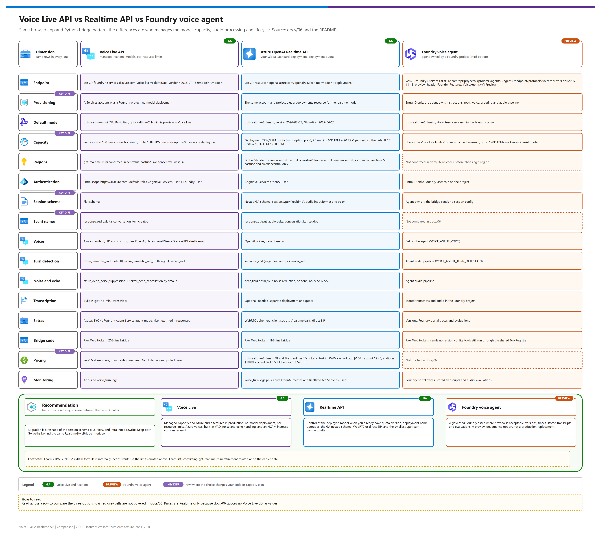

[README](../README.md) › [docs index](./00-reproduce-this-demo.md) › 06 Comparison

# Azure AI Voice Live API vs Azure OpenAI GPT Realtime API (GA deep dive)

<p>
&nbsp;
&nbsp;
&nbsp;
&nbsp;
&nbsp;

</p>

   

**Bottom line:** this page is the two-GA-API deep dive. The repo now also includes a third option, a Foundry voice agent public preview; use the root README for the full three-way decision table. Same model family, same browser app, same Python bridge pattern — the practical difference is who manages model deployment, capacity/quota, voice/audio processing, and lifecycle risk.

This page keeps the comparison intentionally narrow: two GA browser voice agents, both deployed to Azure Container Apps, both using managed identity, the same web client, the same shared Python core, and the same reusable agent profile. The only intentional differences are the upstream realtime API bridge and the infrastructure required to provision that API. It is written for the architect choosing between the two GA APIs and for anyone sharing the comparison with stakeholders.

## At a glance

| | Question | One-line answer |
|---|---|---|
|  | **Who manages the model?** | Voice Live: the service (no deployment). Realtime: you, via a Global Standard deployment |
|  | **What limits capacity?** | Voice Live: per-resource limits (100 new connections/min, <=120K TPM, <=60-minute sessions). Realtime: deployment quota in capacity units |
|  | **What changes in code?** | The URL, token scope, and session schema; everything else is the shared bridge ([What changes in the code](#what-changes-in-the-code)) |
|  | **And the third option?** | Foundry voice agent, : same Voice Live limits, agent owned by a Foundry project ([Third option](#third-option-foundry-voice-agent-public-preview)) |

[](./assets/voice-live-vs-realtime-comparison.png)

<sub>Editable source: [`assets/voice-live-vs-realtime-comparison.drawio`](./assets/voice-live-vs-realtime-comparison.drawio) - regenerate with `python scripts/export_diagrams.py docs/assets`.</sub>

> [!IMPORTANT]
> Voice Live does not remove capacity planning. Per-call p90 TPM x concurrency must still fit the resource limits (or a support increase), just as Realtime must fit deployment quota. See [Capacity & quota implications](#capacity--quota-implications-for-a-contact-center).

## Which should I use?

For production today, choose between these two GA API paths. Consider the Foundry voice agent preview only when you want to demonstrate governed agent assets, versions, traces, stored transcripts/audio, and evaluations, and can accept preview limitations.

| Use Voice Live API when... | Use Realtime API when... | Foundry voice agent  when... |
|---|---|---|
| You want managed realtime models with no model deployment resource to create. | You need direct control of the deployed model version, deployment name, and upgrade behavior. | You want the agent definition to live as a versioned Foundry asset instead of app-only config. |
| You prefer per-resource Voice Live limits over per-model Azure OpenAI deployment quota management. | You already have Azure OpenAI realtime quota, know the target region, and want to allocate deployment capacity yourself. | You can accept public preview and do not need it to be production-ready yet. |
| You need Azure neural, HD, or custom voices, plus OpenAI voices. | You need the GA nested Realtime session schema and the OpenAI voice set. | You want Foundry portal traces, stored transcripts/audio, and evaluation hooks. |
| You want built-in Azure semantic VAD, deep noise suppression, server echo cancellation, and built-in input transcription. | You want WebRTC ephemeral tokens or direct SIP transport on the Realtime API surface. | You are comfortable with Voice Live per-resource limits and no Azure OpenAI deployment quota. |
| You want Avatar, BYOM, or Foundry Agent Service agent mode from the same Voice Live surface. | You are staying close to an existing Realtime API contact-center implementation and want the smallest upstream contract delta. | You want native Twilio/Teams Phone binding and transfer-to-human options available later, though this demo keeps telephony on the shared bridge. |
| You are comfortable requesting a Voice Live new-connections/min increase when concurrency requires it. | You are comfortable managing lifecycle dates, quota requests, regional capacity, and the fact that PTU is not offered for realtime models. | You will re-run the postprovision hook after profile edits to publish a new agent version. |


##  Third option: Foundry voice agent (public preview)


| | Aspect | Foundry voice agent (`examples\foundry-voice-agent\`) |
|---|---|---|
|  | Kind |  Foundry Agent Service voice agent (`kind: voice`) built on Voice Live |
|  | Route | `wss://<foundry>.services.ai.azure.com/api/projects/<project>/agents/<agent>/endpoint/protocols/voice?api-version=2025-11-15-preview` with `Foundry-Features: VoiceAgents=V1Preview` |
|  | Auth | Entra ID only |
|  | Model | Managed model default `gpt-realtime-2.1-mini` |
|  | Bridge behavior | Sends no session config (Agent Service rejects per-response instruction overrides); tools still run through the shared `ToolRegistry` |

The third example, `examples\foundry-voice-agent\`, is a Foundry Agent Service voice agent (`kind: voice`) built on Voice Live. It uses the Foundry portal sample's route `wss://<foundry>.services.ai.azure.com/api/projects/<project>/agents/<agent>/endpoint/protocols/voice?api-version=2025-11-15-preview` with `Foundry-Features: VoiceAgents=V1Preview`, Entra ID only, and a managed model default of `gpt-realtime-2.1-mini`. The agent owns instructions, function-tool declarations, voice, greeting, audio pipeline, `store: true`, and versions in a Foundry project; the bridge sends no session config (Agent Service rejects per-response instruction overrides) and still executes tools through the shared `ToolRegistry`, so RAG behavior stays aligned.

Capacity-wise, it behaves like Voice Live for this demo: no model deployment and no Azure OpenAI quota, but it shares the resource's Voice Live new-connection and TPM limits when run on the shared platform. Treat it as a preview governance/observability option, not a production replacement for the two GA API paths.

> [!WARNING]
> The voice agent is public preview. Do not treat it as a production replacement for the two GA API paths.

> [!NOTE]
> [`assets/comparison-one-pager.pdf`](./assets/comparison-one-pager.pdf) is a concise, one-page export of [`assets/comparison-one-pager.html`](./assets/comparison-one-pager.html), not a reproduction of this longer Markdown deep dive. The HTML/PDF intentionally compare the two GA APIs with a preview callout for the third option. Regenerate from the repo root with `pwsh scripts\export-comparison.ps1` (Microsoft Edge). The print copy disables navigation links to avoid embedding local file paths; the HTML keeps its links.

## Side-by-side comparison


| Dimension | Voice Live API example | Realtime API example |
|---|---|---|
| Service, status, API version | Azure AI Speech Voice Live API ; GA default `api-version=2026-07-15`. | Azure OpenAI GPT Realtime API GA `/openai/v1` ; no date-based `api-version`. |
| Endpoint | `wss://<foundry>.services.ai.azure.com/voice-live/realtime?api-version=2026-07-15&model=<model>`; `cognitiveservices.azure.com` host also works. | `wss://<resource>.openai.azure.com/openai/v1/realtime?model=<deployment>`; `model` is the Azure deployment name. |
| What you provision | Standalone: own `Microsoft.CognitiveServices/accounts` kind `AIServices`, S0, custom subdomain, local auth disabled, and a Foundry project; no model deployment. Shared: reuse platform resource/project. | Standalone: same resource/project shape plus `Microsoft.CognitiveServices/accounts/deployments` for the realtime model. Shared: reuse platform resource/project/deployment. |
| Model selection | Query string `model=<model>`; Voice Live manages the backing model. The demo's voice agent defaults to the project-scoped route described above; BYOM adds `profile=<mode>`. | Bicep creates a Global Standard deployment with `model.name`, `model.version`, `sku.capacity`, `versionUpgradeOption`, and `raiPolicyName`. |
| Models and lifecycle | Demo default `gpt-realtime-mini` is GA and Basic tier; `gpt-realtime-2.1-mini` is supported but preview in Voice Live.[4] Lifecycle is service-managed; re-check model and region tables before use. | Demo default `gpt-realtime-2.1-mini` version `2026-07-07` is GA and retires `2027-06-25`; `gpt-realtime-mini` version `2025-12-15` is GA but has conflicting retirement rows, so plan to the earlier listed date.[1] |
| Capacity and limits | **Not a deployment** — no Azure OpenAI deployment quota. Per S0 resource: <=120K TPM, 100 new connections/min, <=60-minute sessions. New-connections/min is adjustable by Azure support request; TPM rises with it (TPM = NCPM x 4,000; Learn's table and example disagree — confirm the effective TPM).[6] | Deployment TPM/RPM quota per model + version, moving to a subscription-level Global Standard pool across regions; documented default for base `gpt-realtime` is 100K TPM / 200 RPM. Request quota with the Azure OpenAI quota form. No PTU for realtime; regional capacity is constrained; new quota can be refused for versions near retirement. |
| Scaling to N concurrent calls | Still requires sizing: per-call p90 TPM x concurrency must fit resource limits or be handled by support increase / multiple resources. Voice Live shifts capacity management; it does not make capacity limitless. | Still requires sizing: per-call p90 TPM x concurrency must fit approved subscription quota and deployment capacity. Insufficient quota can fail provisioning or create latency before 429s. Realtime capacity is set in capacity units (`gpt-realtime-2.1-mini`: 10K TPM + 20 RPM per unit; default quota often 10 units = 100K TPM).[3] |
| Regions | `gpt-realtime-mini` confirmed in `centralus`, `eastus2`, `swedencentral`, `westus2`; 25+ Voice Live regions overall, model coverage varies. | Global Standard realtime regions: `canadacentral`, `centralus`, `eastus2`, `francecentral`, `swedencentral`, `southindia`. Data Zone Standard has pricing meters but no region rows in the region matrix.[5] |
| Auth and RBAC | Entra bearer scope `https://ai.azure.com/.default`. Roles: Cognitive Services User `a97b65f3-24c7-4388-baec-2e87135dc908` and Foundry User `53ca6127-db72-4b80-b1b0-d745d6d5456d`. | Entra bearer scope `https://ai.azure.com/.default` by default. Role: Cognitive Services OpenAI User `5e0bd9bd-7b93-4f28-af87-19fc36ad61bd`. |
| Session schema | Flat realtime shape: `modalities`, top-level `voice`, `input_audio_format`, `output_audio_format`, `input_audio_sampling_rate`, top-level `turn_detection`. | GA nested shape: `session.type="realtime"`, `output_modalities`, `audio.input.format`, `audio.input.turn_detection`, `audio.output.voice`, `max_output_tokens`. |
| Event names | Voice Live beta-style audio names: `response.audio.delta`, `response.audio_transcript.delta`, `conversation.item.created`, plus `response.done`, `input_audio_buffer.speech_started/stopped`, and tool events. | GA names: `response.output_audio.delta`, `response.output_audio_transcript.delta`, `conversation.item.added/.done`, `rate_limits.updated`, plus shared `response.done`, speech, and tool events. |
| Voices | Azure standard neural/HD/custom voices and OpenAI voices. Demo default: `en-US-Ava:DragonHDLatestNeural`. | OpenAI voices: `alloy`, `ash`, `ballad`, `coral`, `echo`, `sage`, `shimmer`, `verse`, `marin`, `cedar`. Demo default: `marin`. |
| Turn detection | `azure_semantic_vad`, `azure_semantic_vad_multilingual`, or `server_vad`; OpenAI `semantic_vad` only for selected realtime models. | `semantic_vad` with eagerness or `server_vad`. Demo default: `semantic_vad` with `eagerness="auto"`. |
| Noise and echo | Built-in `azure_deep_noise_suppression` and `server_echo_cancellation` enabled by default in the bridge. | `near_field`, `far_field`, or no noise-reduction block; no equivalent echo-cancellation block in this bridge. |
| Input transcription | Built in: demo defaults to `gpt-4o-mini-transcribe` for `gpt-realtime` / `gpt-realtime-mini`, otherwise `azure-speech`; no separate deployment. | Optional and separate: `audio.input.transcription.model` must be an Azure deployment name with its own model deployment and quota. |
| Telephony and transports | Demo uses server-side WebSocket for parity. Production options include Voice Live accelerator connectors such as ACS, Genesys AudioHook, Twilio, Infobip, Sinch, and Bandwidth. | Demo uses server-side WebSocket for parity. Production browser guidance favors WebRTC with `client_secrets`; SIP is available only in `eastus2` and `swedencentral`. |
| Extras | Avatar, BYOM, Foundry Agent Service agent mode, audio timestamps, visemes, interim responses, Azure voices. | WebRTC ephemeral tokens, `/realtime/calls`, SIP, GA nested schema, direct deployment lifecycle control. |
| SDK | `azure-ai-voicelive` 1.3.0 is GA; this demo uses raw WebSockets so the two bridges are line-comparable. | This demo uses raw WebSockets against the GA endpoint; production browser paths can use WebRTC + ephemeral tokens. |
| Pricing model | Per-1M-token Voice Live tiers: Pro / Basic / Lite / BYO; mini models are Basic. Exact Voice Live dollar prices are not quoted here because the static pricing source did not expose stable numeric values.[2] | `gpt-realtime-2.1-mini` Global Standard per 1M tokens: text in $0.60, cached text $0.06, text out $2.40; audio in $10.00, cached audio $0.30, audio out $20.00. |
| Monitoring notes | App logs one `voice_turn` JSON line per turn to Log Analytics; use app-side TTFA, response time, tokens/min, and busy counts. | Same app-side metrics, plus Azure OpenAI Requests by status code, token metrics, and Realtime API Seconds Used. App-side timestamps remain primary for latency. |

Footnotes: [1] `gpt-realtime-mini` retirement rows conflict in the model retirement schedule. [2] Re-check Voice Live dollar pricing in the rendered pricing page or Azure Pricing Calculator before quoting. [3] Realtime deployment `sku.capacity` is in capacity units. Observed 2026-09-29 (`az cognitiveservices model list` and a live deployment): `gpt-realtime-2.1-mini` 2026-07-07 = 10,000 TPM + 20 RPM per unit; `gpt-realtime-mini` 2025-12-15 = 10,000 TPM + 3 RPM per unit. The quota row is labelled `Requests Per Minute - <model> - GlobalStandard` but is counted in these units. [4] `gpt-realtime-2.1-mini` is preview in Voice Live even though it is GA in Azure OpenAI Realtime. [5] Data Zone Standard pricing meters exist for some realtime models, but the region-availability matrix showed no Data Zone rows when verified. [6] Voice Live quota page (checked 2026-09-28) lists 100 NCPM / <=120,000 TPM for S0 but gives the formula example 30 NCPM x 4,000 = 120,000 TPM; the two can't both hold. Voice Live BYOM profiles call your own Foundry deployment, so that deployment's quota also applies in BYOM mode.

## What changes in the code

The bridge line counts after `app-realtime` completed are: `examples\voice-live-api\src\voice_live_bridge.py` = **208 lines**; `examples\realtime-api\src\realtime_api_bridge.py` = **193 lines**.

The payloads below were rendered from the real bridge methods with default API settings and a generic empty-tool profile; in the running demo, `instructions` and `tools` are injected by the shared profile loader.

<table>
<tr>
<th>Voice Live API default <code>session.update</code></th>
<th>Realtime API default <code>session.update</code></th>
</tr>
<tr>
<td>

<pre><code>{
  "type": "session.update",
  "session": {
    "modalities": ["text", "audio"],
    "instructions": "You are a helpful voice-first assistant. Keep spoken answers concise.",
    "voice": {
      "type": "azure-standard",
      "name": "en-US-Ava:DragonHDLatestNeural",
      "temperature": 0.8
    },
    "input_audio_format": "pcm16",
    "output_audio_format": "pcm16",
    "input_audio_sampling_rate": 24000,
    "turn_detection": {
      "type": "azure_semantic_vad",
      "threshold": 0.5,
      "prefix_padding_ms": 300,
      "silence_duration_ms": 500,
      "create_response": true,
      "interrupt_response": true,
      "remove_filler_words": false
    },
    "input_audio_noise_reduction": {"type": "azure_deep_noise_suppression"},
    "input_audio_echo_cancellation": {"type": "server_echo_cancellation"},
    "input_audio_transcription": {"model": "gpt-4o-mini-transcribe"},
    "tools": [],
    "tool_choice": "auto",
    "temperature": 0.8,
    "max_response_output_tokens": "inf"
  }
}</code></pre>

</td>
<td>

<pre><code>{
  "type": "session.update",
  "session": {
    "type": "realtime",
    "instructions": "You are a helpful voice-first assistant. Keep spoken answers concise.",
    "output_modalities": ["audio"],
    "audio": {
      "input": {
        "format": {"type": "audio/pcm", "rate": 24000},
        "turn_detection": {
          "type": "semantic_vad",
          "eagerness": "auto",
          "create_response": true,
          "interrupt_response": true
        },
        "noise_reduction": {"type": "near_field"}
      },
      "output": {
        "format": {"type": "audio/pcm", "rate": 24000},
        "voice": "marin"
      }
    },
    "tools": [],
    "tool_choice": "auto",
    "max_output_tokens": "inf"
  }
}</code></pre>

</td>
</tr>
</table>

| Hook | Voice Live API bridge | Realtime API bridge |
|---|---|---|
| `build_url` | Converts `https://<foundry>.services.ai.azure.com` to `wss://<foundry>.services.ai.azure.com/voice-live/realtime?api-version=2026-07-15&model=<model>`. Existing `ws` / `wss` endpoints keep their query values when already set. | Converts `https://<resource>.openai.azure.com` to `wss://<resource>.openai.azure.com/openai/v1/realtime?model=<deployment>` and overwrites `model` with the deployment name. |
| `build_headers` scope | `https://ai.azure.com/.default` with optional local-only `VOICE_LIVE_API_KEY`. | `AZURE_OPENAI_TOKEN_SCOPE`, default `https://ai.azure.com/.default`, with optional local-only `AZURE_OPENAI_API_KEY`. |
| `build_session_update` | Flat schema, Azure voice object, Azure semantic VAD, deep noise suppression, echo cancellation, built-in transcription, `temperature`, `max_response_output_tokens`. |  Nested schema, OpenAI voice string, semantic/server VAD, optional noise reduction, optional separate transcription deployment, `max_output_tokens`. |
| Event aliases | Shared base accepts both `response.audio.*` and `conversation.item.created`. | Shared base accepts both `response.output_audio.*` and `conversation.item.added`. |
| Infra delta | Standalone creates `AIServices` plus a Foundry project; shared mode reuses them. Grants Cognitive Services User + Foundry User to the UAMI and deploying principal; no model deployment. | Adds a deployment resource in standalone mode (reuses the platform deployment in shared mode), `REALTIME_DEPLOYMENT_CAPACITY`, model version mapping, `versionUpgradeOption`, and Cognitive Services OpenAI User role assignments. |

Everything else reuses the same implementation: browser mic/speaker client, 24 kHz PCM16 WebSocket envelope, FastAPI server factory, tool registry, metrics, admission control, history trimming, local-run script, fake upstream tests, and the load probe. Each example runs its own app instance and `SessionHub`; the admission counter is not shared across the three apps, even in shared-platform mode.

## Capacity & quota implications for a contact center

Use this generic sizing formula before cutover:

```text
required TPM ~= p90 tokens/minute per active call x target concurrent calls
```

Worked example: if a realistic call profile measures **~80K TPM/call p90** and the target is **20 concurrent calls**, then **80K x 20 ~= 1.6M TPM**. That is far above the Voice Live default **120K TPM/resource** and above the documented base Realtime default **100K TPM** quota. The symptom may be long pauses and degraded time-to-first-audio before obvious errors appear.

How each option handles that:

- **Voice Live API:** request a new-connections/min increase, which raises the dependent TPM limit, and/or shard across resources. Confirm the 100 new-connections/min gate separately from steady concurrent sessions.
- **Foundry voice agent:** same Voice Live limit model as Voice Live API; in shared mode it shares the resource limit with the Voice Live example, so run one at a time or use a separate resource for fair capacity tests.
- **Realtime API:** secure subscription-level quota for the model/global pool, choose a supported region with available capacity, and set deployment capacity within the available capacity units (`az cognitiveservices usage list`; 1 unit = 10K TPM + 20 RPM for `gpt-realtime-2.1-mini`).
- **All three apps:** keep each app's `MAX_CONCURRENT_SESSIONS` below its validated capacity envelope. Browser overflow gets `busy` + `1013`; ACS/Twilio use configured overflow or reject/end the call; Asterisk sends `HANGUP` for dialplan fallback. There is no built-in human queue; see [architecture](./01-architecture.md#end-to-end-data-flow).

Token-reduction levers are usually cheaper than quota: trim instructions and tool schemas, keep spoken answers to one or two sentences, cap or delete history with `conversation.max_history_items`, and load test with the same prompts, audio cadence, and tool frequency expected in production. Upstream unheard-audio truncation via `conversation.item.truncate` remains future hardening; the current bridge flushes/cancels/discards playback but does not implement that truncation.

**Confirm before you move:** get quota or Voice Live limit increases approved and visible, run the load probe at target concurrency, verify p90 TTFA and busy count in Log Analytics, and keep the current region/path as a rollback option until the bake-off passes.

##  Migration path

| | Direction | Summary |
|---|---|---|
|  | Realtime API to Voice Live API | Swap endpoint/RBAC, drop the deployment, reshape `session.update` to the flat schema, map events, pick voice/VAD options, load test |
|  | Voice Live API to Realtime API  | Add a realtime deployment, reshape to the nested GA schema, replace Azure-specific audio features, confirm quota/region/lifecycle |

Realtime API to Voice Live API:

1. Change the upstream endpoint, token scope if needed, and RBAC from Cognitive Services OpenAI User to Cognitive Services User + Foundry User.
2. Replace the model deployment reference with a Voice Live `model` query parameter; remove deployment Bicep and deployment capacity from infra.
3. Reshape `session.update` from nested GA schema into the flat Voice Live schema.
4. Map event names: the shared bridge already accepts the Voice Live and GA Realtime aliases for audio, transcript, item, speech, tool, and response events.
5. Pick an Azure or OpenAI voice, VAD mode, noise suppression, echo cancellation, and transcription option.
6. Load test with the probe at target concurrency; request a Voice Live new-connections/min increase if the target profile exceeds the default envelope.

Reverse path, Voice Live API to Realtime API:

1. Add an Azure OpenAI realtime model deployment and select version/upgrade behavior.
2. Reshape the flat session payload into the nested GA schema.
3. Replace Azure-specific voice/audio features with the Realtime equivalents or app-side processing.
4. Confirm quota, region capacity, lifecycle dates, and optional transcription deployment before cutover.

The safest operating pattern is to keep both upstreams behind the same `RealtimeStyleBridge` interface until capacity, quality, and cost are validated with the same workload.

## How to reproduce

See [03-deployment.md](03-deployment.md) for the full tenant-explicit `az` / `azd` setup and [04-testing.md](04-testing.md) for functional, load, and bake-off testing. Always pin the tenant and subscription first. Never run a bare `azd up` against ambient credentials.

```powershell
az login --tenant <TENANT_ID>
az account set --subscription <SUBSCRIPTION_ID>
azd auth login --tenant-id <TENANT_ID>
```

Voice Live API example:

```powershell
cd examples\voice-live-api
azd env new vl-demo
azd env set AZURE_TENANT_ID <TENANT_ID>
azd env set AZURE_SUBSCRIPTION_ID <SUBSCRIPTION_ID>
azd env set AZURE_LOCATION centralus
azd up
```

Realtime API example:

```powershell
cd examples\realtime-api
azd env new rt-demo
azd env set AZURE_TENANT_ID <TENANT_ID>
azd env set AZURE_SUBSCRIPTION_ID <SUBSCRIPTION_ID>
azd env set AZURE_LOCATION centralus
azd up
```

After deployment, run the shared tests and load probe from [04-testing.md](04-testing.md); all three examples expose the same browser UI and `/ws` bridge so results are comparable.

##  Sources

Verified 2026-09-25; re-verify model lifecycle, regions, quota, and pricing before production use.

| Topic | Where to re-check |
|---|---|
| Voice Live API | Reference, overview, release notes, quotas, regions and pricing pages (first six links below) |
| Realtime API | How-to, WebRTC how-to, retirement schedule, quotas, quota management, region matrix and pricing (next links) |
| Repo code | The bridges, Bicep resources, `azure.yaml` and example READMEs listed last |

- Voice Live API reference: https://learn.microsoft.com/en-us/azure/ai-services/speech-service/voice-live-api-reference-2026-07-15
- Voice Live overview, models, features, and pricing tiers: https://learn.microsoft.com/en-us/azure/ai-services/speech-service/voice-live
- Voice Live release notes: https://learn.microsoft.com/en-us/azure/ai-services/speech-service/releasenotes
- Voice Live quotas and limits: https://learn.microsoft.com/en-us/azure/ai-services/speech-service/speech-services-quotas-and-limits?tabs=voice-live
- Voice Live regions: https://learn.microsoft.com/en-us/azure/ai-services/speech-service/regions?tabs=voice-live
- Voice Live pricing page: https://azure.microsoft.com/en-us/pricing/details/cognitive-services/speech-services/
- Realtime API how-to: https://learn.microsoft.com/en-us/azure/foundry/openai/how-to/realtime-audio
- Realtime WebRTC and ephemeral-token how-to: https://learn.microsoft.com/en-us/azure/ai-foundry/openai/how-to/realtime-audio-webrtc
- Azure OpenAI model retirement schedule: https://learn.microsoft.com/en-us/azure/foundry/openai/concepts/model-retirement-schedule
- Azure OpenAI quotas and limits: https://learn.microsoft.com/en-us/azure/foundry/openai/quotas-limits
- Azure OpenAI quota management: https://learn.microsoft.com/en-us/azure/foundry/openai/how-to/quota
- Realtime region availability matrix: https://learn.microsoft.com/en-us/azure/foundry/foundry-models/concepts/models-sold-directly-by-azure-region-availability
- Azure OpenAI pricing page: https://azure.microsoft.com/en-us/pricing/details/cognitive-services/openai-service/
- Azure Retail Prices API: https://prices.azure.com/api/retail/prices
- Repo code inspected: `examples\voice-live-api\src\voice_live_bridge.py`, `examples\realtime-api\src\realtime_api_bridge.py`, both `infra\modules\resources.bicep`, both `azure.yaml`, both example `README.md`, and `shared\voiceagent_core\bridge.py`.

---

**Next:** [07 Telephony and shared endpoint](./07-telephony-and-shared-endpoint.md)

*Last updated: 2026-10-02*
