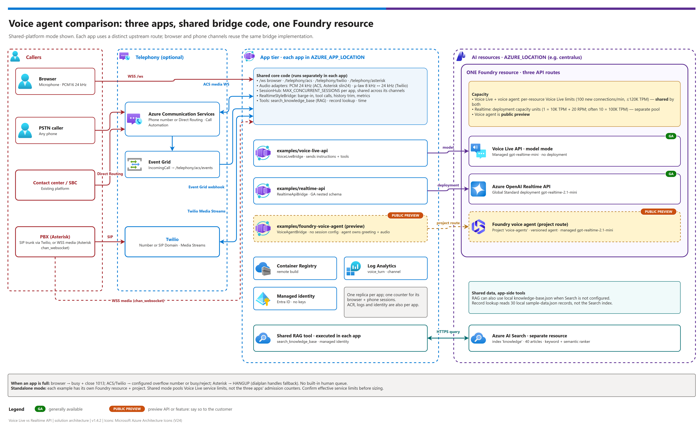
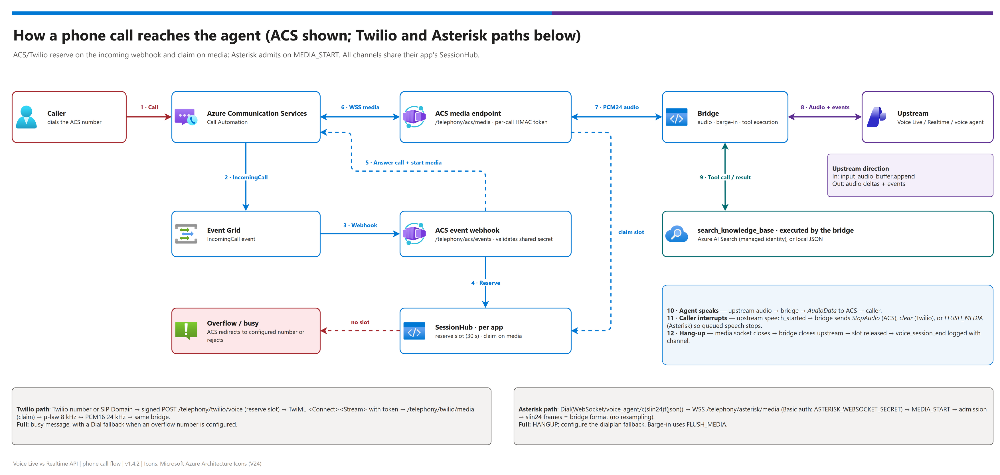

[README](../README.md) › [docs index](./00-reproduce-this-demo.md) › 07 Telephony and shared endpoint

# 07 — Telephony and the shared Foundry resource

<p>
&nbsp;
&nbsp;
&nbsp;
&nbsp;
&nbsp;

</p>

  

> [!IMPORTANT]
> No live ACS, Twilio, or Asterisk call is recorded as verified. Telephony adapters are covered by protocol-level tests and fake-upstream tests; see [Known limitations](#known-limitations) and [04 Testing](./04-testing.md#live-validation).

> [!CAUTION]
> Telephony generates secrets (Asterisk configs, Twilio auth token, ACS Event Grid secret). Keep generated files out of source control and see [Security notes](#security-notes).

Adds real phone calls and document grounding (RAG) while keeping **all three apps on one subscription and one Foundry resource**. The APIs use distinct hosts/routes and limits, **not one literal WebSocket URL or one quota pool**. Admission is per app. The recommended `scripts\demo.ps1` workflow includes Search and lets you opt into ACS, Twilio, and Asterisk; the browser experience remains available on all three apps.

## Recommended wrapper phone setup

Start with [00 — Reproduce this demo](00-reproduce-this-demo.md#recommended-shared-path--deploy-all-three-and-set-up-phones) or the [full deployment contract](03-deployment.md#recommended-shared-deploy-all). Install **Python 3.12+** and local dependencies before actual deployment, from the repo root:

```powershell
python -m venv .venv
.\.venv\Scripts\python.exe -m pip install -r scripts\requirements-agent.txt

$Demo = @{
  DemoName = "voice-demo"
  TenantId = "<tenant-guid>"
  SubscriptionId = "<subscription-guid>"
}
./scripts/demo.ps1 -Action Up @Demo -AppLocation eastus2 -Telephony 'acs,twilio,asterisk' -WhatIf
./scripts/demo.ps1 -Action Up @Demo -AppLocation eastus2 -Telephony 'acs,twilio,asterisk'
```

The wrapper uses `.venv/Scripts/python.exe` or `.venv/bin/python`, else `python` (`azure-identity` is required for Search loading; `azure-ai-projects` for the voice agent). On non-Windows hosts install with `.venv/bin/python -m pip install -r scripts/requirements-agent.txt`. AI region defaults to `centralus` (allowed: `centralus`, `eastus2`, `swedencentral`); `-AppLocation` defaults to the AI region if omitted, while the example explicitly uses `eastus2`. Initial `-RealtimeCapacity` is `10`, with existing model defaults. Phone providers default to **none**; choose only the ones you need.

`-WhatIf` prints order/targets **offline**, with no CLI calls, cloud access, or file changes; it is not ARM what-if. Actual `Up` signs `az`/`azd` in tenant-explicitly (`-SkipLogin` still checks Azure context), provisions the platform with **Search always** and **ACS only if selected**, loads 40 articles, wires named app environments, and runs ARM preview then `azd up` for each app sequentially. Postprovision creates the voice-agent version. The wrapper checks `/healthz` and `/api/info` backend/provider configuration and prints three app URLs; **that does not test upstream audio or real calls**. Do not separately deploy `knowledge\` on this path.

### What is automatic, and what stays manual

| Provider | Wrapper output / behavior | Operator handoff |
|---|---|---|
| Asterisk | With `-Telephony asterisk`, generates all three `examples/<example>/.azure/<env>/asterisk/` configs: **7001** Voice Live, **7002** Realtime, **7003** voice agent. | Install/configure the external PBX and merge/copy `websocket_client.conf` and `extensions.conf` yourself. Generated configs contain secrets. See [section 7](#7-connect-asterisk-directly-over-wss-no-twilio). |
| Twilio | Securely prompts for a missing auth token (not a command-line argument), keeps existing secrets, prints all three **HTTP POST** voice webhooks. | Buy/use a number or SIP Domain and set its webhook in Twilio Console. Choose **one target per number**; switch among the three URLs or use separate numbers. |
| ACS | Creates the ACS resource only when `acs` is selected. Routing is skipped without `-AcsPhoneNumber`; when supplied, creates/updates stable Event Grid subscription **`incoming-demo`** on this demo's ACS resource. | Acquire the number separately **after provisioning (paid step)**, then route it with `Phones` below. One number, one app target. |

### Route an acquired ACS number, or regenerate phone configs

After acquiring a number on this demo's ACS resource:

```powershell
./scripts/demo.ps1 -Action Phones @Demo -PhoneTarget foundry-voice-agent -AcsPhoneNumber '+<E164-number>'
```

`Phones` inherits providers from `.azure/demos/<DemoName>.json` and reruns routing/config generation **without `azd up`**; omit Up-only region/provider/capacity/overflow arguments. `-PhoneTarget` defaults to `foundry-voice-agent`; alternatives are `voice-live-api` and `realtime-api`. It updates the single `incoming-demo` route to that target, not all three. Optional `-OverflowNumber +E164` on **Up** configures ACS/Twilio fallback; the external Asterisk dialplan handles its own fallback.

**Avoid duplicate delivery:** older manually created Event Grid subscriptions are **not automatically deleted**. Before testing, inspect all incoming-call routes on the ACS resource for duplicate number filters; one number should reach one app. Do not run the manual per-app routing examples below on top of `incoming-demo` for the same number.

### Resume and tear down the shared demo

`DemoName` is 3–20 lowercase letters/digits/hyphens, starting with a letter and ending alphanumeric. The gitignored, nonsecret manifest records ownership of `<DemoName>-platform`, `-vl`, `-rt`, `-agent`; each project also keeps its own `.azure/<env>/.env`. The wrapper refuses adoption of pre-existing environments/resource groups and tenant/location/provider drift. Resume with the **same Up arguments**; existing env values are used, but naming settings are immutable. There is **no automatic rollback**; completed stages stay deployed and cost money.

```powershell
./scripts/demo.ps1 -Action Down @Demo -WhatIf
./scripts/demo.ps1 -Action Down @Demo
```

`Down` displays the four owned resource groups and asks for confirmation, deleting **agent → Realtime → Voice Live → platform**. No need to repeat regions/providers. `-Force` is unattended-confirmation opt-in; separate `-Purge` requests irreversible `azd --purge` behavior, not guaranteed Cognitive Services purging. Local manifest/env state is kept for retries/audit; use a **new DemoName** after full teardown. `knowledge\` and unrelated environments are never removed. **External Twilio/PBX configuration, phone numbers, and billing require operator cleanup.**

## What this adds

| Capability | How |
|---|---|
| One Foundry resource for all three apps | `platform/` azd project provisions one Foundry (AI Services) resource with one Global Standard realtime deployment and one Foundry project for the voice agent. All three examples run in **shared mode**, using distinct API hosts/routes and their own app identities. |
| Phone calls over Azure | ACS Call Automation answers PSTN calls (ACS number or Direct Routing) and streams audio over a **WebSocket** to the same bridge the browser uses. |
| Phone calls over Twilio | Twilio Media Streams (`<Connect><Stream>`) over a **WebSocket**. Works for Twilio numbers and Twilio SIP Domains, so an existing PBX (for example Asterisk with a SIP trunk to a Twilio SIP Domain) can route an extension or IVR option to the agent. |
| Phone calls from Asterisk directly | Asterisk `chan_websocket` streams call audio over **WSS** to `/telephony/asterisk/media` (no Twilio, no SIP). |
| RAG on every channel | `search_knowledge_base` tool (`knowledge_search` handler) queries Azure AI Search (keyword + semantic ranker, managed identity) or a local JSON file. Same handler and knowledge source on browser, ACS, Twilio, and Asterisk calls. |
| One admission counter **per app** | Browser tabs and phone calls within an app share `MAX_CONCURRENT_SESSIONS`, not a global cap across all three. ACS/Twilio use configured overflow or reject/end the call; Asterisk sends `HANGUP` for dialplan fallback. A human queue is external, not provided by the demo. |

## Topology



**Diagram scope:** the image shows all three app instances, the project voice agent, and optional ACS/Twilio/Asterisk paths. The compact sketch below focuses on ACS/Twilio ingress to one example app. “One endpoint” here means one Foundry resource with distinct API hosts/routes, not one literal WebSocket URL or a single quota pool for all APIs.

```text
                                        ┌──────────────── platform RG (centralus) ───────────────┐
PSTN ─► ACS number ─► Event Grid ───────┤ ACS  ──────────────┐                                    │
PSTN ─► Twilio number ─────────────┐    │ AI Search (index)  │  Foundry AI Services (one resource)│
PBX ─► Twilio SIP Domain ──────────┤    │                    │   ├─ gpt-realtime-2.1-mini (GS)    │
                                   │    └────────────────────┼───┴─ Voice Live (managed models)   │
                                   ▼                         │                                    │
   ┌──────────── example app (Container Apps) ───────────┐   │                                    │
   │ /telephony/acs/*   /telephony/twilio/*   /ws        │───┘  managed identity, no keys          │
   │        └──── adapters ───► shared bridge ◄── browser│                                         │
   │                     tools: record lookup, RAG       │                                         │
   └──────────────────────────────────────────────────────┘                                        │
```

Each example keeps its own Container App, ACR, Log Analytics, user-assigned managed identity,
and `SessionHub`. Only the Foundry resource/project/deployment, separate Search index, and
optional ACS resource are shared. Browser, ACS, Twilio, and Asterisk sessions share admission
within one app, **not across the three apps**. Browser overflow gets `busy` + `1013`; ACS/Twilio
use a configured overflow number or reject/end the call. Asterisk sends `HANGUP` for dialplan
fallback. A human queue must be configured externally; the demo does not provide one.

## Audio path

[](./assets/diagrams/03-phone-call-flow.png)

<sub>Editable source: [`assets/diagrams/03-phone-call-flow.drawio`](./assets/diagrams/03-phone-call-flow.drawio) - regenerate with `python scripts/export_diagrams.py docs/assets`.</sub>

**Admission in this flow:** ACS/Twilio reserve a slot on the incoming-call webhook and claim it
when media connects. Asterisk instead attempts admission after `MEDIA_START` on its media
connection. Audio flows both ways; `input_audio_buffer.append` labels caller audio sent upstream,
not assistant audio returned to the caller.

| Channel | On the wire | Conversion at the adapter | Barge-in |
|---|---|---|---|
| Browser | PCM16 24 kHz (JSON over WebSocket) | none | client flushes playback |
| ACS | `pcm24KMono`, bidirectional WebSocket (`AudioData`) | none | `StopAudio` |
| Twilio / SIP Domain | G.711 mu-law 8 kHz (`media` events) | decode + 3x upsample in, low-pass + 3x decimate + encode out | `clear` |
| Asterisk (`chan_websocket`) | Raw BINARY frames, `slin24` recommended (`ulaw`/`slin` supported) | none for `slin24` | `FLUSH_MEDIA` |

All three upstream paths receive PCM16 24 kHz, so the Voice Live vs Realtime vs voice-agent comparison
stays apples-to-apples across channels. Telephone calls carry only 8 kHz audio, which is
why a phone test is still needed: recognition and VAD behave differently on narrowband
audio than on a browser microphone.

## Quota and limits: Voice Live vs Realtime API

The single most important difference: **Voice Live's natively supported models are not a
deployment.** Microsoft manages the model and its throughput, so there is nothing to deploy and
no Azure OpenAI deployment quota to request. That moves capacity into a *different* set of
limits — it does not remove them.

| | Voice Live API (managed model, e.g. `gpt-realtime-mini`) | Azure OpenAI Realtime API |
|---|---|---|
| What you create | `AIServices` resource only — **no model deployment** | `AIServices` resource **plus** a Global Standard model deployment |
| What limits you | **Per-resource** Voice Live limits (S0): **100 new connections/min**, **≤ 120,000 TPM**, **≤ 60 min per session** | **Deployment quota** for that model + version, set in **capacity units** (`REALTIME_DEPLOYMENT_CAPACITY`). For `gpt-realtime-2.1-mini` 1 unit = **10,000 TPM + 20 RPM**, so 10 units = 100K TPM / 200 RPM (the portal shows it as TPM). `az cognitiveservices usage list` labels the quota row `Requests Per Minute - <model> - GlobalStandard`, but it is counted in units (often 10 by default). Documented default for base `gpt-realtime` Global Standard: 100,000 TPM / 200 RPM; mini and 2.1-mini rows aren't listed separately |
| Scope of the limit | One Voice Live/Speech resource | Moving to **subscription-level pools**: Global Standard deployments of the same model + version share one pool across all regions in the subscription (started after 2026-05-07 with some models, "soon all models") |
| What you raise | **New connections/min** (only adjustable item); TPM rises with it at **TPM = NCPM × 4,000** | TPM quota for the model/version |
| How you ask | Azure portal **support request** (Speech / Voice Live quota) | Azure OpenAI quota request (https://aka.ms/oai/stuquotarequest) or Foundry → Quota |
| Region capacity / model end-of-life | Managed by the service for native models (no per-version quota request) | Your problem: region capacity can block deployments, and new quota is refused on versions near retirement (the current escalation) |
| Input transcription | Built in (`gpt-4o-mini-transcribe` / `azure-speech`); no extra deployment or quota | A **separate** transcription model deployment with its **own** quota |
| PTU | n/a | Not offered for realtime models (per the region-availability matrix at verification time) |
| Voice Live BYOM exception | With a BYOM profile, Voice Live calls **your** Foundry deployment, so that deployment's quota applies as well (inferred from the BYOM model — confirm before relying on it). This demo does not use BYOM. | — |

**Learn inconsistency to confirm with support:** the Voice Live quota table lists S0 defaults of
100 NCPM and ≤ 120,000 TPM, but the same page's formula example says 30 NCPM × 4,000 = 120,000 TPM
(100 NCPM × 4,000 would be 400,000). Plan with **120,000 TPM** until a support engineer confirms
the effective TPM for the resource.

### What this means in the shared-endpoint setup

- All three examples run on the **same `AIServices` resource**, but not on the same limits:
  - **Realtime API** uses only the platform deployment's quota (capacity units: 10K TPM + 20 RPM each).
  - **Voice Live API** and the **Foundry voice agent** both use the resource's **per-resource
    Voice Live limits** (the voice agent is Voice Live in agent mode). They **share** those limits:
    100 new connections/min and ≤120K TPM across both apps together.
  - Load on the Realtime app does not reduce Voice Live headroom, and vice versa. Load on the
    Voice Live app **does** reduce the voice agent's headroom.
- For a fair capacity test of the two managed-model options, run them **one at a time**, or give
  the voice agent its own Foundry resource (standalone mode) so each has its own limits.
- If other workloads also use Voice Live on this resource, they share the same per-resource
  Voice Live limits; use a separate resource for them (or for sharding) when testing at scale.
- The Voice Live **new-connections/min** gate matters for call bursts (a wave of calls at the top
  of the hour) independently of steady concurrency; the Realtime deployment has an **RPM** limit
  as well as TPM.
- Size both the same way: **p90 TPM per call × target concurrent calls**, from the load probe.
  Example: 20 calls at ~80K TPM each ≈ 1.6M TPM — more than the Voice Live default (120K) and the
  base Realtime default (100K), so either path needs an increase before a 20-caller test is fair.
- `MAX_CONCURRENT_SESSIONS` is per app replica (`maxReplicas: 1`), so each app enforces its own
  cap. Set it to what the corresponding limit can actually hold, or overflow tests will measure
  throttling instead of admission control.

Sources (verified 2026-09-28): Voice Live quotas and limits —
https://learn.microsoft.com/en-us/azure/ai-services/speech-service/speech-services-quotas-and-limits ·
Voice Live overview ("fully managed, so you don't need to deploy models, worry about capacity
planning, or provision throughput") — https://learn.microsoft.com/en-us/azure/ai-services/speech-service/voice-live ·
Azure OpenAI quotas and subscription-level quota — https://learn.microsoft.com/en-us/azure/ai-foundry/openai/quotas-limits

## Deploy (centralus, one subscription)


**Manual shared-platform alternative, not additional wrapper steps.** Prefer `demo.ps1 Up` above for a new demo. The sequence below exposes the underlying helpers for operators managing their own environments; such environments are not adopted by the wrapper. Unlike the wrapper (which always includes Search), this manual path lets you disable Search. Preserve explicit tenant/subscription selection and use fresh named environments for every app.

Follow the multi-tenant auth gate first: confirm `az account show` matches the intended
tenant and subscription, and use tenant-explicit `azd auth login --tenant-id`.

### 1. Shared platform

```powershell
cd platform
azd auth login --tenant-id <tenant-id>
azd env new voice-shared
azd env set AZURE_TENANT_ID <tenant-id>
azd env set AZURE_SUBSCRIPTION_ID <subscription-id>
azd env set AZURE_LOCATION centralus
azd env set REALTIME_DEPLOYMENT_CAPACITY 10      # capacity units: 10 = 100K TPM / 200 RPM; preprovision hook checks quota
azd provision
```

Manual options: `DEPLOY_SEARCH=false` (use the local knowledge file and skip step 2), `DEPLOY_COMMUNICATION_SERVICES=false`
(no ACS, for example Twilio/Asterisk only), `ACS_DATA_LOCATION` (default `United States`). Set these before provisioning. The wrapper sets Search on and ACS according to the selected providers instead.

### 2. Load the knowledge index

```powershell
$search = (azd env get-value AZURE_SEARCH_ENDPOINT)
cd ..
python scripts/load-knowledge-index.py --endpoint $search --index knowledge
```

Replace `config/knowledge-base.json` with your own documents (or point the tool's
`handler_config` field names at an existing index — `title_field`, `content_field`,
`source_field`, optional `vector_field` for an integrated vectorizer).

### 3. Get a phone number

- **ACS:** Azure portal → the platform ACS resource → *Phone numbers* → *Get* (toll-free or
  geographic, inbound calling). Needs a paid subscription (not trial/free credits). One number
  per app keeps routing simple.
- **Twilio:** use an existing number, or a SIP Domain for PBX routing (step 6).

### 4. Point each app at the platform and deploy

This manual helper accepts a token variable; use masked input rather than typing a secret literal in command history. The recommended wrapper handles the secure prompt itself and preserves existing secrets. Create/select the intended fresh azd environment in each app folder before wiring it.

```powershell
$TwilioAuthToken = Read-Host "Twilio auth token" -MaskInput
./scripts/use-shared-platform.ps1 -Example realtime-api  -PlatformEnv voice-shared -Telephony acs,twilio -TwilioAuthToken $TwilioAuthToken -OverflowNumber +15555550100
./scripts/use-shared-platform.ps1 -Example voice-live-api -PlatformEnv voice-shared -Telephony acs,twilio -TwilioAuthToken $TwilioAuthToken -OverflowNumber +15555550100
./scripts/use-shared-platform.ps1 -Example foundry-voice-agent -PlatformEnv voice-shared -Telephony acs,twilio -TwilioAuthToken $TwilioAuthToken -OverflowNumber +15555550100
Remove-Variable TwilioAuthToken

cd examples/realtime-api;  azd up
cd ../voice-live-api;      azd up
cd ../foundry-voice-agent; azd up   # postprovision hook creates the agent version
```

The script copies the platform outputs into each example's azd env, sets the same tenant,
subscription, and region, and generates two random secrets: `TELEPHONY_WEBHOOK_SECRET` (signs
per-call tokens; never leaves the app) and, for ACS, `ACS_EVENTGRID_SECRET` (the value placed
in the Event Grid endpoint URL). Secrets are stored only in the local azd env and as Container
Apps secrets — never as Bicep outputs.

Run the example's `azd up` in a new azd environment (`azd env new`) if the example was
previously deployed standalone; shared mode does not create a Foundry resource.

#### Container Apps in a different region than the AI endpoint

The AI region and the app region are separate settings:

| Setting | Controls | Default |
|---|---|---|
| `AZURE_LOCATION` | AI endpoint region (Foundry, realtime deployment, Voice Live), plus the resource group's metadata location | `centralus` |
| `AZURE_APP_LOCATION` | Container Apps environment + app, ACR, Log Analytics, and the app's managed identity | empty = same as `AZURE_LOCATION` |

When Container Apps capacity or quota is constrained in `centralus`, keep the AI endpoint there
and move only the app tier:

```powershell
./scripts/use-shared-platform.ps1 -Example realtime-api  -PlatformEnv voice-shared -Telephony acs,twilio -AppLocation eastus2 ...
./scripts/use-shared-platform.ps1 -Example voice-live-api -PlatformEnv voice-shared -Telephony acs,twilio -AppLocation eastus2 ...
./scripts/use-shared-platform.ps1 -Example foundry-voice-agent -PlatformEnv voice-shared -Telephony acs,twilio -AppLocation eastus2 ...
# or directly: azd env set AZURE_APP_LOCATION eastus2
```

The script checks that `Microsoft.App/managedEnvironments` is offered in that region for the
subscription. Guidance:

- **Use the same `AZURE_APP_LOCATION` for all three apps.** The extra app → AI network hop sits on every
  audio frame and every response, so a different app region per API would bias the TTFA comparison.
- Pick the nearest region with Container Apps capacity (for `centralus`, typically `eastus2`,
  `northcentralus`, or `southcentralus`) and record it with the results — cross-region adds a few
  milliseconds of round-trip per hop.
- Nothing else moves: ACS is a global resource, AI Search and the realtime deployment stay in the
  platform region, and `PUBLIC_BASE_URL` follows the Container Apps environment automatically.
- Resource names don't depend on the app region, so Azure rejects moving an already-deployed app
  tier to a new `AZURE_APP_LOCATION`. Use fresh manual environments, or deliberately tear down the old ones first; purge is a separate irreversible choice. For wrapper-owned deployments, use a new `DemoName` rather than editing the recorded location. Regenerate phone configs/routes because app URLs change.

### 5. Route ACS numbers (Event Grid)

**Manual alternative only:** these helpers create per-app subscriptions, unlike the wrapper's single stable `incoming-demo`. Use different numbers and check for existing subscriptions with the same number filter; do not layer these routes onto a wrapper-managed number.

```powershell
./scripts/configure-telephony.ps1 -Example realtime-api  -PhoneNumber +1<acs-number-A>
./scripts/configure-telephony.ps1 -Example voice-live-api -PhoneNumber +1<acs-number-B>
./scripts/configure-telephony.ps1 -Example foundry-voice-agent -PhoneNumber +1<acs-number-C>
```

Creates an Event Grid subscription per app on the shared ACS resource, filtered on
`data.to.PhoneNumber.Value`, that delivers `IncomingCall` to
`/telephony/acs/events?secret=<ACS_EVENTGRID_SECRET>`. The app must already be running with `acs` enabled so the
Event Grid validation handshake succeeds.

### 6. Route Twilio numbers and PBX calls

Set the Voice webhook (HTTP POST) to `https://<app>/telephony/twilio/voice`:

- **Twilio number:** Phone Numbers → the number → *A call comes in* → Webhook.
- **Asterisk over a SIP trunk (via Twilio):**
  1. Twilio Console → Voice → *SIP Domains* → create `<name>.sip.twilio.com`; set *A call comes
     in* to the webhook above; restrict with an IP access control list for Asterisk's public IP
     (and/or a credential list).
  2. Asterisk `pjsip.conf`: an outbound endpoint + AOR whose contact is `sip:<name>.sip.twilio.com`
     (TLS transport recommended).
  3. Dialplan: `exten => 7777,1,Dial(PJSIP/7777@<twilio-endpoint>)` (or an IVR option that does the same).
  4. Inbound calls are unchanged: PSTN → your carrier/trunk → Asterisk → extension/IVR → (option) →
     SIP Domain → agent.

Point one Twilio number (or one SIP Domain) at each app; to compare, change the webhook
among the **three app URLs** or use three numbers. Each number/SIP Domain has one target at a time; the wrapper prints these URLs but does not configure Twilio Console for you.

**Generic customer pattern:** an existing contact-center platform or SBC reaches ACS through
**Direct Routing**, or any platform that can stream call audio over a WebSocket can be added
as another adapter in `shared/voiceagent_core/telephony/` without changing the bridge.

### 7. Connect Asterisk directly over WSS (no Twilio)

Asterisk 20.16+, 21.11+, 22.6+ and 23 include the WebSocket channel driver (`chan_websocket`). An
extension can `Dial()` a WebSocket client and Asterisk opens an **outbound** WSS connection to the app,
streaming raw call audio (BINARY frames) with control messages (TEXT frames). The app accepts it at:

```text
wss://<app-fqdn>/telephony/asterisk/media
```

Enable it on an example (standalone or shared mode), deploy, and generate the Asterisk config:

For wrapper deployments, this is already done by `Up -Telephony asterisk`; use `Phones` to regenerate the three app configs without redeploying. The commands below are the **manual per-example alternative**.

```powershell
./scripts/enable-telephony.ps1 -Example <example> -Providers asterisk     # generates TELEPHONY_WEBHOOK_SECRET + ASTERISK_WEBSOCKET_SECRET
cd examples\<example>; azd up; cd ..\..
./scripts/enable-telephony.ps1 -Example <example> -WriteAsteriskConfig    # writes .azure\<env>\asterisk\*.conf
```

Secret details, manual generation, and rotation: [03 — Deploy with the Asterisk channel](03-deployment.md#deploy-with-the-asterisk-channel).
The files below are what `-WriteAsteriskConfig` produces.

**`/etc/asterisk/websocket_client.conf`**:

```ini
[voice_agent]
type = websocket_client
connection_type = per_call_config
uri = wss://<app-fqdn>/telephony/asterisk/media
protocols = media
username = asterisk
password = <ASTERISK_WEBSOCKET_SECRET>
tls_enabled = yes
connection_timeout = 3000
```

**Dialplan** (`extensions.conf`; use whichever context your phones dial from):

```ini
[internal]
exten => 7001,1,Dial(WebSocket/voice_agent/c(slin24)f(json))
 same => n,Hangup()
```

- `c(slin24)` sends PCM16 24 kHz, which is exactly what the bridge uses, so no resampling. `ulaw` and `slin` (8 kHz) also work (converted at the edge).
- `f(json)` selects JSON control messages (Asterisk 20.18+/22.8+/23.2+); plain text also works.
- Auth: HTTP Basic with the password above, or add `v(secret=<ASTERISK_WEBSOCKET_SECRET>)` to the dial string.
- Agent speech is sent between `START_MEDIA_BUFFERING` / `STOP_MEDIA_BUFFERING` so Asterisk frames and times it; barge-in sends `FLUSH_MEDIA`.
- When every admission slot is taken, the app sends `HANGUP` and closes, so `Dial()` returns and the dialplan can continue (e.g. `same => n,Queue(support)` for a human queue).
- One extension per example: point a second `websocket_client` entry (e.g. `[voice_live]`) at another app's FQDN.

**Verify before pointing Asterisk at it** (simulates `chan_websocket`: Basic auth, `media` subprotocol, JSON `MEDIA_START`, slin24 silence):

```powershell
$env:ASTERISK_WEBSOCKET_SECRET = azd env get-value ASTERISK_WEBSOCKET_SECRET
python scripts\probe-asterisk.py --url wss://<app-fqdn>/telephony/asterisk/media
```

Expected: `connected (subprotocol=media)`, `START_MEDIA_BUFFERING`, then agent audio (the greeting). A wrong secret returns HTTP 403.

#### `chan_websocket` vs. a PJSIP `wss` transport

A PJSIP endpoint with `transport=wss` (for example an AOR contact of
`sip:<app-fqdn>:443;transport=wss`) is **SIP over WebSocket** (RFC 7118), the signaling used by WebRTC
softphones. It does **not** work with this app:

| | `chan_websocket` (`Dial(WebSocket/...)`) | PJSIP `transport=wss` |
|---|---|---|
| What travels over the WebSocket | The call **audio** (raw `slin24`/`ulaw` frames) + small control messages | Only **SIP signaling** (INVITE, 200 OK, BYE with SDP) |
| Where the audio goes | Same WebSocket | Separate **RTP/SRTP** streams (WebRTC: DTLS-SRTP + ICE), negotiated in SDP |
| What the app must implement | This demo's `/telephony/asterisk/media` adapter | A full SIP user agent plus an RTP/WebRTC media stack |
| Direction | Asterisk connects **out** to the app (`websocket_client.conf`) | Asterisk's PJSIP WebSocket transport **accepts** connections (it rides the built-in HTTP server for browser softphones); it is not an outbound trunk to a remote WSS server |
| Reachable on Azure Container Apps | Yes (HTTPS/WSS ingress on 443) | No: ingress only carries HTTP/WebSocket, so UDP RTP can't reach the app |

Two smaller notes on that snippet: `bind` on a `wss` transport is ignored (it uses the HTTP server in
`http.conf`), and `vp8`/`h264` are video codecs the voice agent never uses. To reach the agent **over SIP**,
use a SIP-to-WebSocket gateway in front of the app: a Twilio SIP Domain (step 6) or an ACS Direct Routing SBC.
To reach it **directly from Asterisk**, use `chan_websocket` as shown above.

## Test plan

| Step | What it proves | How |
|---|---|---|
| 1 | All three apps respond and report shared-platform configuration (not an upstream audio test) | `GET /healthz` succeeds; `GET /api/info` shows the intended backend, `telephony`, and `knowledge: azure-ai-search:knowledge` |
| 2 | RAG over browser | Ask a how-to question; the tool pane shows `search_knowledge_base` with index results |
| 3 | RAG over phone | Call each number and ask the same question; logs show `phone_tool_call` |
| 4 | Barge-in on the phone | Talk over the agent; agent playback stops as soon as the upstream VAD reports speech |
| 5 | Admission control within one app | Set that app's `MAX_CONCURRENT_SESSIONS=2`, place 3 calls to it; the 3rd gets ACS/Twilio overflow/busy or Asterisk `HANGUP` for dialplan fallback |
| 6 | Concurrency and quota | Browser/probe sweep 1/4/10/20, then repeat with real calls; compare TTFA p50/p90 and tokens/min per API (see [04-testing](04-testing.md)) |

Logs (Log Analytics → `ContainerAppConsoleLogs_CL`): `voice_session_start/end` now include
`channel` (`browser`, `acs`, `twilio`, `asterisk`) so browser and phone results can be separated.

##  Security notes

| Control | Behavior |
|---|---|
| Event Grid secret | `ACS_EVENTGRID_SECRET` in the query string, distinct from the call-token signing key |
| Per-call HMAC token | Bound to purpose and call; ACS media / Twilio stream tokens default 300 s, ACS callback tokens default 4 h |
| Twilio handshake | Valid token within 10 s; at most 50 unauthenticated sockets |

- Event Grid → app uses `ACS_EVENTGRID_SECRET` in the query string (visible to anyone with read
  access to the Event Grid subscription). It is deliberately a different value from the
  call-token signing key, so exposing it cannot be used to forge media or callback tokens. For
  production, use Entra ID–protected webhook delivery.
- Every per-call URL carries an HMAC token bound to its purpose and call: ACS media and Twilio
  stream tokens are short-lived (`TELEPHONY_TOKEN_TTL_SECONDS`, default 300 s); ACS callback
  tokens last for the maximum call length (`TELEPHONY_CALLBACK_TTL_SECONDS`, default 4 h) so
  mid-call and hang-up events keep arriving. Tokens are not interchangeable across purposes.
- Twilio media sockets must present a valid token within `handshake_timeout` (10 s) and the
  number of not-yet-authenticated sockets is capped (50), so idle unauthenticated connections
  cannot exhaust the app.
- Twilio webhooks are rejected unless `X-Twilio-Signature` validates against `TWILIO_AUTH_TOKEN`.
  `TWILIO_SKIP_SIGNATURE_VALIDATION=true` exists only for local tunnels.
- ACS Call Automation uses the app's managed identity, which gets **Contributor on the ACS
  resource only**. Search access is **Search Index Data Reader**; Search keys are disabled.
- Transcripts are logged at DEBUG only (they can contain caller PII).

##  Known limitations


| Area | Limitation |
|---|---|
| Live validation | Not validated against live ACS/Twilio traffic |
| Audio quality | mu-law resampler is a lightweight linear-interpolation/FIR design for telephone-band audio |
| Load generation | No automated phone-driven load; use the browser/probe sweep for scale |

- Not yet validated against live ACS/Twilio traffic; the adapters are covered by protocol-level
  tests and an end-to-end test through the real Realtime bridge with a fake upstream.
- The mu-law resampler is a lightweight linear-interpolation/FIR design tuned for telephone
  band audio, not a studio-grade resampler.
- Capacity is **reserved** atomically when the call arrives (ACS `IncomingCall` / Twilio voice
  webhook) and **claimed** when media connects, so simultaneous arrivals beyond the cap get the
  busy/overflow treatment instead of being answered and dropped. Unclaimed reservations expire
  after 30 s; a failed ACS answer releases its reservation immediately.
- Phone-driven load generation (placing N simultaneous calls automatically) is not included;
  use the browser/probe sweep for scale and a handful of real calls for phone quality.

---

**Next:** [09 Environment variables](./09-environment-variables.md)

*Last updated: 2026-10-02*
