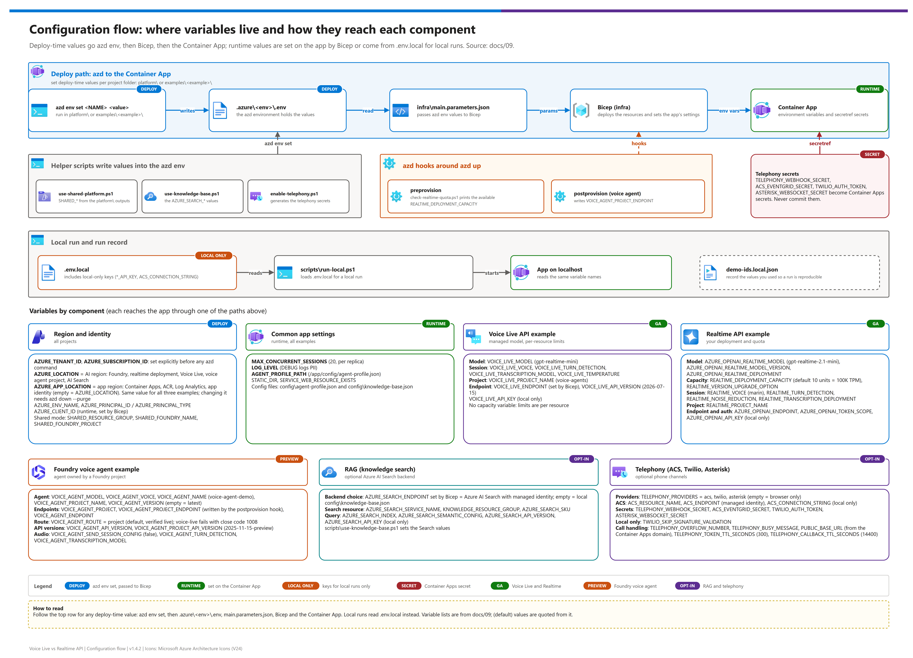

[README](../README.md) › [docs index](./00-reproduce-this-demo.md) › 09 Environment variables

# 09 — Environment variables

&nbsp;
&nbsp;
&nbsp;
&nbsp;
&nbsp;

 

Every setting that changes how the demo deploys or behaves. Set **deploy-time** values with
`azd env set <NAME> <value>` in the relevant project folder (`platform\`, `examples\<example>\`);
azd passes them to Bicep through `infra\main.parameters.json`. **Runtime** values are set on the
Container App by Bicep (or in `.env.local` for `scripts\run-local.ps1`).

Record the values you used with every result set (`demo-ids.local.json`) — especially
`AZURE_LOCATION`, `AZURE_APP_LOCATION`, model, and capacity — or a run cannot be reproduced.

## At a glance

| | Group | Where it applies |
|---|---|---|
|  | [Capacity constraints](#reproducing-under-capacity-constraints-read-first) and [region/identity](#region-and-identity-all-projects) | Deploy time, all projects |
|  | [Shared single-endpoint mode](#shared-single-endpoint-mode) | Examples pointed at the `platform\` resource |
|  | Per-example variables: [Voice Live](#voice-live-api-example), [Realtime](#realtime-api-example), [voice agent](#foundry-voice-agent-example-preview)  | Each example's azd env / Container App |
|  | [Common app settings](#common-app-settings-all-examples) | Runtime, all examples |
|  | [RAG](#rag-knowledge-search) | Runtime, knowledge search |
|  | [Telephony](#telephony-acs-twilio-and-asterisk) | Runtime, phone channels |

Editable source: [`assets/configuration-flow.drawio`](./assets/configuration-flow.drawio) - regenerate with `python scripts/export_diagrams.py docs/assets`.

> [!IMPORTANT]
> Set the tenant and subscription explicitly (`AZURE_TENANT_ID`, `AZURE_SUBSCRIPTION_ID`) before any `azd` command; ambient credentials drift across tenants.

> [!WARNING]
> Telephony secrets (`TELEPHONY_WEBHOOK_SECRET`, `ASTERISK_WEBSOCKET_SECRET`, `ACS_EVENTGRID_SECRET`, `TWILIO_AUTH_TOKEN`) become Container Apps secrets. Never commit them; see [Generating the telephony secrets](#generating-the-telephony-secrets).

##  Reproducing under capacity constraints (read first)

| Constraint you hit | Variable | What to do |
|---|---|---|
| Container Apps capacity/quota unavailable in the AI region | **`AZURE_APP_LOCATION`** | Keep `AZURE_LOCATION` (AI) in `centralus`; set `AZURE_APP_LOCATION` to the nearest region with Container Apps (e.g. `eastus2`). Use the **same value for all three examples** so the app→AI network hop is equal. Changing it after deploy requires `azd down --purge` (resource names don't depend on it). |
| `InsufficientQuota` on the realtime deployment | **`REALTIME_DEPLOYMENT_CAPACITY`** | Capacity units: for `gpt-realtime-2.1-mini` 1 unit = 10,000 TPM + 20 RPM (the portal shows TPM). The quota row is labelled `Requests Per Minute - <model> - GlobalStandard` but counts units; many subscriptions have 10 (= 100K TPM). The `preprovision` hook prints the available value. |
| Model not offered / refused in a region | `AZURE_LOCATION`, `AZURE_OPENAI_REALTIME_MODEL`, `VOICE_LIVE_MODEL`, `VOICE_AGENT_MODEL` | Pick a region where Voice Live, Agent Service (voice agent), and the realtime model are all available: `centralus`, `eastus2`, `swedencentral`. |
| Voice Live throttling under load (Voice Live + voice agent) | *(no variable)* | Per-resource limits (100 new connections/min, ≤120K TPM). In shared mode both managed-model examples draw on the **same** resource's limits; request an increase or run one example at a time. |

##  Region and identity (all projects)

| Variable | Scope | Default | Purpose |
|---|---|---|---|
| `AZURE_TENANT_ID` | deploy | — | Tenant to deploy into. Always set explicitly (multi-tenant accounts drift). |
| `AZURE_SUBSCRIPTION_ID` | deploy | — | Subscription (one subscription for the shared test). |
| `AZURE_LOCATION` | deploy | platform: `centralus`; examples: required | **AI region**: Foundry resource, realtime deployment, Voice Live, voice agent project, AI Search. |
| **`AZURE_APP_LOCATION`** | deploy (examples) | empty = `AZURE_LOCATION` | **App region**: Container Apps environment + app, ACR, Log Analytics, app managed identity. |
| `AZURE_ENV_NAME` | deploy | set by `azd env new` | Names the resource group `rg-<env>` and seeds resource names. |
| `AZURE_PRINCIPAL_ID` / `AZURE_PRINCIPAL_TYPE` | deploy | set by azd / `User` | Deploying identity that receives developer roles (Foundry, Search). |
| `AZURE_CLIENT_ID` | runtime | set by Bicep | User-assigned managed identity used by the app. |

##  Shared single-endpoint mode

Written by `scripts\use-shared-platform.ps1` from the `platform\` outputs. Empty = standalone.

| Variable | Scope | Purpose |
|---|---|---|
| `SHARED_RESOURCE_GROUP` | deploy (examples) | Platform resource group. |
| `SHARED_FOUNDRY_NAME` | deploy (examples) | The one Foundry resource all three examples use. |
| `SHARED_FOUNDRY_PROJECT` | deploy (voice agent) | Foundry project in that resource that holds the voice agent. |
| `DEPLOY_SEARCH` | deploy (platform) | `true` — create Azure AI Search. |
| `DEPLOY_COMMUNICATION_SERVICES` | deploy (platform) | `true` — create ACS. |
| `ACS_DATA_LOCATION` | deploy (platform) | `United States` — ACS data residency. |

##  Voice Live API example

| Variable | Scope | Default | Purpose |
|---|---|---|---|
| `VOICE_LIVE_MODEL` | deploy + runtime | `gpt-realtime-mini` | Managed model (`gpt-realtime-mini`, `gpt-realtime-2.1-mini`). No deployment. |
| `VOICE_LIVE_VOICE` | deploy + runtime | `en-US-Ava:DragonHDLatestNeural` | Azure neural or OpenAI voice. |
| `VOICE_LIVE_PROJECT_NAME` | deploy (standalone) | `voice-agents` | Foundry project on the Voice Live example's resource (same portal experience as the other two examples). |
| `VOICE_LIVE_ENDPOINT` | runtime | Bicep | `https://<foundry>.services.ai.azure.com` |
| `VOICE_LIVE_API_VERSION` | runtime | `2026-07-15` | Voice Live API version. |
| `VOICE_LIVE_TURN_DETECTION` | runtime | `azure_semantic_vad` | Also `azure_semantic_vad_multilingual`, `server_vad`. |
| `VOICE_LIVE_TRANSCRIPTION_MODEL` | runtime | derived | `gpt-4o-mini-transcribe` for mini/base, else `azure-speech`. |
| `VOICE_LIVE_TEMPERATURE` | runtime | `0.8` | 0.6–1.2. |
| `VOICE_LIVE_API_KEY` | local only | empty | Deployed resources disable key auth. |

##  Realtime API example

| Variable | Scope | Default | Purpose |
|---|---|---|---|
| `AZURE_OPENAI_REALTIME_MODEL` | deploy + runtime | `gpt-realtime-2.1-mini` | Deployed model (`gpt-realtime-2.1-mini`, `gpt-realtime-mini`). |
| `AZURE_OPENAI_REALTIME_MODEL_VERSION` | deploy | derived | `2026-07-07` / `2025-12-15`. |
| `AZURE_OPENAI_REALTIME_DEPLOYMENT` | deploy + runtime | model name | Deployment name. |
| **`REALTIME_DEPLOYMENT_CAPACITY`** | deploy (example + platform) | `10` | Global Standard capacity units (`gpt-realtime-2.1-mini`: 10K TPM + 20 RPM each; 10 = 100K TPM / 200 RPM). Checked by the `preprovision` hook. |
| `REALTIME_VERSION_UPGRADE_OPTION` | deploy | `OnceCurrentVersionExpired` | Deployment auto-upgrade policy. |
| `REALTIME_VOICE` | deploy + runtime | `marin` | One of the 10 OpenAI voices. |
| `REALTIME_PROJECT_NAME` | deploy (standalone) | `voice-agents` | Foundry project on the Realtime example's resource; the deployment is visible and testable from it in the Foundry portal (same experience as the voice agent). |
| `AZURE_OPENAI_ENDPOINT` | runtime | Bicep | `https://<foundry>.openai.azure.com` |
| `REALTIME_TURN_DETECTION` | runtime | `semantic_vad` | Or `server_vad`. |
| `REALTIME_NOISE_REDUCTION` | runtime | `near_field` | `far_field`, `none`. |
| `REALTIME_TRANSCRIPTION_DEPLOYMENT` | runtime | empty | Separate transcription deployment (its own quota). |
| `AZURE_OPENAI_TOKEN_SCOPE` / `AZURE_OPENAI_API_KEY` | runtime / local | `https://ai.azure.com/.default` / empty | Auth overrides. |

##  Foundry voice agent example (preview)

| Variable | Scope | Default | Purpose |
|---|---|---|---|
| `VOICE_AGENT_MODEL` | deploy + agent | `gpt-realtime-2.1-mini` | Managed model stored on the agent (`gpt-realtime-mini`, `gpt-realtime`). No deployment. |
| `VOICE_AGENT_VOICE` | deploy + agent | `en-US-Ava:DragonHDLatestNeural` | Voice stored on the agent. |
| `VOICE_AGENT_NAME` | deploy + runtime | `voice-agent-demo` | Agent name. |
| `VOICE_AGENT_PROJECT_NAME` | deploy (standalone) | `voice-agents` | Project created in standalone mode. |
| `VOICE_AGENT_PROJECT` | runtime | Bicep | Project the bridge connects to (`agent-project-name`). |
| `VOICE_AGENT_PROJECT_ENDPOINT` | hook | Bicep | Used by `scripts\create-voice-agent.py`. |
| `VOICE_AGENT_ENDPOINT` | runtime | Bicep | `https://<foundry>.services.ai.azure.com` |
| `VOICE_AGENT_VERSION` | runtime | empty (latest) | Pin an agent version. |
| `VOICE_AGENT_API_VERSION` | runtime | `2026-07-15` | Voice Live API version; used only with `VOICE_AGENT_ROUTE=voice-live`. |
| `VOICE_AGENT_ROUTE` | runtime | `project` | `project` = Foundry portal sample route `/api/projects/
/agents/<a>/endpoint/protocols/voice` with `Foundry-Features: VoiceAgents=V1Preview` (verified live). `voice-live` = `/voice-live/realtime?agent-name=…&agent-project-name=…`; currently fails for `kind: voice` agents (server closes with 1008 after "Session configuration failed after 5 attempts"). |
| `VOICE_AGENT_PROJECT_API_VERSION` | runtime | `2025-11-15-preview` |  API version for the `project` route. |
| `VOICE_AGENT_SEND_SESSION_CONFIG` | runtime | `false` | `true` sends an audio-only `session.update`; by default the agent owns the session (greeting, VAD, noise, echo, transcription). |
| `VOICE_AGENT_TURN_DETECTION` | runtime | `azure_semantic_vad` | Only used when `VOICE_AGENT_SEND_SESSION_CONFIG=true`; the agent definition sets Azure semantic VAD. |
| `VOICE_AGENT_TRANSCRIPTION_MODEL` | runtime | derived | Same rule as Voice Live. |

##  Common app settings (all examples)

| Variable | Scope | Default | Purpose |
|---|---|---|---|
| `MAX_CONCURRENT_SESSIONS` | deploy + runtime | `20` | Admission cap per replica, shared by browser and phone sessions. Set to what the API's limit can hold. |
| `LOG_LEVEL` | runtime | `INFO` | `DEBUG` also logs transcripts (PII). |
| `AGENT_PROFILE_PATH` | runtime | `/app/config/agent-profile.json` | Domain profile (instructions, tools). |
| `STATIC_DIR` | runtime | `/app/static` | Browser UI. |
| `SERVICE_WEB_RESOURCE_EXISTS` | deploy | set by azd | Reuse the deployed image on re-provision. |

##  RAG (knowledge search)

| Variable | Scope | Default | Purpose |
|---|---|---|---|
| `AZURE_SEARCH_SERVICE_NAME` | deploy | empty | Search service in `SHARED_RESOURCE_GROUP` (the `knowledge\` project or the platform); empty = local `config\knowledge-base.json`. Set by `scripts\use-knowledge-base.ps1`. |
| `KNOWLEDGE_RESOURCE_GROUP` | output (knowledge) | `rg-<kb-env>` | Resource group of the `knowledge\` project; copied to an example's `SHARED_RESOURCE_GROUP`. |
| `AZURE_SEARCH_SKU` | deploy (knowledge) | `basic` | Search tier for the `knowledge\` project. |
| `AZURE_SEARCH_ENDPOINT` | runtime | Bicep | Set → Azure AI Search backend with managed identity. |
| `AZURE_SEARCH_INDEX` | deploy + runtime | `knowledge` | Index name. |
| `AZURE_SEARCH_SEMANTIC_CONFIG` | deploy + runtime | `default` | Semantic ranker configuration. |
| `AZURE_SEARCH_API_VERSION` | runtime | `2024-07-01` | Search REST API version. |
| `AZURE_SEARCH_API_KEY` | local only | empty | Deployed search has key auth disabled. |

##  Telephony (ACS, Twilio, and Asterisk)

| Variable | Scope | Default | Purpose |
|---|---|---|---|
| `TELEPHONY_PROVIDERS` | deploy + runtime | empty | Any of `acs`, `twilio`, `asterisk` (comma-separated). Empty = browser only. |
| `ACS_RESOURCE_NAME` | deploy | empty | ACS resource in the platform RG. |
| `ACS_ENDPOINT` | runtime | Bicep | ACS endpoint for Call Automation (managed identity). |
| `ACS_CONNECTION_STRING` | local only | empty | Alternative to `ACS_ENDPOINT` for local tests. |
| `TELEPHONY_WEBHOOK_SECRET` | deploy + runtime (secret) | generated | Signs per-call tokens; never leaves the app. |
| `ACS_EVENTGRID_SECRET` | deploy + runtime (secret) | generated | Placed in the Event Grid endpoint URL; must differ from the signing key. |
| `TWILIO_AUTH_TOKEN` | deploy + runtime (secret) | empty | Validates `X-Twilio-Signature`. |
| `ASTERISK_WEBSOCKET_SECRET` | deploy + runtime (secret) | empty | Password Asterisk sends to `/telephony/asterisk/media` (HTTP Basic, or `?secret=`); required when `TELEPHONY_PROVIDERS` includes `asterisk`. |
| `TWILIO_SKIP_SIGNATURE_VALIDATION` | local only | `false` | Local tunnels only. |
| `TELEPHONY_OVERFLOW_NUMBER` | deploy + runtime | empty | E.164 human-queue number for callers over the cap. |
| `TELEPHONY_BUSY_MESSAGE` | runtime | built-in | Spoken to busy Twilio callers. |
| `PUBLIC_BASE_URL` | runtime | Bicep | Public https base for callbacks (set from the Container Apps domain). |
| `TELEPHONY_TOKEN_TTL_SECONDS` | runtime | `300` | Media/stream token lifetime. |
| `TELEPHONY_CALLBACK_TTL_SECONDS` | runtime | `14400` | ACS callback token lifetime (max call length). |

### Generating the telephony secrets

`scripts\enable-telephony.ps1 -Example <x> -Providers <acs|twilio|asterisk>` creates every secret the chosen
channels need (32 random bytes, URL-safe base64) and stores it in the example's azd env; `azd up` turns them
into Container Apps secrets. Existing values are kept unless you pass `-RotateSecrets`.

| Channel | Settings required | Generated? |
|---|---|---|
| any | `TELEPHONY_PROVIDERS`, `TELEPHONY_WEBHOOK_SECRET` | yes |
| `asterisk` | `ASTERISK_WEBSOCKET_SECRET` (copy into Asterisk `websocket_client.conf` as `password`; `-WriteAsteriskConfig` writes the file for you) | yes |
| `acs` | `ACS_EVENTGRID_SECRET`, `ACS_RESOURCE_NAME`, `SHARED_RESOURCE_GROUP` | secret yes; ACS comes from `platform\` |
| `twilio` | `TWILIO_AUTH_TOKEN` | no — from the Twilio Console |

Manual alternatives: PowerShell `[Convert]::ToBase64String([Security.Cryptography.RandomNumberGenerator]::GetBytes(32)).TrimEnd('=').Replace('+','-').Replace('/','_')`,
`python -c "import secrets; print(secrets.token_urlsafe(32))"`, or `openssl rand -base64 32 | tr '+/' '-_' | tr -d '='`.
Minimum length is 16 characters; avoid `;` in Asterisk `.conf` values (it starts a comment).

---

**Next:** [10 Knowledge base](./10-knowledge-base.md)

*Last updated: 2026-10-02*

