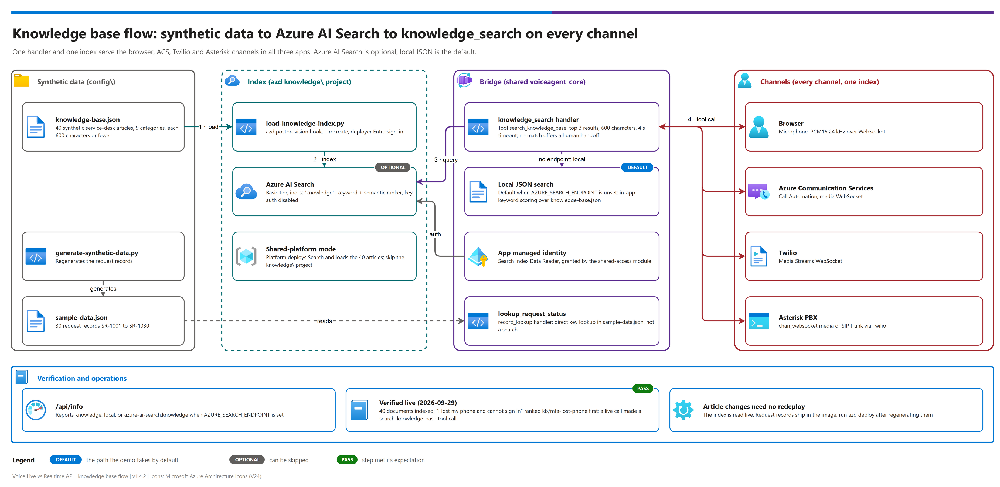

[README](../README.md) › [docs index](./00-reproduce-this-demo.md) › 10 Knowledge base

# 10 — Knowledge base (synthetic data)

<p>
&nbsp;
&nbsp;
&nbsp;
&nbsp;

</p>

  

All three examples ground answers with the same `search_knowledge_base` tool. This page covers the
**synthetic** knowledge base that ships with the demo and how to put it in Azure AI Search.

> [!NOTE]
> **Synthetic data only.** Every article and request record describes a fictional organization. Replace
> `config\knowledge-base.json` and `config\sample-data.json` with your own content to retarget.

## At a glance

| | Item | Detail |
|---|---|---|
|  | Articles | 40 short service-desk articles in `config\knowledge-base.json` |
|  | Request records | 30 records `SR-1001`…`SR-1030` in `config\sample-data.json` |
|  | Index | Azure AI Search index `knowledge` (keyword + semantic ranker), loaded by the `knowledge\` azd project |
|  | Tool | `search_knowledge_base` in `config\agent-profile.json`, handled by `knowledge_search` |

[](./assets/knowledge-base-flow.png)

<sub>Editable source: [`assets/knowledge-base-flow.drawio`](./assets/knowledge-base-flow.drawio) - regenerate with `python scripts/export_diagrams.py docs/assets`.</sub>

> [!TIP]
> The same handler and knowledge source serve browser, ACS, Twilio, and Asterisk calls, so one index covers every channel; see [07 Telephony](./07-telephony-and-shared-endpoint.md).

##  What ships

| File | Contents | Used by |
|---|---|---|
| `config\knowledge-base.json` | 40 short service-desk articles in 9 categories (accounts and sign-in, network and remote access, devices, software and apps, email and collaboration, security, service desk, policies, facilities). Each is ≤ 600 characters (the longest is 331) so it can be spoken whole. Fields: `id`, `title`, `category`, `content`, `source`, `last_reviewed`. | `search_knowledge_base` (RAG) |
| `config\sample-data.json` | 30 request records `SR-1001`…`SR-1030` with status, summary, owning team and last-updated date; 25 of them also carry `opened`, `priority`, and a `related_article`. Generated by `scripts\generate-synthetic-data.py` (fixed seed; `SR-1001`–`SR-1005` kept verbatim). | `lookup_request_status` |

### Article categories

| Category | Articles | Examples (`source`) |
|---|---|---|
| Service desk | 7 | `kb/support-hours`, `kb/escalation`, `kb/request-status`, `kb/priorities`, `kb/human-agent` |
| Accounts and sign-in | 6 | `kb/password-reset`, `kb/account-unlock`, `kb/mfa-setup`, `kb/mfa-lost-phone` |
| Devices | 6 | — |
| Email and collaboration | 5 | — |
| Network and remote access | 4 | — |
| Software and apps | 4 | — |
| Security | 3 | — |
| Policies | 3 | — |
| Facilities | 2 | — |

Articles were last reviewed between 2026-07-15 and 2026-09-10 (`last_reviewed`).

### Request records

Statuses in the shipped records: Resolved (14), Waiting on requester (6), Scheduled (5), In progress (4),
Under review (1). The `lookup_request_status` tool reads this file through its `record_lookup` handler
(`collection: records`, `key_field: id`), so *"what's the status of SR-1012?"* is a direct key lookup, not a search.

Good demo questions: *"I got a new phone and my authenticator app is gone"*, *"my account keeps locking"*,
*"what's the status of SR-1012?"*, *"someone sent me a weird email with a link"*, *"what are your hours?"*,
*"I need to work from another country for a month"*.

##  Two backends, one tool

The `knowledge_search` handler (`shared\voiceagent_core\rag.py`) is configured per tool in the agent profile:
`top: 3` results, `max_chars: 600` per passage, and a 4-second timeout so the tool round-trip (and the tokens
re-sent every turn) stay small. With no match it returns an empty result and a message telling the model to say so
and offer a human handoff instead of guessing.

| Backend | When | How |
|---|---|---|
| Local JSON | `AZURE_SEARCH_ENDPOINT` not set (default, tests, local runs) | Keyword scoring over `config\knowledge-base.json` inside the app |
| Azure AI Search | `AZURE_SEARCH_ENDPOINT` set by Bicep | Index `knowledge`, keyword + **semantic ranker**, app managed identity with **Search Index Data Reader**; key auth disabled |

`/api/info` reports which one is active (`knowledge: local` or `knowledge: azure-ai-search:knowledge`).

##  Deploy the knowledge base

```powershell
cd knowledge
azd auth login --tenant-id <tenant-id>
azd env new <kb-env>
azd env set AZURE_TENANT_ID <tenant-id>
azd env set AZURE_SUBSCRIPTION_ID <subscription-id>   # same subscription as the examples
azd env set AZURE_LOCATION centralus
azd up        # creates Azure AI Search (Basic, semantic ranker free tier); postprovision loads the index
```

The `postprovision` hook runs `scripts\load-knowledge-index.py --recreate`, which rebuilds the index and
uploads the corpus with your Entra sign-in (the Bicep grants you Search Service Contributor and Search Index
Data Contributor; the loader retries for up to 5 minutes while those roles propagate).

##  Connect the examples

```powershell
./scripts/use-knowledge-base.ps1 -Example voice-live-api      -KnowledgeEnv <kb-env>
./scripts/use-knowledge-base.ps1 -Example realtime-api        -KnowledgeEnv <kb-env>
./scripts/use-knowledge-base.ps1 -Example foundry-voice-agent -KnowledgeEnv <kb-env>
cd examples\<example>; azd provision   # per example
```

The script sets `SHARED_RESOURCE_GROUP`, `AZURE_SEARCH_SERVICE_NAME`, `AZURE_SEARCH_INDEX`, and
`AZURE_SEARCH_SEMANTIC_CONFIG`. Each example keeps its own Foundry resource; its `shared-access` module grants
the app identity Search Index Data Reader and the Container App gets `AZURE_SEARCH_ENDPOINT`.
Examples in shared-platform mode (`SHARED_FOUNDRY_NAME` set) already use the platform's search service; load
the corpus there with `python scripts\load-knowledge-index.py --endpoint <platform-search> --recreate`.

##  Update or replace the content

```powershell
# edit config\knowledge-base.json, then:
cd knowledge; azd hooks run postprovision
# regenerate request records:
python scripts\generate-synthetic-data.py --count 40
```

No app redeploy is needed for article changes (the index is read live). Request records are packaged in the
container image, so run `azd deploy` in each example after regenerating `sample-data.json`.

##  Verify

```powershell
# index document count
$tok = az account get-access-token --tenant <tenant-id> --resource https://search.azure.com --query accessToken -o tsv
Invoke-RestMethod -Headers @{Authorization="Bearer $tok"} "$(azd env get-value AZURE_SEARCH_ENDPOINT)/indexes/knowledge/docs/`$count?api-version=2024-07-01"
```

Then ask an app a knowledge question in the browser; the tool pane shows `search_knowledge_base` with
`backend: azure-ai-search:knowledge` and the matching `kb/...` sources.

##  Cost

| Item | Billing |
|---|---|
| Azure AI Search **Basic** | Hourly while the service exists (check the Azure pricing page for the region) |
| Semantic ranker | Free plan covers a demo's query volume |
| Clean-up | `azd down --purge` in `knowledge\` |

Azure AI Search **Basic** is billed hourly while the service exists (check the Azure pricing page for the
region). The semantic ranker's free plan covers a demo's query volume. Remove it with `azd down --purge` in
`knowledge\` when not in use; the examples fall back to the local JSON backend only after their
`AZURE_SEARCH_*` settings are cleared and they are re-provisioned.

---

**Next:** [Back to the README](../README.md)

*Last updated: 2026-10-02*
